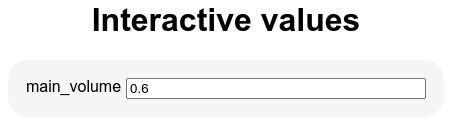
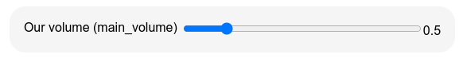
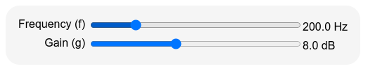
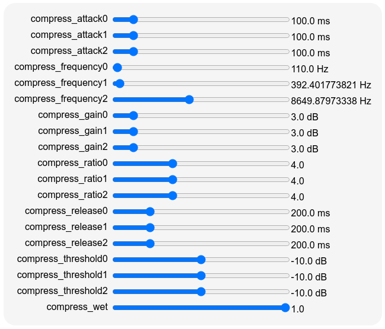
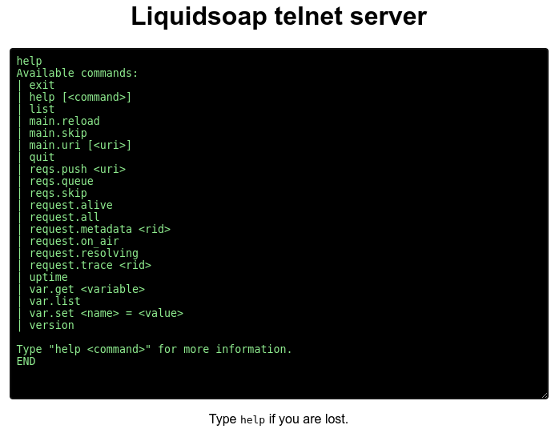
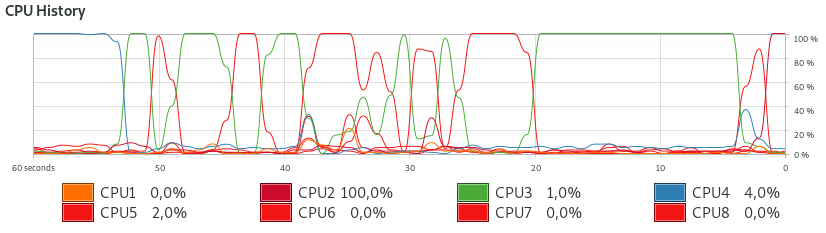
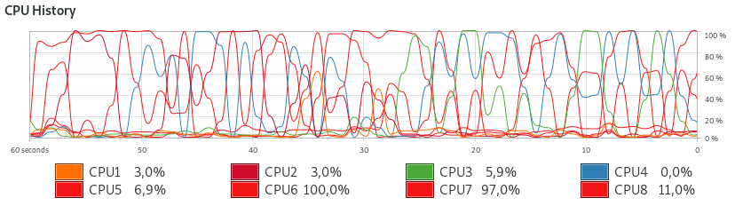

Full workflow of a radio station {#chap:workflow}
================================

This chapter explains in details the main tools and techniques in order to setup
a webradio. It essentially follows [the introductory chapter](#sec:radio),
but gives much more details about techniques and parameters one can use to
achieve his goals.

Inputs {#sec:inputs}
------

### Playlists

A radio generally starts with a _playlist_, which is simply a file containing a
list of files to be played. The `playlist`\indexop{playlist}
operator does that: it takes as a playlist as argument and sequentially plays
the files it contains. For instance, the script

```{.liquidsoap include="liq/playlist2.liq" from=1}
```

will play all the files listed in the `my_playlist` playlist. The operator also
accepts a directory as argument, in which case the playlist will consist of all
the files in the directory: the script

```{.liquidsoap include="liq/playlist.liq" from=1}
```

will play all the files in the `Music` directory. The format of a playlist generally
consists in a list of files, with one file per line, such as

```
/data/mp3/file1.mp3
/data/mp3/file2.mp3
/data/mp3/file3.mp3
http://server/file.mp3
ftp://otherserver/file.mp3
```

but other more advanced playlist formats are also supported: pls, m3u, asx,
smil, xspf, rss podcasts, etc. Those are generally created by using dedicated
software.

#### Playlist arguments

By default, the files are played in a random order but this can be changed with
the `mode` parameter of `playlist` which can either be

- `"normal"`: play files in the order indicated in the playlist,
- `"randomize"`: play files in a random order chosen for the whole playlist at
  each round (default mode),
- `"random"`: pick a random file each time in the playlist (there could thus be
  repetitions in files).

In the first two modes, the `loop` argument indicates, when we have played all
the files, whether we should start playing them again or not. By default, the
playlist is never reloaded, i.e. changes brought to it are not taken in account,
but this can be modified with the parameters `reload_mode` (which indicates when
we should reload the playlist) and `reload` (which indicates how often we should
reload the playlist). For instance:

- reload the playlist every hour (1 hour being 3600 seconds):
  
  ```{.liquidsoap include="liq/playlist-reload1.liq" from=1 to=-1}
  ```

- reload the playlist after each round (when the whole playlist has been played):

  ```{.liquidsoap include="liq/playlist-reload2.liq" from=1 to=-1}
  ```
  
- reload the playlist whenever it is modified:

  ```{.liquidsoap include="liq/playlist-reload3.liq" from=1 to=-1}
  ```

Playlists can also be reloaded from within the scripts by calling the `reload`
method of a source produced by the `playlist` operator. For instance, reloading
every hour can also be performed with

```{.liquidsoap include="liq/playlist-reload4.liq" from=1 to=-1}
```

The `reload` method take an optional argument labeled `uri` in case you want to
specify a new playlist to load.

Another useful option is `check_next`, to specify a function which will
determine whether a file should be played or not in the playlist: this function
takes a request as argument and returns a boolean. For instance, we can ensure
that only the files whose name end in ".mp3" are played with

```{.liquidsoap include="liq/playlist-check.liq" from=1 to=-1}
```

The function `check` takes the request `r` given as argument, extracts its uri,
and then returns true or false depending on whether this uri ends with ".mp3" or
not. As another example, we can base our decision on the metadata of the file
as follows:


```{.liquidsoap include="liq/playlist-check2.liq" from=1 to=-1}
```

Here, we obtain the metadata with `request.metadata`, and declare that we should
play a file only if its genre is "Rock" (remember that the metadata are encoded
as an association list, as explained in [there](#sec:association-list)).

#### Playing lists of files

One inconvenient of the `check` function is that it is called whenever the
`playlist` operator needs to prepare a new song, presumably because the current
one is about to end. This means that if too many songs are rejected in a row, we
might fail to produce a valid next file in time. Another approach could consist
in filtering the files we want at startup: this takes longer at the beginning,
but it is more predictable and efficient on the long run. This approach is taken
in the following script to play dance music songs:

```{.liquidsoap include="liq/playlist-check3.liq" from=1 to=-1}
```

We use `playlist.files` to obtain the list of files contained in our playlist of
interest, then we use `list.filter` to only keep in this list the files which
are validated by the function `check`, and finally we use the `playlist.list`
operator to play the resulting list of files (`playlist.list` is a variant of
`playlist` which takes a list of files to play instead of a playlist). The
`check` function uses `file.metadata` in order to obtain the metadata for each
file `f`: this can take quite some time if we have many files, but will be done
only at the startup of the script.

#### Avoiding repetitions

A common problem with playlists in randomized order is that, when the playlist
is reloaded, it might happen that a song which was played not so long ago is
scheduled again. In order to avoid that, it is convenient to use the `playlog`\indexop{playlog}
operator which records when songs were played and can indicate when a song was
last played. When called, it returns a record with two functions:

- `add` which records that a song with given metadata has just been played,
- `last` which returns how long ago a song with given metadata was last played,
  in seconds.

We can use this to reject, in a playlist, all the songs which have been played
less than 1 hour (= 3600 seconds) ago as follows:

```{.liquidsoap include="liq/playlist-check4.liq" from=2}
```

and thus avoid repetitions when reloading.

Interesting options of the `playlog` operator are:

- `duration` specifies the time after which the tracks are forgotten in the playlog
  (setting this avoids that it grows infinitely by constantly adding new
  tracks),
- `persistency` provides a file in which the list of songs is recorded, which
  allows preserving the playlog across restarts of the script,
- `hash` is a function which extracts the string identifying a file from its
  metadata: by default, we use the filename as identifier, but we could for
  instance use an MD5 checksum of the file by passing the function
  
  ```liquidsoap
  fun (m) -> file.digest(metadata.filename(m))
  ```

#### Single files

If you only need to play one file, you can avoid creating a playlist with this
file only, by using the operator `single`\indexop{single} which loops on one file. This operator
is also more efficient in the case the file is distant because it is downloaded
once for all:

```{.liquidsoap include="liq/single.liq" from=1 to=-1}
```

By the way, if you do not want to loop over and over the file, and only play it
once, you can use the operator `once`\indexop{once} which takes a source as argument, plays
one song of this source, and becomes unavailable after that.

```{.liquidsoap include="liq/single-once.liq" from=1 to=-1}
```

### Distant streams

The operators `playlist` or `single` make sure in advance that the files to be
played are available: in particular, they download distant files so that we are
sure that they are ready when we need them. Because of this, they are not
suitable in order to play continuous streams (which are very long, or can even
be infinite), because Liquidsoap would try to download them entirely before
reading them.

This is the reason why the `input.http`\indexop{input.http} operator should be used instead in order
to play a stream:

```{.liquidsoap include="liq/input.http.liq" from=1 to=-1}
```

This operator works with streams such as those generated by Icecast, but also
with playlists containing streams. It will regularly pull data from the given
location, and therefore should be used for locations that are assumed to be
available most of the time. If not, it might generate unnecessary traffic and
pollute the logs: in this case, it is perhaps better to inverse the paradigm and
use the `input.harbor` operator described below, which allows the distant stream
to connect to Liquidsoap.

#### HLS streams

Streams in HLS format are quite different from the above ones: they consist of a
rolling playlist of short audio segments, as explained in
[there](#sec:HLS). This is the reason why they are handled by a different
operator, `input.hls`\indexop{input.hls}:

```{.liquidsoap include="liq/input.hls.liq" from=1 to=-1}
```

<!--
In this protocol the stream is segmented in small files and Liquidsoap will
regularly look for new segments (how often can be controlled by the `reload`
parameter).
-->

<!--
\TODO{polish this: we can use input.ffmpeg}
TODO: the format is optional and usually well detected, the list of supported formats can be obtained with `ffmpeg -formats`

```{.liquidsoap include="liq/input.ffmpeg-hls.liq"}
```
-->

### Interactive playlists {#sec:request.dynamic}

Instead of having a static playlist, you might want to use you own script to
generate the song which should be played next (e.g. you might fetch requests
from users from the web or a database, or you might have a neural network
deciding for you which song is the best to be played next). In order to proceed
in this way, you should use the `request.dynamic`\indexop{request.dynamic} operator, which takes as
argument a function returning the next song to be played: this function has type
`() -> request('a)`, meaning that it takes no argument and returns a
request. For instance, suppose that we have a script called `next-song`, which
echoes on the standard output the next song to be played on the standard
output. A degenerate example of such a script, using the shell, could be

```{include="liq/next-song"}
```

which always returns `test.mp3` as song to be played, but of course you could
use any program in any programming language as long as it outputs the file to be
played on the standard output. We can then query this script in order to play
song as follows:

```{.liquidsoap include="liq/request.dynamic.liq" from=1 to=-1}
```

Here, our `next` function executes the above script `next-song`, using the
function `process.read.lines` which returns the list of lines returned by the
script. We then take the first line with `list.hd` and create a request from
from it using `request.create`. As a variant, suppose that the next song to be
played is present in a file named `song`. We can play it as follows:

```{.liquidsoap include="liq/request.dynamic2.liq" from=1 to=-1}
```

The `check` function now reads the contents of the file `song` and creates a
request from it. In the case where the file is empty, there is no song to play,
and we return the value `null` to indicate it. The `retry_delay` parameter of
`request.dynamic` indicates that, in such an event, we should wait for 1 second
before trying again. This example is not perfect: there is a chance that a given
song will be played multiple times if we don't update the file `song` timely
enough: we see a better way of achieving this kind of behavior in next section.

#### The playlist operator

We should mention here that our beloved `playlist` operator is actually
implemented in Liquidsoap, in the standard library, using
`request.dynamic`. Here is a simplified version of the definition of this
function:

```{.liquidsoap include="liq/request.dynamic-playlist.liq" from=1 to=-1}
```

When creating the playlist, we first store the list of its files is a reference
`l`, and randomize its order when the `randomize` parameter is true. We then use
`request.dynamic` with a `next` function which returns a request made from the
first element of the list (and this first element is removed from the
list). When the `reload` parameter is true, we reload the list with the contents
of the playlist when it becomes empty.

### Request queues {#sec:request.queue}

In an interactive playlist, the operator asks for the next song. But in some
situations, instead of this passive way of proceeding (you are asked for songs),
you would rather have an active way of proceeding (you inform the operator of
the new files to play when you have some). Typically, if you have a website
where users can request songs, you would like to be able to put the requested
song in a playlist at the moment the user requests it. This is precisely the
role of the `request.queue`\indexop{request.queue} operator, which maintains a
list of songs to be played in a _queue_\index{queue} (the songs are played in
the order they are pushed). A typical setup involving this operator would be the
following:

```{.liquidsoap include="liq/request.queue.liq" from=1}
```

We have both a playlist and a queue, and the radio is defined by using the
`fallback` operator which tries to fetch the stream from the queue and defaults
to the playlist if the queue is empty. The `track_sensitive=false`\index{track!sensitive} argument
instructs that we should play the stream generated by the queue as soon as it is
available: by default, `switch` will wait for the end of the current track
before switching to the queue.

#### Pushing songs in a queue

You might wonder then: how do we add new songs in the queue?  The role of the
first line is to instruct Liquidsoap to start a "telnet" server, which is
listening by default on port 1234, on which commands can be sent. The queue will
register a new command on this server, so that if you connect to it and write
`queue.push` followed by an uri, it will be pushed into the queue where it will
wait for its turn to be played. In practice this can be done with commands such
as\index{telnet}

```
echo "queue.push test.mp3" | telnet localhost 1234
```

which uses the standard unix tool `telnet` to connect to the server supposed to
be running on the local host and listening on port 1234, and write the command
"`queue.push test.mp3`" on this server, to which it will react by adding the
song "`test.mp3`" in the queue. We refer the reader to [this
section](#sec:telnet) for more details about the telnet server.

If you have multiple queues in your script, you give them names by specifying
the `id` parameter of `request.queue`, which can be any string you want. In this
case, the pushing command will be `ID.push` (where `ID` should be replaced by
the actual identifier you specified), which clearly indicates in which queue you
want to push. For instance, in the script

```{.liquidsoap include="liq/request.queues.liq" from=1}
```

the two queues are respectively called `q1` and `q2`, so that we can push a song
on the second queue by issuing the telnet command "`q2.push file.mp3`".

It is also possible to push a request into a queue directly from Liquidsoap by
using the method `push` of a source defined by `request.queue`, or the method
`push.uri` to push an uri. For instance, consider the following script

```{.liquidsoap include="liq/request.queue-push.liq" from=1}
```

It sets up an auxiliary queue `q`, and uses the function `thread.run` to execute
every minute a function which pushes in to the queue the uri `"say:Another
minute has passed!"`. Because it begins by "`say:`" Liquidsoap will use a speech
synthesis software to turn the text into audio, and we will hear "Another minute
has passed" every minute, over the playlist (the `add` operator plays
simultaneously all the sources in its input list).

#### Implementation of queues

Incidentally, the function `request.queue` is implemented in Liquidsoap, by
using a list to maintain the queue of requests. Here is a slightly simplified
version of it:

```{.liquidsoap include="liq/request.queue-implementation.liq" from=1 to=-1}
```

Internally, it maintains a reference on a list called `queue`. The `next`
function pops the first element of the list and returns it, or `null` if the
queue is empty, and the `push` function adds a new request at the end of the
list. Finally, the source is created by `request.dynamic` with `next` as
function returning the next request. Finally, the source is returned, decorated
with the method `push`.

### Protocols

We have seen that playlists can contain files which are either local or distant,
the latter beginning by prefixes such as "`http:`" or "`ftp:`". A _protocol_\index{protocol} is
a way of turning such a prefixed uri into an actual file. Most of the time it
will consist in downloading the file in the appropriate way, but not
only. Liquidsoap supports many protocols and even the possibility of adding your
own.

For instance, the `youtube-dl` protocol allows the use of the
`youtube-dl`\indexop{youtube-dl} program (or its more recent alternative
`yt-dlp`) in order to download files from YouTube.

```{.liquidsoap include="liq/youtube-dl.liq" from=1 to=-1}
```

when playing such a file, we need to do more than simply connect to some
particular location over the internet, and have to do tricky stuff in order to
fetch the video from YouTube. Similarly, the `say`\indexop{say} protocol uses
text-to-speech software (either `pico2wave`, or `gtts`, or `text2wave` provided
by the festival project) in order to synthesize speech. For instance,

```{.liquidsoap include="liq/say.liq" from=1 to=-1}
```

Incidentally, the `prefix` parameter of `playlist` can be used to add a prefix
to every element of the playlist, which is typically useful for protocols. This
means that the following will read out the paths of the files in the playlist:

```{.liquidsoap include="liq/say-playlist.liq" from=1 to=-1}
```

Another very useful protocol is `annotate`\indexop{annotate} which adds metadata to the following
song, as in

```
annotate:artist=The artist,comment=Played on my radio:test.mp3
```

In particular, this can be used to add metadata in playlists (which can contain
files beginning with `annotate:`), to specify the usual information such as
artist and title (although those are generally already present in files), but
also internal information such as cue in and cue out time.

#### The process protocol

More powerful, the `process`\indexop{process} protocol allows to launch any command in order to
process files. The syntax is

```
process:<ext>,<cmd>:uri
```

where `<ext>` is the extension of the produced file, `<cmd>` is the command to
launch and `uri` is the uri of a file. In the string `<cmd>`, the substring `$(input)` will be replaced
by the input file and `$(output)` by the output file (a temporary file whose
extension is `<ext>`). For instance, we can convert a file `test.mp3` in stereo
wav (even if the input file is mono) by:

```{.liquidsoap include="liq/process1.liq" from=1 to=-1}
```

When playing it, Liquidsoap will first download `test.mp3` into some place (say
`/tmp/temp.mp3`) and then execute

```
ffmpeg -y -i /tmp/temp.mp3 -ac 2 /tmp/temp.wav
```

which will convert it to stereo wav, and then play the resulting temporary file
`/tmp/temp.wav`. The protocol `process` also accepts files of the form

```
process:<ext>,<cmd>
```

in which case only `$(output)` will be replaced in the command. For instance,
the implementation of text-to-speech in Liquidsoap essentially amounts to doing

```{.liquidsoap include="liq/process2.liq" from=1 to=-2}
```

which will run

```
echo 'Hello world!' | text2wave > /tmp/temp.wav
```

and play the resulting file.

#### Registering new protocols

One of the most powerful features of Liquidsoap is that it gives you the ability
of registering your own protocols. For instance, suppose that we have a program
`find_by_artist` which takes as argument the name of an artist and prints a list
of music files from this artist. Typically, this would be achieved by
looking into a database of all your music files. For instance, we suppose that executing

```
find_by_artist Halliday
```

will print a list of files such as

```
/data/mp3/allumer_le_feu.mp3
/data/mp3/l_envie.mp3
/data/mp3/que_je_t_aime.mp3
```

We are going to define a new protocol named `artist` so that, when playing a
file such as `artist:Halliday`, Liquidsoap will run the above command in order
to find a song. This can be done by using the
`protocol.add`\indexop{protocol.add} operator: its first mandatory argument is
the name of the protocol (here, `artist`) and the second one is a function which
takes as arguments

- a function `rlog` to log the resolution process (you can use it to print
  whatever is useful for you to debug problems during the generation of the file),
- a duration `maxtime` in seconds which the resolution should not exceed (you
  should be careful about it when querying distant servers which might take a
  long time for instance),
- the request,

and returns a list of file names corresponding to the request. Liquidsoap will
play the first file available in this list, and those file names might actually
also use Liquidsoap protocols. In our example, we can implement the protocol as

```{.liquidsoap include="liq/add_protocol2.liq" from=1 to=-3}
```

We use the `protocol.add` function to register our protocol `artist`, where the
function `artist_protocol`, which returns the list of files corresponding to a
request, simply returns the list of all the files printed by the command
`find_by_artist`. The `doc` parameter is free form documentation for the
protocol and the `syntax` parameter provides an illustration of a typical
request using this protocol (both are only for documentation purposes). Once
this defined, we can finally play songs of any artist by performing requests of
the form

```liquidsoap
s = single("artist:Sinatra")
```

and, of course, an uri such as "`artist:Nina Simone`" could also be used in a
playlist or pushed in a request queue.

<!--
TODO: some other useful predefined protocols:

- s3
- annotate (detailed below)
- There is a [list of
protocols](https://www.liquidsoap.info/doc-dev/protocols.html)
-->

### Soundcard inputs

In order to input sound from a soundcard, you should use functions such as
`input.alsa` or `input.pulseaudio` or `input.portaudio` depending on the library
you want to use for this: the first one is a little more efficient, because it is
closer to the hardware, and the second is more portable and widespread. For
instance, you can hear your voice with

```{.liquidsoap include="liq/mic.liq" from=1}
```

Basically, this script plays the stream generated by `input.alsa`\indexop{input.alsa}. However, we
have to use the `buffer` operator in order to bufferize the stream coming from
the soundcard and deal with synchronization issues between the input and
the output, as detailed in [there](#sec:clocks-ex).

If you want to use a particular device, you should use the parameter `device` of
`input.alsa`, which takes as argument a string of the form `hw:X,Y` where `X` is
the card number and `Y` is the device number. The list of all devices available
on your computer can be obtained with the command

```
aplay -l
```

On my laptop this returns

```
card 0: PCH [HDA Intel PCH], device 0: ALC3246 Analog [ALC3246 Analog]
  Subdevices: 0/1
  Subdevice #0: subdevice #0
card 0: PCH [HDA Intel PCH], device 3: HDMI 0 [HDMI 0]
  Subdevices: 1/1
  Subdevice #0: subdevice #0
```

so that if I want to input from HDMI (the second one listed above), I should use
`hw:0,3` as `device` parameter.

By default, the ALSA operators have an internal buffer in order to be able to
cope with small delays induced by the soundcard and the computer. However, you
can set the `bufferize` parameter to `false` in order to avoid that in order to
reduce latencies. For instance, if you are lucky, you can hear your voice
almost in realtime, with some flanger effect added just for fun:

```{.liquidsoap include="liq/alsa-realtime.liq" from=1}
```

Beware that by reducing the buffers, you are likely to hear audio glitches due
to the fact that blank is inserted when audio data is not ready soon enough. In
this case, you should also see the following in the logs

```
Underrun! You may minimize them by increasing the buffer size.
```

which indicates that you should buffer in order to avoid defects in the audio.

### Distant inputs with harbor {#sec:input.harbor}

Many programs are able to stream to an Icecast server, and we can use those as
an input for Liquidsoap scripts with the `input.harbor`\indexop{input.harbor} operator. This operator
instructs Liquidsoap to run an Icecast-compatible server, called
_harbor_\index{harbor}. Clients can then connect to it, as they would do on any
Icecast server, and the stream they send there is then available as a source in
your script. This can be useful to relay an intermittent live stream without
having to regularly poll the Icecast server to find out when it is available. It
can also be used to have interventions from distant live speakers and DJs: for
instance the [Mixxx](https://mixxx.org/) software can be used to easily make
mixes from home. A typical setup would be

```{.liquidsoap include="liq/input.harbor.liq" from=1}
```

In this example, we use the `playlist` source by default, but we give priority
to the `live` source, which is a harbor input, available only when some client
connects to it. Apart from the parameters specifying the port and the password
to use when connecting to the server, the unlabeled argument specifies the
_mountpoint_: this should be specified by the client when connecting, which
means that a same harbor server can simultaneously relay multiple sources, as
long as they use different mountpoints.

#### Sending sound to harbor

In order to test the above script, we need some software which can send streams
using the Icecast protocol to the harbor input. Ours obviously being Liquidsoap,
after having started the above script, you can run the second script

```{.liquidsoap include="liq/input.harbor-client.liq" from=1}
```

which will stream connect to the harbor Icecast server and stream our music
library in mp3 format. Of course, `localhost` should be changed by the name (or
IP) of the server if you are not running the client on the same machine.

Another possibility would be to use the `shout` program which can be used to
directly send music files to Icecast. For instance,

```
cat test.ogg | shout --format ogg --host localhost --pass hackme --mount /live
```

will send the file `test.ogg` to our harbor server.

Yet another possibility consists in using the `darkice` program which captures
the microphone of the computer and sends it to an Icecast server. We can use it
to stream our voice with

```
darkice -c darkice.cfg
```

where `darkice.cfg` is a configuration file specifying the parameters of the
program, such as

```{include="liq/darkice.cfg"}
```

#### Securing harbor

Since harbor exposes a server to the internet, you should be serious about
security and think thoroughly about who should be having access to this
server. The fact that the server is programmed in OCaml makes it quite unlikely
that an exploit such as a buffer overflow is possible, but one never knows.

First, the list of IPs which are allowed to connect to harbor can be changed
with the following setting:

```liquidsoap
settings.harbor.bind_addrs := ["0.0.0.0"]
```

It takes as argument a list of allowed IPs, the default one `0.0.0.0` meaning
that every IP is allowed.

In practice, it is often quite difficult to know in advance the IPs of all the
clients, so that the main security is given by the password which is passed as
argument of `input.harbor`: please choose it wisely, and avoid at any means the
default password "`hackme`". Even with a strong password, the security is not
very good: if some client leaks the password or you want to revoke
a client, you have to change it for every client which is not convenient. For
this reason, the authentication can also be done through a function, which is
passed as the `auth` argument of `input.harbor` and is of type

```
({user : string, password : string, address : string}) -> bool
```

It takes as argument a record containing the username, the password and the IP
address of a client trying to log in and returns whether it should be allowed or
not. Typically, you would like to call an external script, say `harbor-auth`,
which will take the username and password as argument and print "`allowed`" if
the user is allowed (such a command would usually look into a database to see
whether the credentials match, and perhaps do additional checks such as ensuring
that the user has the right to connect at the given time).

```{.liquidsoap include="liq/input.harbor-auth.liq" from=1}
```

Here, our function `auth` begins by executing the script `harbor-auth` with the
username and password as argument. Note that we use `string.quote` to escape
shell special characters, so that the user cannot introduce shell commands in
his username for instance... The `process.read.lines` function returns the list
of lines returned by our script and our function returns `true` or `false`
depending on whether this first line is "`allowed`" or not. In this way you
could easily query an external database of allowed users.

Finally, the clients should be able to determine that they are really connected
with your server and not some hacker's one. The best way to achieve that is to
use SSL certificates, which can be handled with the `input.harbor.ssl` variant
of the harbor source, which is present only if Liquidsoap has been compiled with
SSL support. The certificate can be specified with the setting
`harbor.ssl.certificate` (the setting `harbor.ssl.private_key` can also be used
to specify the private key and `harbor.ssl.password` the password to unlock the
private key). Obtaining a proper SSL\index{SSL} certificate can be tricky. You may want to
start with a self-signed certificate first, which you can for instance obtain
from [_Let's Encrypt_](https://letsencrypt.org/). Alternatively, a self-signed
certificate for local testing you can use the following one-liner:

```
openssl req -x509 -newkey rsa:4096 -sha256 -nodes -keyout server.key -out server.crt -subj "/CN=localhost" -days 3650
```

#### Webcast

For interventions by external collaborators, it can be problematic to have them
perform a "complex setup" such as installing Liquidsoap or run `darkice`. For
this reason, we have developed a protocol which allows streaming sound directly
from the browser, be it from music files or the microphone, without having to
install anything: this protocol is called _webcast_\index{webcast} and we provide a [JavaScript
implementation `webcast.js`](https://github.com/webcast/webcast.js), which
should be easy to integrate in your own website, based on websockets and media
recorder API. Of course, `input.harbor` has support for it and will accept
clients using the webcast protocol in addition to the traditional Icecast
protocol.

A full-fledged website based on this library, called _Webcaster_, [is
available](https://webcast.github.io/webcaster/). It provides a web interface which
looks like this:

\

As you can see, it allows performing simple DJ interventions, by mixing between
two playlists and the microphone input. And should you need more, [the source
code is available](https://github.com/webcast/webcaster). In the lower-left corner
is the URI we should connect to, in the following form:

```
ws://username:password@host:port/mountpoint
```

For instance, with the above harbor input example, we should thus use the URI

```
ws://user:hackme@localhost:8000/live
```

(the username is not taken in account when using the basic password
authentication).

### External inputs

\index{external!input}

In case you are still not satisfied (for instance, if you have very specific
needs or are the proud owner of hardware which is not widely supported), it is
possible to use any program as an input, as long as this program echoes audio on
its standard output either in wav or in raw audio format, with the operators
`input.external.wav` and `input.external.rawaudio`. Here, "raw audio" data
consists in interleaved samples encoded as signed 16 bits little-endian integers
(the use of the wav format is preferable to avoid confusions about the encoding
format). For instance, we can play a sine wave which is generated by the program
`ffmpeg` with

```{.liquidsoap include="liq/input.external.wav.liq" from=1 to=-1}
```

or with

```{.liquidsoap include="liq/input.external.rawaudio.liq" from=1 to=-1}
```

The argument `cmd` is the program which is going to be executed: here, we use
`ffmpeg`, which is instructed to generate a sine at 440 Hz (`-i
sine=frequency=440`) in stereo (`-ac 2`), encode it in wav (`-f wav`) or raw
format (`-f s16le`), and output it on the standard output (`-`).

#### FFmpeg input

The above examples are only to illustrate the use external programs as input,
but you would not use it with `ffmpeg` in practice because Liquidsoap has
builtin support for it, through the `input.ffmpeg`\indexop{input.ffmpeg} operator. A more natural way
of writing the above to generate a sine through FFmpeg would thus be

```{.liquidsoap include="liq/input.ffmpeg.liq" from=1 to=-1}
```

#### GStreamer input {#sec:gstreamer-input}

Finally, another very general possibility for input is to use the
`input.gstreamer.audio` operator in order to use the GStreamer\index{GStreamer}
library to generate audio. The generation itself is described through a
_pipeline_ which consists in a sequence of GStreamer operators separated by
"`!`": a pipeline "`a ! b`" means that the output of operator "`a`" should be
fed to operator "`b`". We refer the reader to the documentation of the library
for more information about it. In Liquidsoap, the pipeline can be passed in the
argument labeled `pipeline`, as expected. For instance, we can generate a sine
wave (again) with

```{.liquidsoap include="liq/input.gstreamer.liq" from=1 to=-1}
```

where we use the operator `audiotestsrc` to generate a sine, which we pipe to
the `audioamplify` operator to change its volume. Similarly, we can play the
file `test.mp3` with

```{.liquidsoap include="liq/input.gstreamer2.liq" from=1 to=-1}
```

In practice, no one would use the above example as is, because Liquidsoap
already has builtin support for using GStreamer to decode files...

#### JACK input

If the other program has support for it, it is possible to use JACK with the
`input.jack`\indexop{input.jack} operator. This library is dedicated to the communication of audio
data between programs and greater stability and precision is expected than with
the above method. Its use is detailed in [there](#sec:JACK).

<!--
### Distant streams

Sometimes the machine which is producing the sound is not the same as the one
which is producing the stream. For instance, it might be the case that we
capture sound with the help of a computer _A_ located in the physical studio of
the radio, but that the scheduling and encoding is performed by a Liquidsoap
instance on another computer _B_.

#### Using the Icecast protocol

In order to send audio from the first to the second computer, a first
possibility is to use the Icecast protocol:

- computer _B_ sets up an `input.harbor` input on which computer _A_ will send
  its stream using Liquidsoap with an `output.icecast` output (or an external
  tool such as [Ices](https://icecast.org/ices/)), or
- computer _A_ can broadcast an Icecast stream by using an `output.harbor`
  output which computer _B_ will fetch using `input.http`.

This solution is not entirely satisfactory because the sound has to be
compressed (the Icecast protocol does not allow sending uncompressed data such
as wav, it can however send lossless compressed data with the FLAC codec).

#### UDP

`input.udp` and `output.udp`
-->

#### SRT

In order to transmit a stream between two machines on the same local network,
one can use the Icecast protocol (i.e. `input.harbor` or `input.http`) but this
is not satisfactory: firstly, the has to be compressed (the Icecast protocol
does not allow sending uncompressed data such as wav, it can however send
lossless compressed data with the FLAC codec) and, secondly, it induces much
delay in the stream due to the various buffers used by Icecast.

A much better solution consists in using the SRT\index{SRT} (for _Secure Reliable
Transport_) protocol, which allows reliable data transmission with low latency,
and can be performed using the `input.srt`\indexop{input.srt} operator. A minimal script could be

```{.liquidsoap include="liq/input.srt.liq" from=1}
```

Note that we need to use the `buffer` operator here because SRT uses its own
synchronization mechanism, which is different from the one on the output based
on the Pulseaudio library, see [below](#sec:clocks-ex). The input is not
available unless it receives some stream, which is why we pass `fallible=true`
to `buffer`. We can send such a stream with `ffmpeg` for instance: the script

```
ffmpeg -re -i test.mp3 -f mp3 -c:a copy srt://localhost:8000
```

sends the contents of the `test.mp3` using SRT on the host `localhost` (you
should of course change this if you are connecting to a distant machine) on the
port 8000, which is the default one. The `-re` option ensure that the file is
sent progressively and not all at once. Another option to send an SRT stream is,
of course, to use Liquidsoap. We can use the script

```{.liquidsoap include="liq/output.srt.liq" from=1}
```

to stream our music library to the above SRT input in wav format (you could use
`%mp3` instead of `%wav` to compress in mp3 in order save bandwidth).


Scheduling
----------

Now that we have a wide panel of sources, we need to combine them.

### Fallback {#sec:fallback}

The first way of combining sources is through the `fallback`\indexop{fallback} operator, which
takes as argument a list of sources, and plays the first one which is available,
i.e. can produce some stream. We have already seen examples of this with request
queues ([here](#sec:request.queue)) such as

```liquidsoap
radio = fallback([queue, playlist])
```

Here, we want to play a song from the request queue when there is one, otherwise
we play songs from the playlist. By default, if we are playing a song from the
playlist and there is a new song in the queue, the operator will wait for the
current playlist song to finish before playing the one from the queue. This
behavior can be changed by setting the `track_sensitive`\index{track!sensitive} parameter to `false`,
in which case the song from the queue will be immediately played:

```liquidsoap
radio = fallback(track_sensitive=false, [queue, playlist])
```

Typically, you would use this to switch to a live show when available

```{.liquidsoap include="liq/input.harbor.liq" from=1 to=-1}
```

or to feature live interventions when someone is speaking on the microphone

```{.liquidsoap include="liq/blank.strip.liq" from=1 to=-1}
```

In this last example, we are using the operator `blank.strip`\index{blank} to make the source
`mic` unavailable when there are at least 2 seconds of silence (the duration is
controlled by the `max_blank` argument, and the `threshold` argument indicates
that we consider anything below -20 dB as silence): in this case, the `fallback`
operator will default to the `music` playlist until someone is speaking again.

In order to make a source `s` always available, it is quite common to stream
blank when the source is not available, i.e. re-define the source

```{.liquidsoap include="liq/fallible3.liq" from=1 to=-1}
```

with a fallback on blank. Since this is quite common in scripts, the function
`mksafe`\indexop{mksafe} is defined in the standard library as a shorthand, and the above is
equivalent to writing

```liquidsoap
s = mksafe(s)
```

#### Skipping fallback

In a fallback situation where we have a live source and a music playlist as
above, the solution we provided is not entirely satisfactory: when the live
source ends, the music source is played again where we left it, whereas it is
often the case that we want to start on a fresh track. The `fallback.skip`
operator allows precisely this: the script

```{.liquidsoap include="liq/fallback.skip.liq" from=5 to=-1}
```

will play the `live` source and default to the `music` source, like a regular
track insensitive fallback operator, but it will also skip the current track of
the `music` source after switching to the `live` source, so that we will begin
on a fresh track when switching back again to `music`.

<!--
For didactic purposes, let us provide another way of implementing this. The
`on_leave` method of a source allows registering a function which is to be
called when the source is not used anymore. We can use this to enforce skipping
the `music` source when we switch the `live` source, and the following script
will behave like the above one:

```{.liquidsoap include="liq/fallback.skip-on_leave.liq" from=5 to=-1}
```
-->

### Switching and time predicates

Another way of selecting a source among multiple ones is the
`switch`\indexop{switch} operator. It takes as argument a list, whose elements
are pairs consisting of a predicate and a source. Here, each
_predicate_\index{predicate} is function taking no argument an returning a
boolean (it is of type `() -> bool`) indicating whether the corresponding source
should be played or not: a typical predicate is `{8h-10h}` which is true when
the current time is between 8h and 10h. The `switch` operator will select and
play the first source whose predicate returns `true`.

For instance, supposing that we have two different playlists for night and day,
we could alternate between those depending on the hour with

```{.liquidsoap include="liq/switch.liq" from=3 to=-1}
```

Here also, the `track_sensitive`\index{track!sensitive} parameter controls whether a change of source
only occurs at track boundaries (when `true`, which is the default) or as soon
as possible.

If you want to make sure that there is always something to play, the condition
of the last source should always be true, i.e. you can use `{true}`. For
instance,

```{.liquidsoap include="liq/switch2.liq" from=4 to=-1}
```

will have two special programs on the morning and the evening, and will default
to the `music` playlist at other times. We thus obtain the same behavior as if
we had used a `fallback` operator:

```{.liquidsoap include="liq/switch2-fallback.liq" from=4 to=-1}
```

#### Time predicates {#sec:time-predicates}

\index{time!predicate}
\index{predicate!time}

In the above examples, `{0h-7h}` is a _time predicate_: it is something which is
`true` or `false` depending on the current time. Some other examples of time
predicates are

-------------   -------------------------------------
`{11h15-13h}`   between 11h15 and 13h
`{12h}`         between 12h00 and 12h59
`{12h00}`       at 12h00
`{00m}`         on the first minute of every hour
`{00m-09m}`     on the first 10 minutes of every hour
`{2w}`          on Tuesday
`{6w-7w}`       on weekends
-------------   -------------------------------------

Above, `w` stands for weekday: 1 is Monday, 2 is Tuesday, and so on. Sunday is
both 0 and 7.

#### Other predicates

We could also use this operator to manually switch between sources. As an
illustration, supposing that we have two radio streams named `radio1` and `radio2`,
we could use a script such as

```{.liquidsoap include="liq/switch3.liq" from=6 to=6}
```

where the predicate `p` determines when `radio1` should be played. For instance,
if we want to play it when a file `select-radio` contains "`1`", we could define
it as

```{.liquidsoap include="liq/switch3.liq" from=3 to=3}
```

Another way to achieve this could be use an "interactive boolean", as detailed
in [there](#sec:telnet), and defined instead

```{.liquidsoap include="liq/switch3.liq" from=4 to=5}
```

The interactive boolean is a sort of reference whose value can be changed over
the telnet by issuing commands such as "`var.set r1 = true`", which sets the
value of the boolean named `r1` to `true`. Therefore, we can switch to radio 1
by typing the command\index{interactive variable}\index{telnet}

```
echo "var.set r1 = true" | telnet localhost 1234
```

and back to radio 2 with

```
echo "var.set r1 = false" | telnet localhost 1234
```

(or directly connecting to the telnet server and issuing the commands, see
[there](#sec:telnet)).

### Adding

Instead of switching between two sources, we can play them at the same time with
the `add`\indexop{add} operator, which takes a list of sources whose sound are to be
added. For instance, if we want to make a radio consisting of a microphone input
together with background music (which is often called a "bed"), we can define

```{.liquidsoap include="liq/add.liq" from=3 to=-1}
```

This will play the two sources `mic` and `bed` at equal volume. By default, the
volume of the output is divided by 2 (because there are 2 sources) in order not
increase the loudness too much. If you want to keep the original volume of the
sources, you should set the `normalize` parameter to `false`:

```{.liquidsoap include="liq/add2.liq" from=3 to=-1}
```

but beware that this might result into some clipping if the two sources are
loud, which is never nice to hear, see also [there](#sec:clipping).

As a side note, the operator `add` only adds the sources which are ready. This
means that if `mic` is taken from a harbor input such as

```{.liquidsoap include="liq/add.liq" from=1 to=1}
```

and the client did not connect or was disconnected, we will hear only the bed,
as expected.

#### Weights

The `add` operator also offers the possibility of weighting the sources,
i.e. specifying their relative volume: if we want to hear the microphone twice
as loud as the bed, we should give the microphone twice the weight of the
bed. The weight of each source can be specified in a list passed in the
`weights` arguments. For instance,

```{.liquidsoap include="liq/add3.liq" from=3 to=-1}
```

assigns the weight `2.` to `mic` and `1.` to `bed`. This is equivalent to
amplifying each of the sources with the corresponding factor, i.e.

```{.liquidsoap include="liq/add4.liq" from=3 to=-1}
```

but more efficient and natural.

### Sequencing

The `sequence`\indexop{sequence} operator allows a behavior which sometimes useful: it takes as
argument a list of sources and plays one track from each source in order, and
finally keeps on playing tracks from the last source. This means that

```liquidsoap
s = sequence([s1, s2, s3])
```

will play one track from `s1`, one track from `s2` and will then keep on
playing `s3`. We will for instance use this in [section below](#sec:transitions)
in order to insert jingles during transitions.

### Jingles and ads

Jingles\index{jingle} are short announcements, generally indicating the name of the radio or
the current show. They are quite important in order for the listener to remember
the brand of your radio and create some familiarity with the radio (the music
changes, but the jingles remain the same). Technically, jingles are not
different from any other music source, but we give here the usual ways of
inserting those, presenting tricks which might be useful in other situations too
(in particular, ads follow basically the same techniques). We suppose here that
we have a source `music` which plays our music and a source `jingles` which
plays jingles: typically, it will be defined as

```{.liquidsoap include="liq/jingles-add.liq" from=1 to=1}
```

where `jingles` is a playlist containing all our jingles.

#### Rotating tracks

The most basic strategy consists in inserting one jingle every _n_ tracks, which
is easily achieved thanks to the `rotate`\indexop{rotate} operator. It takes a list of sources
and a list of weights associated to each source (in the argument labeled
`weight`), and selects tracks from the sources according to the weights. For
instance, in the following script

```{.liquidsoap include="liq/jingles-rotate.liq" from=3 to=-1}
```

we play `jingles` with weight `1` and `music` with weight `4`: this means that
we are going to play one jingle, then four music tracks, then one jingle, then
four music tracks, and so on.

If you want something less regular, the `random`\indexop{random} operator can be used instead of
`rotate`:

```{.liquidsoap include="liq/jingles-random.liq" from=3 to=-1}
```

It is basically a randomized version of the previous source, which will randomly
chose tracks from `jingles` and `music`, the probability of choosing a track
from the latter being four times the probability of choosing a track from the
former.

The `rotate` and `random` operators can also be used to vary the contents of a
source. For instance, if we wanted our `jingles` sources to play alternatively a
jingle, a commercial and an announcement for a show, we could have defined

```{.liquidsoap include="liq/jingles-rotate2.liq" from=1 to=-1}
```

#### Playing jingles regularly

Another approach for jingles consists in playing them at regular time
intervals. This is easily achieved with the `delay`\indexop{delay} operator function which
prevents a source from being available before some time. For instance, we can
play a jingle roughly every 30 minutes with

```{.liquidsoap include="liq/jingles-delay.liq" from=3 to=-1}
```

Above, the function `delay` above enforces that, after playing a track, the
`jingles` source will not be available again before 1800 seconds, which is 30
minutes. Therefore, every time the current music track ends and more than 30
minutes has passed since the last jingle, a new one will be inserted. As a
variant, we can add the jingle on top of the currently playing music with

```{.liquidsoap include="liq/jingles-delay2.liq" from=3 to=-1}
```

<!--
\TODO{this is useful for non-track-sensitive switches to play one track, but
ensuring that is won't last longer, see https://github.com/savonet/liquidsoap/issues/1544 }
-->

#### Jingles at fixed time

Instead of inserting jingles regularly, you might want to insert them at fixed
time. This is quite a common approach, but a bit tricky to achieve. Suppose
that we want to play a jingle at the beginning of each hour, without
interrupting the current track. One would typically write a script such as

```{.liquidsoap include="liq/jingles-once.liq" from=3 to=-1}
```

which states that when the current minute of the time is "00", we should play
the `jingles` source. But this is not really good: if a track from the music
source starts at 11h58 and ends at 12h01 then no ad will be played around
noon. In order to accommodate for this, we are tempted to widen the time
predicate and replace the second line with

```{.liquidsoap include="liq/jingles-once2.liq" from=4 to=4}
```

Well, this is not good either: if a track of the music source ends at 12h01, we
now hear a jingle as expected, but we actually continuously hear jingles for 14
minutes instead of hearing only one. In order to fix this, we are tempted to use
the `once`\indexop{once} operator and change the line to

```{.liquidsoap include="liq/jingles-once3.liq" from=4 to=4}
```

This is not good either: `once(jingles)` plays only one track from `jingles`,
but during the whole execution of the script. This means that our script will
only work as expected on the first hour, where we will correctly hear one
jingle, but on the following hours we will hear no jingle because one has
already been played. An acceptable solution consists in using `delay` to ensure
that we should wait at least 30 minutes before playing another jingle and
replace the second line by

```{.liquidsoap include="liq/jingles-once4.liq" from=4 to=4}
```

it says that we should play a jingle in the first quarter of every hour and not
more often than once every half hour, and achieves precisely what we want. Note
that anything from `900.` (15 minutes) to `2700.` (45 minutes) would be
acceptable as argument for the `delay`.

As a last remark, if we want to play the jingle exactly at the top of the hour,
and interrupt the currently playing song if necessary, it is enough to add
`track_sensitive=false` to the `switch` operator:

```{.liquidsoap include="liq/jingles-once6.liq" from=3 to=-1}
```

#### Jingles at fixed time: alternative approach

In the previous example, an alternative approach instead of using the `delay`
operator, consists in using the `predicate.once`\index{predicate!once} function. It takes a predicate
`p` as argument, and returns a predicate which is true only once each time `p`
is continuously true. In case it helps, we have illustrated in the following
figure an example of a predicate `p` over time (below) and the resulting
predicate `predicate.once(p)` over time (above):

\

This means that `predicate.once({00m-15m})` is a predicate which is true once
between in the first quarter of every hour, and can thus be used to play on
jingle in the first quarter of every hour as follows:

```{.liquidsoap include="liq/jingles-once6.liq" from=3 to=-1}
```

As a variant, if we wanted to play a jingle every half hour, we could replace
the second line by

```liquidsoap
    (predicate.once({00m-15m or 30m-45m}), jingles),
```

As another variant, if we wanted to play 3 jingles, we could write

```liquidsoap
    (predicate.at_most(3, {00m-15m}), jingles),
```

where `predicate.at_most` is similar to `predicate.once`, but is true a given
number of times instead of only once (its it pointless to play 3 jingles in a
row, but this can be quite useful for ads for instance).

If we want to add the jingle on top of the currently playing music, we can use
the function `source.available` which takes as arguments a source and a
predicate, and makes the source available only when the predicate is
satisfied. We can then add the music with the jingles source made available once
every half hour as follows:

```{.liquidsoap include="liq/jingles-available.liq" from=3 to=-1}
```

#### Signaling

As a more advanced use of predicates, we would like to introduce the
`predicate.signal`\index{predicate!signal} function which creates a particular predicate which is false
most of the time, unless some other part of the program sends a "signal", in
which case the predicate becomes true once and then false again, until the next
signal. Concretely, we can use this function to create a predicate `p` by

```liquidsoap
p = predicate.signal()
```

The predicate `p` is false by default, in order to make it true we can send a
signal by calling its method `signal`, i.e. writing `p.signal()`. For instance,
in the script

```{.liquidsoap include="liq/jingles-signal.liq" from=3 to=-1}
```

we use `predicate.signal` to create a predicate `p` which controls playing
jingles (if there is no jingle to play we default to the `music` source). We
then use `thread.run` to execute `p.signal()` every 20 minutes (or 1200
seconds). This means that every 20 minutes (or a bit more because we are waiting
for the current track of `music` to end), we will hear a jingle.

Of course, this is not the way one would typically regularly insert jingles, but
this can easily be modified to insert jingles by interacting with the
environment. For instance, we can register a command on the telnet server as
follows:

```{.liquidsoap include="liq/jingles-signal2.liq" from=6 to=-1}
```

The function `cmd`, when called with some argument, will run `p.signal()` and
return a string indicating that the jingle has been inserted. We then use the
`server.register` function to instruct Liquidsoap that the function `cmd` should
be called when a user runs the command `insert_jingle` on the telnet
server. This means that if you connect to the telnet server and type
`insert_jingle`, a jingle will be inserted after next track, which could be
quite useful if you are designing some sort of graphical interface for your
radio.

#### Inserting jingles on metadata

We will also see in [next section](#sec:tracks) that the insertion of jingles
can also conveniently be triggered by metadata in sources.

#### Inserting jingles in transitions

Yet another method for inserting transition consists in adding them in
transitions between tracks, this is detailed in [a later
section](#sec:transitions).

Tracks and metadata {#sec:tracks}
-------------------

Liquidsoap has a notion of _track_\index{track} in stream, which is generally used to mark
the boundary between two successive songs. We have seen that many functions to
control the stream (`fallback`, `switch`, etc.) have the ability to detect
tracks and only change stream when a track is over in order not to abruptly
interrupt a playing song (this behavior can be altered by setting the
`track_sensitive` parameter to `false`).

To every track is associated metadata\index{metadata}, which is information concerning the song
which is going to be played. In Liquidsoap, metadata can actually be present at
any time, and does not have to correspond to a track boundary (we can have
metadata in the middle of a song) although this is generally the case. We have
seen in [there](#sec:association-list) that metadata is generally coded as an
association list: this is a list consisting of pairs of strings, whose type is
thus `[string * string]`. Typically, the metadata `m` for a track will look like

```{.liquidsoap include="liq/metadata.liq" from=0 to=0}
```

which indicates that the artist is "Sinatra" and the title is "Fly me". Typical
metadata fields are: `artist`, `title`, `album`, `genre`, `year` and `comment`.

#### Manipulating metadata

In order to retrieve the title in such a list, one can use the notation

```liquidsoap
m["title"]
```

which returns the value associated to the field `title` in the metadata `m`, the
empty string `""` being returned in the case where the metadata is not
present. Changing the value of some metadata is simply obtained by putting the
new metadata at the top, by using the function `list.add` or `list.append`. For
instance, we can define a metadata `m'` where the artist has been changed and
the year has been added by

```{.liquidsoap include="liq/metadata.liq" from=1 to=1}
```

or, if we only want to change the year,


```{.liquidsoap include="liq/metadata2.liq" from=1 to=1}
```

#### Metadata in requests

Metadata are usually stored within files: for instance, mp3 files generally
contain metadata encoded in the ID3v2 format. Typical operators reading files,
such as `playlist`, automatically read those when opening a file. We recall that
it is also possible to add metadata to files in playlists using the `annotate`\indexop{annotate}
protocol. For instance,

```
annotate:artist=The artist,comment=Played on my radio:test.mp3
```

Incidentally, the `prefix` parameter of the `playlist` operator can be used to
add a prefix to every file in the playlist. It can in particular be used to
annotate every file in order to add some metadata. For instance, if we want to
set the metadata `jingle` to `true` for every track in our playlist, we can
write something like

```{.liquidsoap include="liq/playlist-prefix.liq" from=1 to=-1}
```

### Handling tracks {#sec:on-metadata}

Every source has `on_track`\indexop{on\_track} and `on_metadata`\indexop{on\_metadata} methods, which respectively
enforce the execution of a function when a track boundary or metadata occur in
the stream. In both cases, the method takes as argument a function of type

```
([string * string]) -> unit
```

This function will itself be called with the metadata as argument when a track
or metadata occurs.

#### Logging tracks

We can for instance use this mechanism to log every song which has gone on air:

```{.liquidsoap include="liq/log-songs.liq" from=1 to=-1}
```

We first define a function `log_song` which takes the metadata `m` as argument,
extracts the artist and the title, and appends those to the file
`/tmp/songs`. We then run the method `on_track` of our `music` source to
register this function to be called when there is a new track and that's it! By
the way, if you want a quick and effective way of logging the metadata, we
advise the use the `metadata.json.stringify` function, which will convert all
the metadata at once into a standardized textual representation in
JSON\index{JSON} format:

```{.liquidsoap include="liq/log-songs2.liq" from=2 to=4}
```

#### Logging the next track

It is sometimes convenient to store the metadata for the next song to be played,
for instance to announce it on a website. This is difficult in general because
Liquidsoap does not compute much of the stream in advance. However, if you are
using a playlist, this can be achieved as follows:

```{.liquidsoap include="liq/log-next-song.liq" from=1 to=-1}
```

Here, we are (ab)using the `check_next` argument which specifies a function
which is called in order to validate the next song: we register our `log_next`
function which always validates the next song (it always returns `true`), but
logs the metadata of the song in between. This works because, by default, the
`playlist` operator always loads one song in advance (this number can be changed
with the `prefetch` parameter), which will be validated by our `log_next`
function, thus providing us with its metadata.

#### Adding jingles on metadata

The functions `on_track` and `on_metadata` can also be used in order to insert
jingles (or ads) when some metadata is present. For instance, we suppose that we
have a music source `s`, perhaps generated by a playlist: when a track has the
metadata `jingle` set to `true`, we want to play a jingle beforehand. One way to
perform this is\indexop{request.queue}

```{.liquidsoap include="liq/jingles-metadata.liq" from=10}
```

It consists in creating a queue `q` and executing a function `insert_jingle`
when a track is present: this function will look whether the value of the
`jingle` metadata is `true`, and if this is the case it will insert a jingle
(the file `jingle.mp3`) into the queue, which will then be played by a usual
fallback mechanism. As an easy variant of the above script, we can read out the
last song which was played on air, by inserting in a queue a request to read it
using the `say` protocol:

```{.liquidsoap include="liq/jingles-metadata2.liq" from=5}
```

Another approach to insert jingles when particular metadata is present could
consist in using the `predicate.signal` function detailed above to trigger
playing one track of a `jingles` playlist when the metadata is present:

```{.liquidsoap include="liq/jingles-metadata3.liq" from=10}
```

#### Prepending and appending tracks

The logic of the above scripts can be somewhat simplified by the use of the `prepend`\indexop{prepend}
operator: this operator takes as argument a function which is called on every
track, with its metadata as source, and returns a source to be played before the
current track. For instance, we can insert a jingle when the metadata `jingle`
is set to `true` by:

```{.liquidsoap include="liq/jingles-prepend.liq" from=11}
```

The function `insert_jingle` looks at the metadata, and if present returns the
`jingles` source, containing all the jingles, of which one track will be
played. If the metadata is not present, we return `fail()`\indexop{fail} which is a source
which is never available: in this case, prepend will simply not insert any track
because none is ready. The function is then registered with the `prepend`
operator.

Of course, there is a dual operator `append`\indexop{append} which allows appending a track for
every track: contrarily to `prepend`, it inserts the track after the currently
playing track. For instance, we can read the song which we have just played with

```{.liquidsoap include="liq/jingles-prepend2.liq" from=5}
```

### Rewriting metadata

If you want to systematically modify the metadata, you can use the
`map_metadata`\indexop{map\_metadata} function which will modify the metadata of a source: it takes as
argument a function and a source, and uses the function to systematically change
the metadata. The type of the function is

```
([string * string]) -> [string * string]
```

it takes the current metadata and returns the new metadata to be inserted. For
instance, we can add the year in the title and a comment into the metadata of
our source `s` with

```{.liquidsoap include="liq/map_metadata.liq" from=2 to=-1}
```

Whenever a metadata passes on the source `s`, the function `update_metadata` is
executed with it and returns the metadata to insert. Here, it states that we
should set the title to `"<title> (<year>)"` (where `<title>` is the title and
`<year>` is the year present in the original metadata) and that we should
advertise about Liquidsoap in the `comment` field.

As another example, suppose that your files do not have proper metadata, for
instance, there could be no metadata at all. Even in this case, Liquidsoap will
add some metadata in order to indicate internal information such as the
filename, more details are given in [there](#sec:requests-metadata). We could
thus use the filename as the title as follows:

```{.liquidsoap include="liq/map_metadata2.liq" from=2 to=-1}
```

The function `path.basename` gives the filename without the leading path and
`path.remove_extension` removes the extension of the file.

### Removing tracks and metadata

In order to remove the tracks indications from a source, the `merge_track`
operator can be used: it takes a source `s` as argument and returns the same
source with the track boundaries removed.

Similarly, `drop_metadata` removes all metadata from a source. This can be
useful if you want to "clean up" all the metadata before inserting your own, as
indicated below.

### Inserting tracks and metadata

If you want to insert tracks or metadata at any point in a source, you can use
`insert_metadata`\indexop{insert\_metadata}: this operator takes a source as argument and returns the same
source with a new method `insert_metadata` whose type is

```
(?new_track : bool, [string * string]) -> unit
```

It takes an argument labeled `new_track` to indicate if some track should be
inserted along with the metadata (by default, it is not the case) and the metadata itself, and inserts
the metadata into the stream. For instance, suppose that we have a source `s` and
we want to set the title and artist metadata to "Liquidsoap" every minute. This
can be achieved by

```{.liquidsoap include="liq/insert_metadata.liq" from=2 to=-1}
```

Here, we add the ability to insert metadata in the source `s` with the operator
`insert_metadata`, and we then use `thread.run` to regularly call a function
which will insert metadata by calling `s.insert_metadata`.

Similarly, we can add a telnet command to change the title metadata of a source `s` by

```{.liquidsoap include="liq/insert_metadata-title.liq" from=3 to=-1}
```

We begin by defining a function `cmd` which takes the title as argument, inserts
it into the stream of `s`, and returns a message saying that the title was
inserted. We then register this command as `set_metadata` on the telnet server,
as detailed in [there](#sec:telnet): when we enter the command

```
set_title New title
```

on the telnet, the title will be set to "New title". In fact, the standard
library offers a generic function in order to do this and we do not have to program
this by ourselves: the function `server.insert_metadata` takes an identifier `id`
and a source as argument and registers a command `id.insert` on the telnet which
can be used to insert any metadata. A typical script will contain

```{.liquidsoap include="liq/server.insert_metadata.liq" from=3 to=-1}
```

and we can then set the title and the artist by running the telnet command

```
src.insert title="New title",artist="Liquidsoap"
```

(the argument of the command is of the form `key1=val1,key2=val2,key3=val3,...`
and allows specifying the key / value pairs for the metadata).

<!--
### ICY metadata

*ICY metadata* is the name for the mechanism used to update metadata in
icecast's source streams. The techniques are primarily intended for data formats
that do not support in-stream metadata, such as mp3 or AAC. However, it appears
that icecast also supports ICY metadata update for ogg/vorbis streams.

When using the ICY metadata update mechanism, new metadata are submitted
separately from the stream's data, via a http GET request. The format of the
request depends on the protocol you are using (ICY for shoutcast and icecast 1
or HTTP for icecast 2).

Starting with 1.0, you can do several interesting things with icy metadata
updates in liquidsoap. We list some of those here.

You can enable or disable icy metadata update in `output.icecast` by setting the
`icy_metadata` parameter to either `"true"` or `"false"`. The default value is
`"guess"` and does the following:

- set `"true"` for: mp3, aac, aac+, wav
- set `"false"` for any format using the ogg container

You may, for instance, enable icy metadata update for ogg/vorbis streams.

The function `icy.update_metadata` implements a manual metadata update using the
ICY mechanism. It can be used independently from the `icy_metadata` parameter
described above, provided icecast supports ICY metadata for the intended stream.

For instance the following script registers a telnet command name
`metadata.update` that can be used to manually update metadata:

```liquidsoap
def icy_update(v) =
  # Parse the argument
  l = string.split(separator=",",v)
  def split(l,v) =
    v = string.split(separator="=",v)
    if list.length(v) >= 2 then
      list.append(l,[(list.nth(v,0,default=""),list.nth(v,1,default=""))])
    else
      l
    end
  end
  meta = list.fold(split,[],l)

  # Update metadata
  icy.update_metadata(mount="/mystream",password="hackme",
                      host="myserver.net",meta)
  "Done !"
end

server.register("update",namespace="metadata",
                 description="Update metadata",
                 usage="update title=foo,album=bar,..",
                 icy_update)
```

As usual, `liquidsoap -h icy.update_metadata` lists all the arguments
of the function.
-->

### Skipping tracks

Every source has a method `skip`\indexop{skip} whose purpose is to skip the
current track and go to the next one. For instance, if our main source is `s`,
we can hear the first 5 seconds of each track of `s` with

```{.liquidsoap include="liq/source.skip.liq" from=2}
```

We could also easily use this to register a telnet command, but this done by
default with the `playlist` operator: you can always use the `skip` telnet
command (or `id.skip` if an identifier `id` was specified for the source) to
skip the current song. For instance, with the script

```{.liquidsoap include="liq/source.skip2.liq" from=1}
```

running the telnet command `music.skip` will end the current track and go to the
next one. As another example, let us register skip as an http service: the script

```{.liquidsoap include="liq/source.skip3.liq" from=2}
```

makes it so that whenever we connect to the url `http://localhost:8000/skip` the
function `skipper` is called and the current song on the source `s` is abruptly
ended: this is part of the interaction you would typically have when designing a
web interface for your radio. Interaction through telnet and harbor http is
handled in [there](#sec:interaction), so that we do not further detail this
example here.

### Seeking tracks {#sec:seeking}

Every source has a method `seek`\indexop{seek} which takes as argument a number
of second and goes forward this number of seconds. It returns the number of
seconds effectively seeked: it might happen that the source cannot be seeked (if
it is a live stream for instance), in which case the function will always return
0, or we might not be able to seek the given amount of time if we are near an
end of track. For instance, the following script will seek forward 5 seconds
every 3 second:

```{.liquidsoap include="liq/seek0.liq" from=1}
```

It is possible to give a negative argument to `seek`, in which case it will try
to seek backward in time.

### End of tracks

The operator `source.on_end` can be used to call a function some time before the
end of each track. In addition to the `delay` parameter, which specifies this
amount of time, the operator takes the source whose tracks are to be processed
and a handler function, which is executed when a track is about to end. This
handler function takes as arguments, the amount of remaining time and the
metadata for the track. For instance, the following track will say the title of
each song 10 seconds before it ends:

```{.liquidsoap include="liq/source.on_end.liq" from=1}
```

You should now recognize a usual programming pattern. The main source is `s`,
which is added to a queue `q`. We use `source.on_end` to register the handler
function `speaker`, which inserts into the queue a request to say the title.

The operator `source.on_end` is also used behind the curtains to implement
`fade.out`.

<!--
### Submitting tracks

TODO: librefm and lastfm
-->

Transitions {#sec:transitions}
-----------

So far, we have seen that we can easily play several music files sequentially
(for instance with the `playlist` operator) or switch between two sources (using
the `fallback` or `switch` operators). However, the resulting transitions
between two tracks are quite abrupt: one track ends and the other starts. We
often want crossfading transitions between tracks, which means that the volume
of the first track should be progressively lowered and the one of the second
progressively increased, in such a way that we hear the two during the
transition:

\

Note that, as figured in the graph above, we don't necessarily want the duration
of the transition to be the same for all tracks: for instance, the transition
should be shorter (or there should even be no transition) for tracks starting or
ending abruptly.

Liquidsoap supports both

- transitions between two distinct sources (for instance, when changing the
  source selected by a `switch`), and
- transitions between consecutive tracks of the same source.

The latter are more tricky to handle, since they involve a fast-forward
computation of the end of a track before feeding it to the transition function:
such a thing is only possible when only one operator is using the source,
otherwise we will run into synchronization issues.

### Cue points

Before discussing transitions, we should first ensure that our tracks begin and
end at the right time: some songs features long introductions or long endings,
that we would like not to play on a radio (think of a Pink Floyd song). In order
to do so, we would rather avoid directly editing the music files, and simply add
metadata indicating the time at which we should begin and stop playing the files:
these are commonly referred to as the _cue in_\index{cue point} and the _cue out_ points.

The `cue_cut`\indexop{cue\_cut} operator takes a source and cuts each track according to the cue
points which are stored in the metadata. By default, the metadata `liq_cue_in`
and `liq_cue_out` are used for cue in and cue out points (the name of the
metadata can be changed with the `cue_in_metadata` and `cue_out_metadata`
parameters of `cue_cut`), and are supposed to be specified in seconds relative
to the beginning of the track. Negative cue points are ignored and if the cue
out point is earlier than the cue in point then only the cue in point is kept.

For instance, in the following example, we use the `prefix` argument of
`playlist` to set `liq_cue_in` to `3` and `liq_cue_out` to `9.5` for every
track of the playlist:

```{.liquidsoap include="liq/cue_cut.liq" from=2}
```

We will thus play every song of the playlist for 6.5 seconds, starting at
second 3. In practice, the metadata for cue points would either be hardcoded in
the files or added for each file with `annotate` in the playlist. In a more
elaborate setup, a `request.dynamic` setup would typically also use `annotate`
in order to indicate the cue points, which would be fetched by your own
scheduling back-end (for instance, the cue points could be stored in a database
containing all the songs).

### Fading

In order to have smoother transitions, a first way to proceed is to
progressively increase the volume from 0 (the minimum) to 1 (the maximum) at the
beginning of tracks and progressively decrease the volume from 1 to 0 at the end
of tracks: these operations are respectively called _fading in_\index{fade} and _fading out_
and their effect on the volume can be pictured as follows:

\

The operators `fade.in` and `fade.out` respectively fade in and out every track
of the source given as argument. The `duration` parameter controls the duration
in seconds of the fade: this corresponds to the length of the ramp on the above
figures, by default it takes 3 seconds to entirely change the volume. The
duration can also be changed by using setting the metadata `liq_fade_in` (the
name can be changed by with the `override_duration` parameter of the
functions). Finally, the parameter `type` controls the shape of the fade: it can
respectively be `"lin"`, `"sin"`, `"log"` and `"exp"` which will respectively
change the shape of the fade as follows:

\

The default shape is linear (it is the simplest), but the sine fade tends to be
the smoother for the ear. For instance, the script

```{.liquidsoap include="liq/fade.liq" from=2 to=-1}
```

will add a sinusoidal fade in of 4 seconds and a linear fade out of 3 seconds to
every track of the source `s`.

### Transitions between successive tracks

In order to have nice transitions between successive tracks of a source, the
simplest way is to use the `crossfade`\indexop{crossfade} operator which takes a source and
performs fading: it fades out the current track, fades in the next track and
superposes the two. In order to crossfade the tracks of a source `s` you can
simply write

```{.liquidsoap include="liq/crossfade.liq" from=2 to=-1}
```

et voilà!

The `fade_out`, `fade_in` and `duration` parameters of `crossfade` control the
length in seconds of the fade out, fade in and the total duration of the
transition as figured below:

\

In this example, we have a fade out time of 2 seconds, a fade in time of 3
seconds and a fade duration of 4 seconds, which corresponds to the following
script:

```{.liquidsoap include="liq/crossfade2.liq" from=2 to=-1}
```

The default values are 3 seconds for fade in and out and 5 seconds for fade:

\

The total duration should always be strictly longer than the one of the fades,
otherwise the fades will not be complete and you will hear abrupt changes in the
volume. For instance, with a fade in and out of 3 seconds and a fade duration of
2 seconds

```{.liquidsoap include="liq/crossfade3.liq" from=2 to=-1}
```

we will have the following incomplete transitions:

\

The fade duration can be changed by setting the `liq_cross_duration` metadata
(and the name of the metadata can be changed in the `override_duration`
parameter).

<!--
This operator needs to compute the beginning of the next track of the source in
advance, which requires that we have full control over the logical time of the
source. For instance, it will work very well with a source generated by a
`playlist` operator, because
-->

#### Smart crossfading

The `crossfade` operator has a "secret" option called `smart` to produce more
relevant transitions. When you set this parameter to `true`, Liquidsoap inspects
the relative loudness of the ending track and the starting track and applies a
different transition depending on their values. The general idea is that we want
to fade music which is soft (i.e. not very loud) and apply no fading to more
brutal (i.e. loud) music. In details the transitions are as follows:

- if both tracks are not very loud (both are below the value specified by the
  `medium` parameter) and the loudness are comparable (their difference is below
  the value specified by the `margin` parameter), we apply a regular transition:
  
  \
  
- if both tracks are very loud (both are above the value specified by the `high`
  parameter), we apply no transition:
  
  \
  
- if the first track is not loud and the second one is, we only fade the first

  \
  
  and dually if the first one is loud and the second one is not.

#### Under the hood: the `cross` operator

In the case you want to customize transitions between tracks, you should use the
`cross`\indexop{cross} operator which allows the fully specify which transition we should
apply.  In fact, the `crossfade` operator is itself programmed in the standard
library using the `cross` operator. This operator takes as argument `duration`
the duration of the fade (whose default value is 5 seconds), a function specifying the
transition, and the source whose tracks should be crossfaded. The type of the
transition function is

```
({metadata : [string * string], db_level : float, source : source},
 {metadata : [string * string], db_level : float, source : source})
-> source
```

It takes two arguments, respectively corresponding to the end of the old track
and the beginning of the new track, which consist in records providing, for
both of them,

- the metadata,
- the loudness in dB,
- the source corresponding to the track,

and returns a source corresponding to the crossfading of the two tracks. For
instance, the usual fading can be achieved with

```{.liquidsoap include="liq/cross.liq" from=3 to=-1}
```

The transition function `f` simply adds the source of the ending track, which is
faded out, together with the source of the beginning track, which is faded
in. It is important that we set here the `normalize` argument of the `add` to
`false`: otherwise the overall volume will be divided by two (because there are
two sources) and we will hear a volume jump once the transition is over.

Let us give some other examples of transition functions. If we want to have no
transition, we can use the `sequence` operator to play the end of the old source
and then the beginning of the new source:

```{.liquidsoap include="liq/cross2.liq" from=3 to=-2}
```

We could take this opportunity to insert a jingle in between the tracks:

```{.liquidsoap include="liq/cross3.liq" from=3 to=-2}
```

where we suppose that `jingle` is a playlist of jingles (the notation
`(x:source)` above means that we impose that `x` should have the type
`source`,i.e. a source without methods; this is unfortunately necessary above
for now, because Liquidsoap otherwise thinks that the function `f` operates on
sources with methods and is not accepted as a valid argument for the `cross`
function). Or we could to all the three at once. Namely, suppose that we have a
jingle and we want to achieve the following:

- we begin by fading out `a` for 3 seconds,
- after 1 second, we start playing the jingle (say that it lasts for 3 seconds),
- after 2 seconds, we start playing `b` which is faded in.

Graphically, this would look like the following:

\

This can be achieved by the following function which is basically adding the old
source faded out, the jingle and the new source faded in:

```{.liquidsoap include="liq/cross4.liq" from=3 to=-2}
```

The operators `sequence` are used here to add some blank at the beginning of the
source in order to delay the moment where they are started. The "real" duration
of the fade is 5 seconds, but we set the `duration` parameter to 6 to have 1
extra second for safety. In order to illustrate the use of the `metadata` fields,
suppose that we want to have no transition, but want to insert a jingle when the
metadata `jingle` of the new track is set to `true`. This can be achieved with:

```{.liquidsoap include="liq/cross5.liq" from=3 to=-2}
```

Here, we make use of the field `metadata` of `b` which contains the metadata for
the starting track.

Finally, in the case where the current track ends unexpectedly, we might not
have enough time to perform the transition. For instance, when we skip the
current track of a source, we immediately go to the next track. The `minimum`
parameter of `cross` controls how much time in advance we should have to perform
the transition: if the remaining time of the current track is below this value,
we simply don't apply any transition.

### Transitions between different sources

The operators which allow switching between different sources (`switch`,
`fallback`, `rotate` and `random`) also allow specifying the transitions to be
applied when switching from one source to the other. A _transition_\index{transition} is described
by a function taking two sources as arguments and returning a new source: the
first argument is the source which is about to be left, the second argument is
the newly selected source, and the returned source is the result of their
combination. This is similar to the transitions for `cross`, excepting that we
don't have the power and metadata in this case. The default transition is the
function

```
fun (a, b) -> b
```

which simply discards the stream from the old source and returns the one of the
new one. In practice, the first argument is often irrelevant because Liquidsoap
cannot predict accurately when the next switch will occur.

The switching operators all take an argument `transition_length` which controls
the length of the transition in seconds, i.e. how long the two sources `a` and
`b` will overlap, the result of the overlap being computed by the transition
function. This transition duration can be overridden by passing the metadata
named `liq_transition_length` (the name of this metadata can be changed with the
`override` parameter). The operators also take a list `transitions`: the nth
element of this list is the transition function that will be used when switching
to the nth source.

In order to illustrate this, suppose that we have two sources: `live` which is a
live source available from time to time (for instance, a DJ connecting to an
`input.harbor` source) and `music` which is a local music source (for instance,
a playlist). In such a situation, we would define with a fallback which plays
the live source if available and defaults to the music source otherwise:

```liquidsoap
radio = fallback(track_sensitive=false, [live, music])
```

We want to enhance our setup and have transitions such that

- when we switch to the live source, we want to hear "And now the live show!"
  while the sound of the live source progressively fades in,
- when we switch back to the music source, we want to hear a jingle and then the
  music source.
  
This will be achieved by implementing two dedicated transition functions:

- the first one, `to_live(a, b)`, will add a request to say the text once with
  the source `b` (which contains the beginning of the live show),
- the second one, `to_music(a, b)`, uses the operator `sequence` to play a
  jingle and then the source `b`.
  
Their code is given below:

```{.liquidsoap include="liq/fallback-transition.liq" from=4 to=-1}
```

We finally use the `fallback` operator to play the live source if available and
the music source otherwise. We set the list `transitions` of transitions to
`to_live` and `to_music`, which are respectively used when switching to the
`live` and `music` sources.

<!-- \TODO{test and implement track-sensitive=false transitions} -->

### Smooth add

We have seen earlier that we could insert a jingle every 30 minutes in a stream
with by adding to the main `music` source a track of `jingle` as follows:

```{.liquidsoap include="liq/smooth_add.liq" from=1}
```

If we want to fade the jingle instead of adding it abruptly when available, we
could use the above functions to program our fades. But fortunately, this is
already programmed for us in the standard library, with the `smooth_add`\indexop{smooth\_add}
function. It takes as argument a `special` source which is available from time
to time (the jingles in our case), a `normal` source which is usually available
(the music source in our case) and, whenever a track of `special` is available
adds it on top of `normal` with a faded transition. The argument `duration`
controls the duration of the transition (1 second by default) and the parameter
`p` controls the proportion of the normal source in the mix (0.2 by default with
means 20% normal source and 80% special source). In the above script, we could
use it by replacing the penultimate line by

```{.liquidsoap include="liq/smooth_add2.liq" from=3 to=3}
```

<!--
Transitions have limited duration, defined by the `transition_length`
parameter. Transition duration can be overriden by passing a metadata. Default
field for it is `"liq_transition_length"` but it can also be set to a different
value via the `override` parameter.

see also: <https://github.com/savonet/liquidsoap/issues/1541>
-->

Signal processing {#sec:signal-processing}
-----------------

Now that we have seen the ways of generating sound, we should see ways to shape
the sound.

<!--
The authors of the book have to admit that they are not specialists
of signal processing and what we describe below are the common uses\TODO{feel
free to comment}
-->

### Amplification {#sec:amplification}

The first basic sound effect is _amplification_, i.e. raising or lowering the
volume of a source. This is basically achieved with the `amplify`\indexop{amplify} operator which
takes a float coefficient and a source, and amplifies the sources by the
coefficient. For instance, we can halve the loudness of a source `s` by

```{.liquidsoap include="liq/amplify.liq" from=2 to=-1}
```

As for most parameters of audio effects, `amplify` also accepts getters as
coefficients, which allow modifying the value dynamically. For instance, we
could use an interactive variable for the amplification parameter:

```{.liquidsoap include="liq/amplify-interactive.liq" from=2 to=-1}
```

this would allow changing the value of the amplification on the telnet using the
command

```
set main_volume 1.2
```

We could also fetch the value of the volume from the contents of the `volume`
file as follows:

```{.liquidsoap include="liq/amplify-file.getter.liq" from=2 to=-1}
```

The `file.getter.float` regularly looks at the contents of the file `volume` and
returns an updated value. Such mechanisms could be handy to provide the user
with a way to adjust his volume for a live show using a graphical interface.

The `amplify` parameter also support setting the amplification coefficient using
metadata: if the metadata `liq_amplify` is specified then its value will be
taken as coefficient for current track (the name of the metadata itself can be
changed with the `override` parameter `amplify`). This value can either be
specified as a float coefficient (such as `0.7`) or in decibels (such as `-3.10
dB`).

#### ReplayGain {#sec:replaygain}

In particular, `amplify` is quite useful if you want to have all your audio
files playing at the same loudness, without having to re-encode them: we can
simply amplify each track differently based on a metadata in order to have more
homogeneous loudness. There is a standard way of computing the required
amplification factor, called _ReplayGain_\index{ReplayGain}, which takes in account the human
perception of the sound in order to suggest a volume correction, thus ensuring a
comfortable, consistent listening experience. Many tools are available to
precompute this value and store it as a metadata in the file, for instance

```
loudgain -s i file.mp3 
```

will add the `replaygain_track_gain` metadata to `file.mp3` and set it to a
value such as `-1.69 dB` indicating that we should lower the volume by 1.69
decibels (which amounts to performing an amplification by 0.82) in order to
reach a standard volume. If we assume that our files are tagged in this
(standard) way, we can use the `amplify` operator to apply the gain correction
as follows:

```{.liquidsoap include="liq/replaygain.liq" from=1 to=-1}
```

For convenience, the amplification by this metadata is defined in the standard
library as the `replaygain` operator, so that we can even simply write

```{.liquidsoap include="liq/replaygain2.liq" from=1 to=-1}
```

If not all your files are tagged with ReplayGain metadata you can use the
command

```{.liquidsoap include="liq/replaygain3.liq" from=1 to=1}
```

to instruct Liquidsoap to compute it for every played file: for each file, it
will run a script (called `extract-replaygain`) which will try to look if the
replaygain metadata is present, and if not will compute it (using `ffmpeg`). If
you want instead to perform it on a per-file basis, you can use the protocol
`replaygain:` which instructs to compute the ReplayGain of a file, with the same
method. For instance,

```{.liquidsoap include="liq/replaygain4.liq" from=1 to=-1}
```

will play the file `test.mp3`, computing its ReplayGain beforehand, and
correcting its volume. Incidentally, we recall that the `prefix` parameter of
playlists can be used add this protocol to all the files in the playlist:

```{.liquidsoap include="liq/replaygain5.liq" from=1 to=-1}
```

The operation of computing the ReplayGain for a given file is a bit costly so
that we strongly advice to perform it once for all for your music files instead
of using the above mechanisms.

#### Normalization

The above ReplayGain allows performing _volume normalization_ when playing music
files: we want the loudness to be more or less constant during the stream. For
files this is "easy" because we can compute this information in advance, however
for live streams we have to proceed differently since we do not have access to
the whole stream beforehand. For such situations, the `normalize`\indexop{normalize} operator can
be used: it continuously computes the loudness of a stream and adjusts the
volume in order to reach a target loudness: this operation is sometimes called
_automatic gain control_\index{automatic gain control}. Basically, the sound of a source `s` can be normalized
with

```{.liquidsoap include="liq/normalize.liq" from=2 to=-1}
```

Of course, the `normalize` operator takes quite a number of optional parameters
in order to control the way the normalization is performed:

- `target` is the loudness we are trying to achieve for the stream (-13 dB by
  default).
- `up` and `down` respectively control the time it takes to increase the volume
  when the stream is not loud enough and the time it takes to decrease the
  volume when it is too loud (the higher, the more times it takes). Default
  values are respectively 10. and 0.1: we want to quickly lower the volume
  because a sound too loud is irritating (or worse, can damage the user's ear),
  but we increase it more slowly in order not to be too sensitive to local
  variations of the loudness.
- `gain_min` and `gain_max` is the minimum and maximum gain we can apply
  (respectively -12 dB and 12 dB by default, which correspond to an amplification
  by 0.25 and 4): the second is particularly useful so that we do not amplify
  like crazy when the stream is almost silent.
- `threshold` controls the level below which we consider that we have silence
  and do not try to increase the volume anymore.
- `window` is the duration of the past stream we take in account as the current
  volume: default value is 0.5 seconds. Increasing this will make the operator
  less sensitive to local variations of the sound, but also less reactive.
- `lookahead` specifies how many seconds of sound we look at in advance (beware
  that this will introduce that amount of delay in the output stream).

For instance, in the script

```{.liquidsoap include="liq/normalize2.liq" from=2 to=-1}
```

we use `normalize` with a window of 4 seconds, which is quite long in order not
to be too sensitive to local variations of sound, and a time of 0.5 seconds to
lower the volume. This results in quite a smooth volume variation, but which
tends to be late: because of the window, we only realize that the sound has gone
up quite some time after it has actually gone up. In order to compensate this,
we use a lookahead of 2 seconds, which makes the normalization base its
decisions on audio 2 seconds in the future. In this way, when the loudness
suddenly goes up, the `normalize` operator will "guess" it in advance and begin
lowering the volume before the peak occurs.

Tweaking the parameters can take quite some time. In order, to ease this, the
`debug` parameter, when set, will print internal parameters of the normalization
(the current loudness, the target loudness, the current gain, and the gain
required to reach target loudness) at the specified interval in the logs. The
messages are printed as debug message, so that you should ensure that you set
the log level high enough to see them:

```{.liquidsoap include="liq/normalize3.liq" from=2 to=-1}
```

If you need more custom logging the source exports methods to retrieve the
current loudness (`rms`), volume (`gain`) and volume required to reach the
target loudness (`target_gain`); those are given in linear scale and can be
converted to decibels with `dB_of_lin`. For instance, the script

```{.liquidsoap include="liq/normalize4.liq" from=2 to=-1}
```

prints the loudness and volume every second.

Finally, if you need more customization over the operator, you can have a look
at its code and modify it. It is written in Liquidsoap, in the `sound.liq` file
of the standard library.

### Handling silence

Another basic signal-processing feature that everyone wants to have is _blank
detection_\index{blank}. We want at all cost to avoid silence being streamed on our radio,
because listeners generally don't like it and will go away.

#### Skipping blank

Itt might happen that some music file is badly encoded and features
a long period of blank at the end. In this case we want to skip the end of the
song, and this is precisely the role of the `blank.skip` function:

```{.liquidsoap include="liq/blank.skip.liq" from=3 to=-1}
```

The parameter `max_blank` specifies how long we want to take before skipping
blank, 2 seconds in our example. Other interesting parameters are `threshold`,
the loudness in dB below which we consider sound as silence, and `min_noise`,
the minimum duration of non-silence required to consider the sound as non-silent
(increasing this value allows considering as blank, silence with some
intermittent short noises).

#### Stripping blank

It might also happen that the DJ has turned his microphone off but forgotten to
disconnect, in which case we want to get back to the default radio stream. To
handle such situations, we cannot use `blank.skip` because we cannot skip a live
stream, but we can resort to the `blank.strip` operator which makes a source
unavailable when it is steaming blank, and is typically used in conjunction with
fallback:

```{.liquidsoap include="liq/blank.strip.liq" from=1 to=-1}
```

The `max_blank` parameter states that we wait for 1 second of silence before
making the source unavailable and the `threshold` parameter means that we
consider anything below -20 dB as silence. The `min_noise` parameter means that
we require that there is 0.1 s of noise before making the source available
again, so that we still consider as silent a microphone where there is no sound
most of the time, excepting very short noises from time to time (such as a
person walking around).

#### Gating

Sometimes we do want to stream silence, and when we do so, we want to stream
real silence. When you have an input such as a microphone, it generally induces
a small noise, which is almost unnoticeable when someone is talking, but quite
annoying when we hear only that. In order to address this, the `gate`\index{gate} operator
can be used to lower the volume when a source is almost silent. For instance,

```{.liquidsoap include="liq/gate.liq" from=1 to=-1}
```

The useful parameters of gate are

- `threshold`: the level (in dB) from which we consider that sound is not
  silence anymore,
- `range`: by how much (in dB) we should lower the volume on "silence",
- `attack` and `release`: the time (in ms) it takes to increase or decrease the
  volume,
- `hold`: how much time (in ms) to wait before starting to lower the volume when
  we did not hear loud sounds.
  
The following pictures both the amplitude of the sound (the squiggling curve)
and the answer of the gate (the thick curve):

\

The internal state of the operator can be observed by the exported method `gate`
which provides a value between 0 and 1 indicating whether the gate is "closed"
or "open", i.e. if the volume is currently lowered or not.

### Sound shaping

Now that we have presented the basic effects, which mainly operate on the volume
of the sound, we will now be presenting some more advanced audio effects, which
can be used to make the listening experience more homogeneous and give a "unique
color" to your radio. We however need to begin by explaining one of the
classical issues we have to face when operating on sound: clipping.

#### Clipping {#sec:clipping}

We have indicated that all the audio samples should have a value between -1 and
1 in Liquidsoap. However, if we increase too much the volume of a source be it
manually with `amplify` or in an automated way with `normalize`, it might happen
that we obtain samples above 1 or below -1:

\

This is not a problem per se: Liquidsoap is perfectly able to handle such values
for the samples. However, when we send such a signal to an output, it will be
_clipped_\index{clipping}: all the values above 1 will be changed to 1 and all the values below
-1 will be changed to -1, in order to conform to the standard range for
samples. Our signal will then look like this

\

As you can see, this operation is not particularly subtle and, as a matter of
fact it has quite a bad effect on sound. If you want to test it you can try the script

```{.liquidsoap include="liq/clipping-sine.liq" from=1}
```

It plays a sine, whose amplitude is given by the internal time of the source
(`s.time()` is the number of seconds we have played of source `s`). On the first
second, the amplitude will raise from 0 to 1 so that we will hear no
distortion. After second 1, the amplification coefficient will be greater than
1, so that clipping will occur, and it occurs more and more as time goes by. You
should hear that our sine quickly does not sound like a sine anymore: we can
hear high harmonics and the sound gets closer to the one of a square wave (try
the `square` operator if you have never heard one). We will see next section
operators which are useful to mitigate those effects.

In passing, if you insist of performing clipping in Liquidsoap (i.e. restricting
samples between -1 and 1 as described above) you can use the `clip` operator.

#### Compressing and limiting

In order be able to increase the loudness of the signal without the sound
artifacts due to clipping, people typically use _compressors_\index{compressor} which are audio
effects, which leave the signal untouched when it is not very loud, and
progressively lowers when it gets loud. Graphically, the output level given the
input level is represented in the following figure:

\

We can observe that below the _threshold_ the output is the same as the input
(the curve on the bottom left is a diagonal), and that above the threshold, the
output increases more slowly than the input, following a _ratio_ which can be
configured (we have pictured ratios 2:1 and 5:1 to illustrate this). This
operator is implemented in Liquidsoap as the `compress`\indexop{compress} operator. For instance,
the compression of a source `s` above -10 dB at a ratio of 5:1 can be achieved
with

```{.liquidsoap include="liq/compress.liq" from=2 to=-1}
```

This operator has a number of useful parameters:

- the `threshold` (in dB) above which we should start compressing,
- the `ratio` of compression (in input dB per output dB, as illustrated above),
- the amplification by `pre_gain` and `gain` of the signal, respectively before
  and after compressing,
- the `attack` and `realease` time (in ms), which are the time it takes to
  respectively lower and increase the volume (those operations are generally not
  performed instantly in order to smoothen the variations and make them more
  natural),
- the `knee` (in dB) controls the width of the smoothing around the threshold:

  \

- the `window` (in ms) used to smoothen the computation of the input level,
- the `lookahead` (in ms), i.e. how much time we look at the signal in the
  future (this is similar to what we already saw for `normalize`).
  
Finally, the `wet` parameter gives the original signal when set to 0 and the
compressed signal when set to 1, and can be useful when configuring compressors,
in order to evaluate the effect of a compressor on a signal.

A typical compressor, will have a ratio from 2 to 5: it will smoothly attenuate
high loudness signals, which allows boosting its loudness while avoiding the
clipping effect. Compressors with higher ratios such as 20 are called
_limiters_: they are here to ensure that the signal will not get out of
bounds. The standard library defines `limit`\indexop{limit}, which is basically a compressor
with a ratio of 20, and can be thought of as a better version of `clip` with
much less sound distortion induced on the sound. For instance, if we get back to
the example we used to illustrate the effects of clipping, you can hear that the
stream sound much more like a sine if we limit it, even when the amplification
is higher than 1:

```{.liquidsoap include="liq/limiting-sine.liq" from=1}
```

Since the `normalize` function is not perfect, it might happen that it produces
a very loud sound for a short period of time. In order to avoid the clipping it
would induce, it is advisable to always pipe the output of `normalize` to a
limiter:

```{.liquidsoap include="liq/normalize5.liq" from=2 to=-1}
```

#### Filters

The last basic effect we are going to introduce are _filters_\index{filter}, which only keep
some frequencies of the input signal. There are three main types:

- low-pass filters only keep low frequencies (below a given _cutoff_ frequency),
- high-pass filters only keep high frequencies (above a given _cutoff_
  frequency),
- band-pass filters only keep frequencies between two boundaries.

Ideal filters would have a frequency response as indicated in the following
figures:

\

For instance, a low-pass filter would keep all the frequencies below the cutoff
exactly as they were in the original signal, and keep none above. In practice,
the transition between kept and removed frequencies is smother and the actual
filter response of a low-pass filter is rather like this:

\

(to be precise, this is the response of a first-order low pass filter, as
implemented in the `filter.rc` operator, with a cutoff frequency of
1000 Hz). Designing filters is an art rather than a science, and this is not the
place to explain it. We will simply mention here that, in practice, using
biquadratic filters is generally a good idea, because they offer good balance
between efficiency and precision. Those are implemented as `filter.iir.eq.*`
operators such as

- `filter.iir.eq.low`: a biquadratic low-pass filter,
- `filter.iir.eq.high`: a biquadratic high-pass filter,
- `filter.iir.eq.low_high`: a band-pass filter obtained by chaining a low- and a
  high-pass biquadratic filter.
  
For comparison, the frequency response of `filter.iir.eq.low` with a cutoff
frequency of 1000 Hz is
  
\

You can observe that it is much sharper than the first-order one, and thus
closer to the ideal filter. The functions `filter.rc` and `filter` are
computationally cheaper (in particular the former) but are of lower quality (in
particular the former): the change of amplitude around the cutoff frequency is
less abrupt for `filter.rc` than for biquadratic filters and `filter` does not
handle well high cutoff frequencies (higher than the quarter of the sampling
rate, which often means around 10 kHz). The `filter.iir.butterworth.*` filter
are of good quality (and their quality can be arbitrarily increased by
increasing their `order` parameter), but require more computations (and the
higher the order is, the more cpu is used).

A typical use of filters is (obviously) to remove unwanted frequencies. For
instance, cheap microphones, often produce noise at low frequencies, which can
be removed using a high-pass filter. This is why the standard library defines
the function

```{.liquidsoap include="liq/mic_filter.liq"}
```

which can be used to perform such a cleaning of the sound by removing
frequencies below 200 Hz.

Another typical use of filters is to increase the frequencies we like. For
instance, increasing bass frequencies makes the sound warmer and thus more
pleasant to listen for background music. If we want to do so, we can extract the
low frequencies (say, below 200 Hz) from a source `s` using a low-pass filter,
amplify them (say, by 6 dB) and add them back to the original sound:

```{.liquidsoap include="liq/bass-boost.liq" from=2 to=-1}
```

However, if we do things in this way, the risk is high that we are going to clip
and thus hear saturation from the basses. As explained above, a much more
pleasant solution consists in using a limiter after increasing the volume. In
this way, we can handle a 8 dB increase of the frequencies below 200 Hz without
any problem:

```{.liquidsoap include="liq/bass-boost2.liq" from=2 to=-1}
```

This is implemented in the standard library as the `bass_boost` operator, so
that the above can be more concisely written

```{.liquidsoap include="liq/bass-boost3.liq" from=2 to=-1}
```

#### Multiband compression

We are now ready to introduce the effect that you were all waiting for, which is
in fact a combination of previous effects: _multiband_ compression\index{compressor!multiband} aka the _big
fat FM radio sound_. This is what is used in most commercial music radios so
that, when you listen to songs in your car without thinking too much, you are
not disturbed by changes in the dynamics of songs. Whether you like it or not,
this can easily be done in Liquidsoap. This is basically achieved by
splitting the signal in various bands of frequencies (using band-pass filters
such as `filter.iir.eq.low_high`), independently compress each of those (using
`compress`), and add them back together (using `add`). In other words, we apply
the same principle as the above "bass booster" to all the spectrum.

For instance, the script

```{.liquidsoap include="liq/compress.multiband.liq" from=2 to=-1}
```

defines a `compress` function by specifying values for some of the arguments of
the original one. It then splits the sound in 5 bands: below 200 Hz, 200 to
800 Hz, 800 to 1500 Hz, 1500 to 8000 Hz and above 8000 Hz. Finally, it applies
compression to each of these bands and adds back the bands.

For convenience, the function `compress.multiband` of the standard library
already implements this: it takes in account the specification of the bands,
which consists in its frequency (this is the higher frequency, the lower one is
taken from the previous band) as well as the threshold, ratio, attack and
release time parameters of the corresponding compressor. The script

```{.liquidsoap include="liq/compress.multiband2.liq" from=2 to=-1}
```

is therefore roughly the same as the above one, excepting that we are varying
the parameters for fun. Of course getting the parameters right requires quite
some trial and error, and listening to the results. Below, we describe
`compress.multiband.interactive` which helps much by providing a simple
graphical interface in which we can have access to those parameters.

<!--
Good examples:

- <https://savonet-users.narkive.com/MiNy36h8/have-a-sort-of-fm-sound-with-liquidsoap>
- <https://www.mkpascal.net/2015/10/25/broadcast-audio-liquidsoap.html> and
  <https://github.com/mkpascal/mk_liquidsoap_processing>
- <https://github.com/JamesHarrison/conduit>
- <https://pzwiki.wdka.nl/mediadesign/Liquidsoap>
- <https://gist.github.com/130db/6001343>
- <https://c-mh.fr/posts/radiomino-mise-a-jour>
-->

### Other effects

We have presented the most useful effects above, but some others are available in
Liquidsoap. You are advised to have a look at the documentation to discover
them.

In particular, there are some effects on stereo stream such as left/right
_panning_ (the `pan` operator) or modifying the width of the signal (the `width`
operator, which takes a float parameter such that -1 turns the original source
into mono, 0 returns the original source and a value greater than 0 returns the
source with "widened" sound). There are some traditional effects used in music
such as `echo` or `flanger`. And finally, there are some effects which operate
on the pitch of the sound such as `stretch` which reads a source quicker than
realtime thus resulting in high-pitched sounds and the `soundtouch` operator
which is able to perform _pitch-shifting_ and _time-stretching_.

<!--
```{.liquidsoap include="liq/stereo.width.liq" from=1}
```
-->

#### LADSPA and LV2 plugins

In the case where you are not satisfied by the builtin operators, Liquidsoap
support LADSPA\index{LADSPA} and LV2\index{LV2} plugins. Those are standards for signal processing
plugins, for use in any application. Many free plugin packs are available, among
which we recommend

- [Calf Studio Gear](https://calf-studio-gear.org/),
- [Linux Studio Plugins](https://lsp-plug.in/),
- [Steve Harris' plugins](https://github.com/swh/ladspa),
- [Tom's plugins](https://tomscii.sig7.se/tap-plugins/ladspa.html).

Once installed on your system, those plugins will appear has operators named
`ladspa.*` or `lv2.*` (here `*` is replaced by the plugin name). You can use the
command

```
liquidsoap --list-functions
```

to list all Liquidsoap operators and thus discover those which are present in
your installation. You can then use the `-h` option to read the help about a
particular plugin. For instance, if we type

```
liquidsoap -h ladspa.fastlookaheadlimiter
```

we obtain

```
Fast Lookahead limiter by Steve Harris.

Type: (?id : string, ?input_gain : {float}, ?limit : {float}, ?release_time : {float}, source(audio=pcm(stereo), video='a, midi='b)) -> source(audio=pcm(stereo), video='c, midi='d)

Category: Source / Sound Processing
Flag: extra

Parameters:

 * id : string (default: "")
     Force the value of the source ID.

 * input_gain : {float} (default: 0.)
     Input gain (dB) (-20 <= `input_gain` <= 20).

 * limit : {float} (default: 0.)
     Limit (dB) (-20 <= `limit` <= 0).

 * release_time : {float} (default: 0.507499992847)
     Release time (s) (0.01 <= `release_time` <= 2).

 * (unlabeled) : source(audio=pcm(stereo), video='a, midi='b)
```

from which we understand that we have some sort of limiter, whose input gain,
threshold and release time can be configured, and can use it in a script as
follows:

```{.liquidsoap include="liq/ladspa.fastlookaheadlimiter.liq" from=2 to=-1}
```

Plugins can be a bit difficult to understand if you have no idea what the plugin
does, in which case the documentation on the author's websites can be useful.

<!-- \TODO{explain that it takes startup time and that loading can be disabled} -->

Many other plugins are provided by the FFmpeg library. They are presented later,
in [there](#sec:ffmpeg-filters), since they are a bit more difficult to use and
you are most likely to use them for video.

#### Stereo Tool {#sec:stereo-tool}

A last possibility to handle your sound is to use software dedicated to
producing high quality radio sound, such as _[Stereo
Tool](https://www.stereotool.com/)_\index{Stereo Tool}, which is supported
through the `stereotool` function. This software is proprietary and you need a
license key to operate (a free version is available though, but it will
introduce regular beeps in the stream). Typically, one would use it to handle a
source `s` with Stereo Tool as follows:

```{.liquidsoap include="liq/stereotool2.liq" from=2 to=-1}
```

Above, you should replace the path to the Stereo Tool library, the license key
and the preset (usually, a file ending with the `.sts` extension) by actual
values. Beware, a current limitation is that the processed audio signal is
slightly delayed (roughly between 50 and 100 ms), because the operator has an
internal processing buffer..

### Playing with parameters

We would now like to make a few remarks about the way parameters can be handled
in order to configure sound effects. You will certainly experience that you
quickly face with loads of parameters and, when you want to find the right
values, it can be very tedious to change them in your script, save the file, and
relaunch the whole script in order to listen to the effect.

#### Decibels

Before dealing with parameters themselves, we remind you that there are two ways
to measure amplitude, either _linearly_ or in _decibels_\index{decibel}. The relationship
between the two is not simple: recall from [the beginning of the
book](#sec:audio-processing) that linear _l_ and decibel _d_ measurements are
related by the relations _d_=20 log~10~(_l_) and _l_=10^_d_/20^. What you should
remember is that

- 0 dB is an amplitude of 1,
- subtracting 6 dB amounts to dividing the amplitude by 2,
- adding 6 dB amounts to multiplying the amplitude by 2.

Graphically, the relationship between the linear amplitude and the gain in
decibels is pictured below in both ways:

\

In Liquidsoap, the functions `lin_of_dB` and `dB_of_lin` can be used to convert
between the two: the first converts decibels in linear units and the second does
the converse. For instance, we can amplify a source `s` by 4 dB with

```{.liquidsoap include="liq/amplify-db.liq" from=2 to=-1}
```

When using operators, you should always check in the documentation the unit for
the amplitudes. Unfortunately, both exist in nature (for instance, `amplify`
takes a linear parameter whereas most effects such as compressors expect
decibels).

#### Getters

Most sound operators take _getters_\index{getter} as arguments, as already explained in [an
earlier section](#sec:getters). For instance, the type of `amplify` is (roughly)

```
({float}, source) -> source
```

The first argument, which corresponds to the amplification parameter, is of type
`{float}` which means that both

- a `float`, or
- a function of type `() -> float`

are accepted. This means that we can either directly provide a value as in

```{.liquidsoap include="liq/amplify.liq" from=2 to=-1}
```

or we can provide a function which returns a `float` each time it is called,
which can be different each time. For instance, in the script

```{.liquidsoap include="liq/amplify-time.liq" from=2 to=-1}
```

we store in `t0` the time (in seconds) at the startup of the program, define `a`
as the function which returns the difference between the current time and the
startup time (in seconds), and use it as amplification factor for the source
`s`: this means that after running the script for _n_ seconds our source `s`
will be amplified by _n_. We also recall that this can be written more concisely
as

```{.liquidsoap include="liq/amplify-time2.liq" from=2 to=-1}
```

and, in fact, we could even directly use the function `time.up` which gives the
time since startup

```{.liquidsoap include="liq/amplify-time3.liq" from=2 to=-1}
```

The fact that we can use getters as parameters is quite useful for retrieving
parameters from external sources. For instance, the function `file.getter.float`
has type

```
(string) -> () -> float
```

It takes as argument a file name (a string) and returns a function which, each
time it is called, returns the float which is contained in the file (and this is
done in an efficient way). This means that the following script

```{.liquidsoap include="liq/amplify-file.liq" from=2 to=-1}
```

will amplify the source `s` by the value indicated in the file `volume`: as soon
as you change the value in this file, you will hear a corresponding change in
the volume.

#### Interactive variables: telnet {#sec:interactive-variables}

\index{interactive variable}
\index{variable!interactive}
\index{server}
\index{telnet}

Instead of using files to store parameters as described above, our preferred way
of handling those is with _interactive variables_. These can be thought of as
references whose contents can be changed in various ways. An interactive
variable of type `float` can be created with the function `interactive.float`
(and similarly interactive strings and booleans can be created by
`interactive.string` and `interactive.bool`). This function takes as argument
the name of the interactive variable, which we will use to modify it, as well as
the initial value. For instance, we can amplify a source `s` by an interactive
float named `main_volume` by

```{.liquidsoap include="liq/amplify-interactive.liq" from=2 to=-1}
```

A first way to modify such variables is through the telnet server. It can be
started by adding

```liquidsoap
server.telnet()
```

add the beginning of the script. We can then connect to the telnet server by
typing

```
telnet localhost 1234
```

Here, we suppose that we are on the machine running the script, otherwise
`localhost` has to be replaced by its address. `1234` is the default port for
the telnet server. Then, we can change the value of the interactive variable
`main_volume` to 0.75 by typing

```
var.set main_volume = 0.75
```

to which the server will answer

```
Variable main_volume set.
END
```

We can also retrieve the value of the variable by typing

```
var.get main_volume
```

which will prompt the answer

```
0.75
END
```

The `telnet` command can also read commands to send from its standard input,
allowing to automate the process of setting variables in scripts. For instance,
we can type

```
echo "var.set main_volume = 0.5" | telnet localhost 1234
```

to set `main_volume` in one go.

#### Interactive variables: persistency

One issue with interactive variables is that they are not _persistent_: if we
stop the script and run it again, their values are lost and we get the default
values again. However, this is easily solved by using the
`interactive.persistent` function, which takes a filename and stores the values
of all interactive variables in this file (in JSON format, which should easily
be readable). For instance, if you end the previous script with

```liquidsoap
interactive.persistent("script.params")
```

you will observe that a file `script.params` has been created and its contents is

```
[ { "main_volume": 0.5 }, [  ], [  ], [  ] ]
```

which, without entering the details, contains the value for
`main_volume`. Moreover, it will automatically be read on next run of the
script, so that interactive variables will keep their values across executions.

There is one important caveat: the function `interactive.persistent` must be
called _after_ all interactive values have been created (i.e. after all calls to
functions `interactive.float` and similar), otherwise previous values are not
taken in account when restarting scripts. If you do not want to think too much,
follow this simple rule: put any call to `interactive.persistent` toward the end
of the script!

#### Interactive variables: web interface

All this is very nice, but having to go through a telnet interface to change
values is not very user-friendly. Fortunately, we can also get a web interface
for free, simply by typing\indexop{interactive.harbor}\index{harbor}

```liquidsoap
interactive.harbor()
```

This will run a web server, which is accessible at the url

  `http://localhost:8000/interactive`
  
which can be configured by setting parameters of the function, and allows
modifying the values of the variables. If you connect to it, you will see a
webpage like

<!-- \begin{center}\includegraphics{img/interactive1.png}\end{center} -->

 \

where we can edit in realtime the value of the interactive variable (of course
if we had many variables we would have one line for each of them). If we specify
the minimal and maximal value of the interactive variable (`min` and `max`
parameters of `interactive.float`) we moreover get a slider, and if we moreover
set the `description` it will be displayed. This means that by changing the
declaration of the interactive variable to

```liquidsoap
a = interactive.float("main_volume", description="Our volume",
                      min=0., max=3., 1.)
```

the webpage will change to

 \

In this way you easily get access to a convenient interface for setting your
parameters, and their values can be stored on the long run by using
`interactive.persistent` as explained above.

In order to provide another illustration, suppose that we want to setup a bass
booster for our radio source `s`. The way we are going to design it is by
setting up two interactive variables `f` and `g` for the frequency and the gain

```{.liquidsoap include="liq/bass-boost4.liq" from=2}
```

and tweaking them using the interactive variables webpage which looks like

\

Once the right values found, they will be stored in the `bb.params` files, but
you could then hardcode them in your script for more resiliency.

As a last example, suppose that we want to set up a multiband compressor. Well,
we could do the same as above for the parameters of `compress.multiband`, but it
becomes quite tedious to create interactive variables for all the parameters of
the function, for each band. Fortunately, the `compress.multiband.interactive`
operator can do this for us: we provide it with the number of bands we want to
have and it creates a `compress.multiband` instance as well as all the
interactive variables for us. For instance, given a source `s`, the script

```{.liquidsoap include="liq/compress.multiband3.liq" from=2}
```

will give rise to the following interface

\

which allows to easily set up the multiband compressor using our ears and our
mouse. The _wet_ parameter allows to compare the output with and without
compression, as explained below.

#### Interactive variables: OSC

Another way to modify interactive variables is through the OSC\index{OSC} (_Open Sound
Control_) protocol, which is used to communicate values over a local
network. There is plenty of software for your tablet or your phone, which
emulate controllers with loads of sliders and send their values using this
protocol. Each of the sliders has an OSC address, which looks like
"`/the/address`", whose name depend on the software you use. When launching your
software, you should first enter the IP address of the machine you want to
communicate with (in our case, the machine where Liquidsoap is running) and the
port on which we want to communicate (Liquidsoap uses 7777 by default, this can
be changed by modifying the `osc.port` configuration). The function
`interactive.float` takes an `osc` parameter which can be used to specify an OSC
controller to listen to: when set, the variable will change when the
corresponding controller updates its value. For instance, the script

```{.liquidsoap include="liq/amplify-osc.liq" from=2}
```

listens on the port 9000 for OSC events and changes the value of the interactive
variable `a` when a new float value is sent at the OSC address "`/volume`".

<!-- #### Low-level OSC -->

In passing, Liquidsoap also offers some more low-level functions in order to
manipulate OSC values:

- `osc.float` takes an OSC address and an initial value as argument, and returns
  a getter whose value changes when a new value is signaled by OSC:
  
  ```{.liquidsoap include="liq/osc.float.liq" from=2 to=-1}
  ```

- `osc.on_float` allows registering a function which is called when a new value
  is received through OSC:
  
  ```{.liquidsoap include="liq/osc.on_float.liq" from=2 to=-1}
  ```
  
- `osc.send_float` allows sending values through OSC:
  
  ```{.liquidsoap include="liq/osc.send_float.liq" from=2 to=-1}
  ```

Of course, similar functions exist for other types (`osc.on_int`,
`osc.send_bool`, etc.)

#### Comparing dry and wet

In order to test the pertinence of an effect, it is often useful to compare the
sound without and with the effect. The `dry_wet` operator can help with this: it
takes a float parameter, a source with the original sound (the _dry_ source) and
a source with the modified sound (the _wet_ source). When the parameter varies
between 0 and 1, the output varies between the dry and the wet source: with 0
only the dry source is played, with 1 only the wet source is played. For
instance, if we want to test a compressor on a source `s`, we could have a setup
such as

```{.liquidsoap include="liq/dry_wet.liq" from=2}
```

Here, `s` is the original source and `s2` is the source with the compressor
effect applied. By varying the interactive variable `wet`, we can hear how
compression affects the source.

Outputs {#sec:outputs}
-------

Now that we have the sound we were dreaming of for our radio, we are ready to
export it to the world. We present here the various ways our stream can be
distributed, as well as the various ways it can be encoded.

### Soundcard output

The first basic output is the soundcard. As we have already seen many times, the
`output`\indexop{output} operator should select for us a decent soundcard output. You can also
use various output operators, depending on the library you want to use to
communicate with the soundcard `output.pulseaudio`, `output.alsa`,
`output.portaudio` and `output.ao`. The first two are generally a good choice.

### Dummy output

Liquidsoap also features an output called `output.dummy`\indexop{output.dummy} which allows streaming
to... nowhere! It can still be useful to animate source: without an output a
source does not produce a stream. As an illustration, suppose that we want to
log the metadata (say, the title and artist) of a stream without listening to
it. This could be performed as follows:

```{.liquidsoap include="liq/output.dummy.liq" from=1}
```

The source `s` is here a distant stream fetched by `input.http`. Whenever we see
a new track on `s`, we log the metadata in some file. The important part here is
the last line: the use of `output.dummy` will make the source regularly produce
a stream (as if it was connected to a soundcard output for instance) and we will
thus be able to inspect tracks. If there is no output it is connected to, no one
will ever ask `s` for data, and we would never see a track.

In fact, a script without any output will never do anything sensible with
respect to streams, and for this reason Liquidsoap will simply refuse to start
when there is no output, displaying the message

```
No output defined, nothing to do.
```

### Icecast

Icecast\index{Icecast} is a server on which Liquidsoap can send a stream, which will take care
of redistributing to the world. In order to use this method, you first need to
setup such a server, which will not be detailed here: you can refer to [the
introductory material](#sec:icecast-setup) or the [official
documentation](http://www.icecast.org) for this. We simply suppose here that we
have setup a sever on the local machine (its address will be `localhost`) with
the default password `hackme` (that you should really change if you do
not want to run into problems).

Streaming our radio to the world is then as simple as this:

```{.liquidsoap include="liq/output.icecast.liq" from=2}
```

The `output.icecast`\indexop{output.icecast} operator takes as first argument the encoding format:
`%mp3` means that we want to encode our stream in mp3. The encoding formats are
detailed in [next section](#sec:encoders), for instance `%mp3.abr(bitrate=160)`
would specify encoding in mp3 with average bitrate of 160 kbps, or
`%fdkaac(bitrate=64)` would specify encoding in aac format with bitrate of
64 kbps. Other arguments of `output.icecast` are: the host where Icecast is
located, the port of the Icecast server (`8000` is the default port), the
password to connect to the Icecast server, the mountpoint (this is the name of
the radio for Icecast) and finally the source we want to encode (here, we
suppose that our stream is named `radio`). We can then listen to the stream by
connecting to the url

  `http://localhost:8000/my-radio.mp3`

The url consists of the name of the Icecast server and its port, followed by the
mountpoint. This allows streaming multiple radios in a same server, by giving
them different mountpoint names. For instance, if we have a `rock` and a
`techno` stream, we can encode both of them, and encode each of them both in mp3
and aac with

```{.liquidsoap include="liq/output.icecast3.liq" from=2}
```

Here, first define a function `out` which acts as `output.icecast`, where the
common parameters have been specified in order not to have to repeat them for
each output, and then we define the various outputs. Note that it is absolutely
not a problem that a given source is encoded multiple times (excepting perhaps
that it requires some cpu resources).

Various arguments of `output.icecast` are available to provide more information
about your radio including its `name`, `genre` and provide a `description` of
it. The argument `dumpfile` can be useful to store the stream which is sent, in
order to keep it for later inspection, although we would advise setting up a
proper file output as described below.

#### Casting without ice

\index{harbor}

If you want to quickly test Icecast output without going through the hassle of
setting up an Icecast server, you can use the `output.harbor`\indexop{output.harbor} operator which
will use Liquidsoap's internal webserver _harbor_. It will make Liquidsoap start
a server which behaves like Icecast would, and it is as simple as this:

```{.liquidsoap include="liq/output.harbor.liq" from=2}
```

As you can remark, for `output.harbor`, you only need to specify the encoding
format, the mountpoint and the source to encode, and it will be available at

  `http://localhost:8000/my-radio.mp3`
  
for you to listen. You can protect the stream by specifying a `user` and a
`password` argument (both need to specified) which will then be required when
trying to listen to the stream:

```{.liquidsoap include="liq/output.harbor2.liq" from=2}
```

Alternatively, you can also specify an authentication function in the `auth`
argument: this function itself takes the user and password as arguments and
returns whether the listener should be granted access to the stream. For
instance, the following allows listeners whose password has odd length:

```{.liquidsoap include="liq/output.harbor3.liq" from=2}
```

The arguments `on_connect` and `on_disconnect` are also useful to monitor
connections from listeners.

### HLS output {#sec:HLS-output}

In the last few years, people have started moving away from Icecast and turn to
HLS\index{HLS} to distribute streams. Basically, a stream in HLS is a playlist of very
short portions of the stream, called segments, whose duration is generally
between 2 and 10 seconds. The playlist itself contains the last minute or so of
the stream, split in segments, and is regularly updated. Compared to Icecast,
this has the advantage of not requiring a constant connection from the user, and
is thus robust to network changes or disconnections, and moreover, the segments
are regular files and can thus be cached using the standard techniques for
serving files over http. Another useful feature of HLS is that multiple
encodings of the same stream can be served simultaneously: typically, one would
serve both a low and a high quality version of the stream, and the user can
seamlessly switch between the two depending on the quality of its connection
(e.g. when going from 3G to 5G on a phone).

The `output.file.hls` operator takes care of this. It takes as mandatory arguments
the directory where all the files will be put (the playlist and the segments), a
list of pairs of stream names and encoding formats (remember that a stream can
be encoded in multiple formats at once), and the source to encode. For instance,
if  we have a stream named `radio`, the script

```{.liquidsoap include="liq/output.file.hls.liq" from=2}
```

will generate an HLS stream in the directory `/tmp/hls`, by encoding the source
in two qualities (`mp3-low` which is mp3 encoded at the bitrate 96 kbps and
`mp3-hi` which is mp3 encoded at 160 kbps). The directory `/tmp/hls` would then
typically be served by an http server. If you have a look at the contents of
this directory, you will see that it contains

- a file `stream.m3u8`: this is the main playlist that your listeners should
  listen to (it links to streams in both qualities, between which the listener
  is able to choose),
- files `mp3-low.m3u8` and `mp3-hi.m3u8`: these are the playlists respectively
  corresponding to the stream in low and high quality,
- files `mp3-low_XX.mp3` and `mp3hi_XX.mp3`, where `XX` are numbers: these are
  the encoded segments, which are created and removed as the stream goes by.
  
Some useful arguments of the `output.file.hls` operator are the following.

- `encode_metadata`: whether to add metadata or not in the stream. This is
  disabled by default because some players assume that there will be one stream,
  and thus stop when they see metadata.
- `on_file_change`: this specifies a function which can be used to execute an
  action when a file is created or removed, which can typically to upload
  segments to a webserver when they are created and remove them when they are
  not in use anymore. This function takes an argument labeled `state` and the
  name of the file concerned. The `state` is a string which can be
  
  - `"opened"`: we have opened the file to start writing on it,
  - `"closed"`: we have finished writing to the file (and it could thus be
    uploaded to a server),
  - `"removed"`: we have removed the file (and it could thus be removed from the
    server).
  
  A simple example of such a function would be
  
  ```{.liquidsoap include="liq/output.file.hls-on_file_change.liq"}
  ```
  
  Here, we are only printing but, again, we would typically copy the files
  somewhere.

- `persist_at`: this specifies a file name which stores the state of the output
  (such as the currently created segments, in JSON format) and will be used to
  properly continue the HLS playlist in the case the script is stopped and
  restarted.
- `playlist`: the name of the main playlist, which is `"stream.m3u8"` by
  default.
- `segment_duration`: the duration of each segment, 10 seconds by default.
- `segment_name`: specify a function to generate the name of the segment files.
- `segments`: the number of segments per playlist, 10 by default.
- `segments_overhead`: the number of segments to keep, which are not anymore in
  the playlist, 5 by default. It might happen that some listeners take some time
  to download the files, and that they have an "old" version of the playlist,
  which will contain names for "old" segments. It is thus important to keep a
  few old segments in order to accommodate for such situations.
- `streams_info`: can be used to specify additional information about the streams
  such as the bandwith (in bits per second), the codecs (following RFC 6381),
  the extension for the files, and the dimensions in pixels for video streams.

A more involved example, inspired of
[`srt2hls`](https://github.com/mbugeia/srt2hls), is

```{.liquidsoap include="liq/output.file.hls2.liq" from=2}
```

It encodes the stream in AAC format, in three different qualities, with
some custom parameters set up.

#### Encoders

Any encoder (see [below](#sec:encoders)) can be used for encoding HLS streams in
Liquidsoap. However, the
[HLS specification](https://tools.ietf.org/html/rfc8216) enforces that the
codecs used should be mp3 and aac, so that you should restrict to those for
maximum compatibility with players. Furthermore, in order to improve
compatibility, it is recommended that sent data encapsulated in an `MPEG-TS`
container: currently, the only encoder capable of doing this in Liquidsoap is
`%ffmpeg`, as illustrated above.

#### Serving with Liquidsoap

It is possible to have Liquidsoap directly serve the files for the HLS stream
with its internal web server with the operator `output.harbor.hls` (and
`output.harbor.hls.ssl` for encrypting with SSL). The arguments of this operator
are the same as those of `output.file.hls`, excepting `port` and `path` which
respectively specify the port of the server, and the path where the stream is
served. It is not recommended for listener-facing setup, because we do not
consider the internal web server harbor ready for heavy loads, but it can be
useful to sync up with a caching system such as CloudFront. A simple setup would
be

```{.liquidsoap include="liq/output.harbor.hls.liq" from=2}
```

which would make the stream of the `radio` source available at the url

  `http://localhost:8000/radio/stream.m3u8`

### File output

The next output we are going to see is the file output which, as you would
expect, is performed by the operator
`output.file`\indexop{output.file}\index{file!output}. It takes three arguments:
the encoding format, the name of the file, and the source we want to encode in
the file. For instance, we can encode a source `s` in the mp3 file `out.mp3`
with

```{.liquidsoap include="liq/output.file.liq" from=2}
```

The name of the file can be a string getter, which will dynamically generate the
filename. This is particularly useful in conjunction with
`time.string`\indexop{time.string} in order to generate a name based on current
time, for instance when archiving a radio stream as in the following example:

```{.liquidsoap include="liq/output.file2.liq" from=2}
```

This mechanism is particularly useful when used in conjunction with the
reopening mechanism: when the method `reopen` is called, the current file is
closed and a new file is created. In order to make a new archive file every
hour, one can thus do

```{.liquidsoap include="liq/output.file3.liq" from=2}
```

or, if you insist in reopening at the beginning of every hour,

```{.liquidsoap include="liq/output.file3b.liq" from=2}
```

A similar mechanism can be used to change the file name according to
metadata. In the following example, the name of the file is stored in a
reference. We then use `on_metadata` to register a handler on the stream which,
when there is new metadata, updates the filename accordingly and reopens the
file. It will thus create a new file for each track, whose name is determined by
the metadata.

```{.liquidsoap include="liq/output.file4.liq" from=2}
```

The argument `on_close` can be used to specify a function which is called
whenever we have finished writing to a file: this function takes the filename as
argument. This is particularly useful to upload archive files to a backup
server. For instance, in the script

```{.liquidsoap include="liq/output.file5.liq" from=2}
```

the function `on_file` is called each time an archive file is created. Here, we
call a command to simply copy this file to the `/radio/backup` directory, but a
more realistic application would for instance upload it on an ftp server or so.

Some other useful optional arguments of the `output.file` operator are

- `append`: when set to `true`, the file will not be overwritten if it exists,
  but new data will be added at the end instead,
- `fallible`: when set to `true` the operator will accept fallible sources, it
  will start recording the source when it is available and stop when this is not
  the case anymore,
- `on_start` and `on_stop` specify functions which are called whenever the
  source starts or stops.

The `on_stop` function is particularly useful when `fallible` is set to `true`:
this allows calling a function when the source fails, see
[there](#sec:offline-processing) for a concrete application.

### YouTube

Another way to stream your radio to the world consists in using the usual video
streaming platforms to deliver the contents. Let us illustrate this by sending
our `radio` stream to YouTube\index{YouTube} (the setup for streaming to other platforms such
as Twich or Facebook live should more or less be the same). This is done as
follows:

```{.liquidsoap include="liq/youtube-output.liq" from=2}
```

The first thing we need to do here is to generate a video stream. Fancy ways to
achieve this are detailed in [this chapter](#chap:video). Here, we simply take
an image `image.jpg`, generate a `video` stream from it and add it to the
`radio` stream using the `source.mux.video` operator. Note that if you wanted to
stream a video `video.mp4` instead of a static image, you could simply replace
the second line by\indexop{output.url}

```liquidsoap
video = single("video.mp4")
```

as expected. Now that our `radio` stream has both audio and video, we need to
send it to YouTube. In order to do so, you first need to obtain the _stream key_
from [YouTube studio](https://studio.youtube.com/): this is the secret key which
will allow us to send our stream. Since we do not like to put secrets in
Liquidsoap scripts, we suppose that it is stored in the file `youtube-key` and
read it in the variable `ykey`: the function `file.contents` returns the
contents of the file and the `string.trim` function removes extraneous spaces or
newlines that you might have put around the key. Finally, we specify in `enc`
the way we want to encode video. Here, we use the FFmpeg encoder `%ffmpeg` which
is further described in [there](#sec:ffmpeg-encoder), and encode the video in
H.264 using the `libx264` encoder and the audio in mp3 using the `libmp3lame`
encoder. These settings should get you started on most setups, however they
require fine-tuning in order to improve quality, following explanations of
[there](#sec:encoders) and [there](#chap:video). In particular, the video
bitrate given by `b="300k"` is very low in order to make sure that it will be
working on any internet connection: if you have a fast one we suggest that you
increase this to something like `2000k` in order to have decent video
quality. Finally, we store in `url` the address where we should stream (for
YouTube, this is `rtmp://a.rtmp.youtube.com/live2/` followed by the key) and use
the `output.url` operator to send our stream `radio` encoded with the encoder
`enc` to the url.

### SRT

In order to send a stream on a local network, we recommend the use of the SRT\index{SRT}
protocol, using the `output.srt`\indexop{output.srt} operator, which has a low latency and can cope
with network problems. This operator has two modes, which are specified by the
`mode` argument.

- In `"caller"` mode, which is the default one, it initiates a connection to a
  remote server (specified by the parameters `host` and `port`). For instance,

  ```{.liquidsoap include="liq/output.srt.liq" from=1}
  ```
  
  will connect to an SRT server on `localhost` on the default port `8000` (this
  client would typically be another instance of Liquidsoap with an `input.srt`
  input in `"listener"` mode) and stream the source `s` in wav format.
- In `"listener"` mode, it waits for clients to connect to it to send them the
  stream. The `port` argument specifies the port it listens to. For instance,
  the script will send the stream of the source `s` encoded in mp3 when a client
  connects to it:

  ```{.liquidsoap include="liq/output.srt2.liq" from=1}
  ```
  
  The stream can then be played by another Liquidsoap script with an `input.srt`
  in `"caller"` mode, or with external tools such as `ffplay`:

  ```
  ffplay srt://localhost:8000
  ```

## Encoding formats {#sec:encoders}

The encoding\index{encoder} formats are specified by expressions of the form
```
%encoder
```

or

```
%encoder(parameters...)
```

if we need to specify some parameters. For instance, the encoding format for
mp3, with default parameters, is

```
%mp3
```

and the format for mp3 at 192 kbps in joint stereo is

```
%mp3(bitrate=192, stereo_mode="joint_stereo")

```

This means that if we want to use this for a harbor output, we will write

```{.liquidsoap include="liq/output.harbor4.liq" from=2}
```

<!-- \TODO{we can add "" around parameter names when they contain dashes} -->

Liquidsoap has support for almost every common standard format. We explain here
the main ones and refer to the [online
documentation](https://www.liquidsoap.info/doc-dev/encoding_formats.html) for
further details.

### MP3

The mp3\index{MP3} format is perhaps the most widespread and well-supported compressed
audio format. It provides reasonable quality and reasonable compression, so that
it is often a good choice. There are three variants of the mp3 encoder depending
on the way you want to handle bitrate (the number of bits of data per second the
encoder will produce):

- `%mp3` or `%mp3.cbr`: constant bitrate encoding,
- `%mp3.vbr`: variable bitrate, quality-based, encoding,
- `%mp3.abr`: average bitrate based encoding,
- `%mp3.fxp` or `%shine`: constant bitrate fixed-point encoding.

The first one is predictable: it will always output the same amount of data. The
second one is more adaptative: it will produce much data when the stream is
"complex", and less when it is more "simple", which means that we get a stream
of better quality, but whose bitrate is less predictable. The third one is a
balance between the two: it will adapt to the complexity of the stream, but will
always output the same bitrate on the average. You should rarely have to use the
last one: it is a constant bitrate encoder, like `%mp3`, which does not use
floating point computations (`fxp` stands for fixed-point), and is thus more
suitable for devices without hardware support for floats, such as some low-end
embedded devices.

The parameters common to all variants are

- `stereo` is either `false` or `true`: encode in mono or stereo (default is
  `stereo`),
- `stereo_mode` is either `"stereo"` or `"joint_stereo"` or `"default"`: encode
  left and right channels separately or conjointly (default is `"default"`),
- `samplerate` is an integer: number of samples per seconds in the encoded
  stream (default is `44100`),
- `internal_quality` is an integer between 0 and 9: controls the quality of the
  encoding, 0 being the highest quality and 9 being the worst (default is 2, the
  higher the quality the more cpu encoding takes),
- `id3v2` is either `false` or `true`: whether to add Id3v2 tags (i.e. metadata
  in our terminology) to the stream (default is `false`).

The parameters for `%mp3` are

- `bitrate`: the fixed bitrate in kilobits per second (kbps) of the encoded
  stream (common values are 128, 160 and 192 kbps, higher means better quality
  but also higher bandwidth).

The parameters for `%mp3.vbr` are

- `quality`: quality of encoded data from `0` (the highest quality) to `9` (the worst
  quality).

The parameters for `%mp3.abr` are

- `bitrate`: average bitrate (kbps),
- `min_bitrate`: minimun bitrate (kbps),
- `max_bitrate`: maximun bitrate (kbps),
- `hard_min`: minimal bitrate to enforce (kbps).

The parameters for `%mp3.fxp` are

- `channels`: the number of audio channels (typically 2 for stereo),
- `samplerate`: the desired samplerate (typically 44100),
- `bitrate`: the desired bitrate (in kbps, typically 128).

For instance, constant 128 kbps bitrate encoding is achieved with

```{.liquidsoap include="liq/encoder-mp3-1.liq" from=2 to=-1}
```

Variable bitrate with quality 7 and samplerate of 22050 Hz is

```{.liquidsoap include="liq/encoder-mp3-2.liq" from=2 to=-1}
```

Average bitrate with mean of 128 kbps, maximun bitrate 192 kbps and ID3v2 tags
is

```{.liquidsoap include="liq/encoder-mp3-3.liq" from=2 to=-1}
```

<!--
Optionally, liquidsoap can insert a message within mp3 data. You can set its
value using the `msg` parameter.  Setting it to `""` disables this feature. This
is its default value.
-->

Fixed-point encoding in stereo at 44100 Hz at 128 kbps is

```{.liquidsoap include="liq/encoder-mp3-4.liq" from=2 to=-1}
```

### Wav

wav\index{WAV} is a non-compressed format: this means that you do not lose anything, but
it takes quite some space to store audio. Not recommended for streaming, but
rather for archiving. The parameters are

- `channels`: the number of channels (`1` and `2` can also respectively be
  specified with `mono` and `stereo`),
- `duration`: duration in seconds to set in the wav header,
- `samplerate`: the number of samples per second,
- `samplesize`: the number of bits per sample (only the values 8, 16, 24 and 32
  are supported for now, 16 being the reasonable default),
- `header`: whether a header should be issued or not (the value `false` means no
  header, and can be used for exchanging raw PCM data).
  
For instance,

```{.liquidsoap include="liq/encoder-wav.liq" from=2 to=-1}
```

Because Liquidsoap encodes a possibly infinite stream, there is no way to know
in advance the duration of encoded data. However, the wav header has to be
written first, and its length is thus set to the maximum possible value by
default. If you know the expected duration of the encoded data and you actually
care about the wav length header then you should use the `duration` parameter.

### Ogg {#sec:ogg}

Liquidsoap has native support for Ogg\index{Ogg} which is a _container_: it is a file
format which can contain multiple streams (typically, audio and/or video). The
syntax for encoding in ogg is `%ogg(...)`, where the `...` is a list of
streams. The currently supported encoders for the streams themselves are Opus,
Vorbis, Speex and FLAC for audio, and Theora for video. For instance, we can
encode an opus stream in an ogg container with the encoder

```{.liquidsoap include="liq/encoder-ogg-1.liq" from=2 to=-1}
```

For convenience, it is possible to simply write

```{.liquidsoap include="liq/encoder-ogg-2.liq" from=2 to=-1}
```

instead of `%ogg(%opus)`, and similarly for other encoders. All ogg encoders
have a `bytes_per_page` parameter, which can be used to try to limit ogg logical
pages size, in bytes: this is the minimal amount of data which has to be read
contiguously. For instance,

```{.liquidsoap include="liq/encoder-ogg-3.liq" from=2 to=-1}
```

The usual value is between 4 kB and 8 kB.

#### Ogg/Opus

The Opus\index{Opus} codec is an open-source codec intended as a modern replacement of both
standard codecs (MP3, Vorbis) and highly compressed codecs (AAC, Speex). This is
the one you should use by default for sound encapsulated in ogg, unless you have
specific needs. It has the same or better quality than equivalent codecs and is
free (both as in beer and as in speech). The only drawback is that it is
slightly less supported on the user-end than MP3 and AAC, although it tends to
be less and less the case.

The encoder is named `%opus` and its parameters are

- `samplerate`: samples per second (must be one of `8000`, `12000`, `16000`,
  `24000` or `48000`, default is 48000),
- `channels`: number of audio channels (must be `1` or `2`, default is 2, you
  can also write `mono` or `stereo` instead of `channels=1` or `channels=2`
  respectively),
- `vbr` specifies whether we want variable bitrate or not: it can either be
  `"none"` (for constant bitrate), `"constrained"` (for variable bitrate with
  constraints such as average target bitrate) or `"unconstrained"` (for
  unconstrained variable bitrate, which is the default),
- `bitrate`: encoding bitrate, in kilobits per second (between 5 and 512, can
  also be `"auto"` to leave the decision to the encoder which is the default),
- `signal`: can either be `"music"` or `"voice"` to specify the kind of input
  (this will influence the parameters of the encoder, by default the encoder
  regularly automatically determines the kind of input),
- `complexity`: the computational complexity between 0 (the fastest encoding, the lowest
  quality) and 10 (the slowest encoding and highest quality, which is the default),
- `frame_size`: encoding frame size, in milliseconds (must be one of `2.5`,
  `5.`, `10.`, `20.`, `40.` or `60.`), smaller frame sizes lower latency but
  degrade quality, default is 20,
- `application` specifies the target application: `"audio"` (the encoder
  determines it automatically, the default), `"voip"` (transmit voice over the
  internet) or `"restricted_lowdelay"` (lower the encoding delay down to 5 ms),
- `max_bandwidth` specifies the bandwidth of the sound to encode: can be
  `"narrow_band"` (for 3--4000 Hz), `"medium_band"` (for 3--6000 Hz),
  `"wide_band"` (for 3--8000 Hz), `"super_wide_band"` (for 3--12000 Hz) or
  `"full_band"` (for 3--20000 Hz), this is automatically detected by default,
- `dtx`: when set to `true`, the bitrate is reduced during silence or background
  noise,
- `phase_inversion`: when set to `false`, disables the use of phase inversion
  for intensity stereo, improving the quality of mono downmixes, but slightly
  reducing normal stereo quality.

More information about the parameters can be found in the [opus
documentation](http://www.opus-codec.org/docs/). A typical encoder would be

```{.liquidsoap include="liq/encoder-opus.liq" from=2 to=-1}
```

#### Ogg/Vorbis

Vorbis\index{Vorbis} is an audio codec which was developed as an open-source replacement for
mp3. It is now largely considered as superseded by opus. There are three
variants of the encoder:

- `%vorbis`: quality-based encoder,
- `%vorbis.abr`: encoder with variable bitrate,
- `%vorbis.cbr`: encoder with fixed constant bitrate.

The common parameters are

- `channels`: the number of audio channels (`mono` and `stereo` are also
  supported for 1 and 2 channels, the default is 2),
- `samplerate`: the number of samples per second (the default is 44100).

The parameters specific to `%vorbis` are

- `quality`: the quality of the stream between -0.1 (the lowest quality and smallest
  files) and 1 (the highest quality and largest files).
  <!-- The `aotuv` implementation of vorbis can even go down to -0.2. -->
  
The parameters specific to `%vorbis.abr` are

- `bitrate`: the target average bitrate (in kilobits per second),
- `min_bitrate` and `max_bitrate`: the minimal and maximal bitrates.

The parameters specific to `%vorbis.cbr` are

- `bitrate`: the target bitrate (in kilobits per second).

For instance, a variable bitrate encoding can be achieved with

```{.liquidsoap include="liq/encoder-vorbis-vbr.liq" from=2 to=-1}
```

an average bitrate encoding with

```{.liquidsoap include="liq/encoder-vorbis-abr.liq" from=2 to=-1}
```

and a constant bitrate encoding with

```{.liquidsoap include="liq/encoder-vorbis-cbr.liq" from=2 to=-1}
```

#### Ogg/Speex

The Speex\index{Speex} codec is dedicated to encoding at low bitrates, targeting applications
such as the transmission of voice over the internet, where having uninterrupted
transmission of the stream, with low latency, is considered more important than
having high-quality sound. It is now considered as superseded by the opus codec.

The encoder is named `%speex` and its parameters are

- `samplerate`: the number of samples per second,
- `mono` / `stereo`: set the number of channels to 1 or 2,
- `abr`: encode with specified average bitrate,
- `quality`: use quality based encoding with specific value between 0 (the lowest
  quality) and 10 (the highest quality), default being 7,
- `vbr`: encode with variable bitrate,
- `mode` sets the bandwidth of the signal: either `"narrowband"` (8 kHz,
  default), `"wideband"` (16 kHz) or `"ultra-wideband"` (32 kHz),
- `complexity`: the computational complexity between 1 (the fastest encoding and lowest
  quality) and 10 (the slowest encoding and highest quality),
- `vad`: when set to `true` detects whether the audio being encoded is speech or
  silence/background noise,
- `dtx`: when set to `true` further reduce the bitrate during silence.

#### Ogg/FLAC

The last audio codec supported in the Ogg container is FLAC\index{FLAC}. Contrary to other
codecs, it is a _lossless_ one, which means that, after decoding, you get the
exact same signal you encoded. However, the signal is still compressed in the
sense that encoded sound takes less space than the raw data, as found for
instance in the wav format. By opposition, most other codecs are lossy: they
deliberately forget about some parts of the signal in order to achieve higher
compression rates.

The flac encoding format comes in two flavors:

- `%flac` is the native flac format, useful for file output but not for
  streaming purpose,
- `%ogg(%flac)` is the Ogg/[FLAC]{.smallcaps} format, which can be used to
  broadcast data with icecast.
  
Note that contrarily to most other codecs, the two are not exactly the same.

The parameters are

- `channels`: the number of audio channels (2 by default, `mono` and `stereo`
  can also be used instead of `channels=1` and `channels=2`),
- `samplerate`: the number of samples per second (44100 by default),
- `bits_per_sample`: the number of bits per sample, must be one of 8, 16, 24 or
  32, the default being 16,
- `compression`: the compression level between 0 (faster compression time, lower
  compression rates)) and 8 (slower compression time, higher compression rate),
  default being 5.
  
For instance,
  
```{.liquidsoap include="liq/encoder-flac.liq" from=2 to=-1}
```

A typical compression achieves around 75% of the original size for a rock song
and 50% for a classical music song.

### AAC

The AAC\index{AAC} codec (AAC stands for _Advanced Audio Coding_) was designed to be a
better replacement for MP3: it achieves better quality at the same bitrates and
can decently encode the stream it low bitrates. Unlike opus, its main competitor,
patent license is required for distributing an AAC codec. However, it has better
hardware support, especially on low-end devices.

The encoder is called `%fdkaac` and its parameters are

- `channels`: the number of audio channels (2 by default),
- `samplerate`: the number of samples per second,
- `bitrate`: encode at given constant bitrate,
- `vbr`: encode in variable bitrate with given quality between 1 (lowest bitrate
  and quality) to 5 (highest bitrate and quality),
- `aot`: specifies the _audio object type_ (the kind of encoding for AAC data,
  which has influence on quality and delay): it can either be `"mpeg4_aac_lc"`,
  `"mpeg4_he_aac"`, `"mpeg4_he_aac_v2"` (the default), `"mpeg4_aac_ld"`,
  `"mpeg4_aac_eld"`, `"mpeg2_aac_lc"`, `"mpeg2_he_aac"` or `"mpeg2_he_aac_v2"`,
- `bandwidth`: encode with fixed given bandwidth (default is `"auto"`, which
  means that the encoder is free to determine the best one),
- `transmux`: sets the transport format, should be one of `"raw"`, `"adif"`,
  `"adts"` (the default), `"latm"`, `"latm_out_of_band"` or `"loas"`,
- `afterburner`: when set to `true` use _afterburner_ which should increase
  quality, but also encoding time,
- `sbr_mode`: when set to `true`, use _spectral band replication_, which should
  enhance audio quality at low bitrates.

More information about the meaning of those parameters can be found in the
[hydrogenaudio knowledge
base](http://wiki.hydrogenaud.io/index.php?title=Fraunhofer_FDK_AAC). For
instance,

```{.liquidsoap include="liq/encoder-fdkaac.liq" from=2 to=-1}
```

### GStreamer

The `%gstreamer` encoder can be used to encode streams using the GStreamer\index{GStreamer}
multimedia framework, which handles many formats, and can provide effects and
more on the stream. It is quite useful, although its support in Liquidsoap should
be considered as much less mature than the FFmpeg encoder, which fulfills
similar purposes, and is presented next.

The parameters of the `%gstreamer` encoder are

- `channels`: the number of audio channels (2 by default),
- `log`: the log level of GStreamer between 0 (no message) and 9 (very very
  verbose), default is 5.

In GStreamer, _pipelines_ describe sequences of GStreamer operators to be
applied, separated by `!`, see also [there](#sec:gstreamer-input). Those are
specified by three further parameters of the encoder:

- `audio`: the audio pipeline (default is `"lamemp3enc"`, the LAME mp3 encoder),
- `video`: the video pipeline (default is `"x264enc"`, the x264 H.264 encoder),
- `muxer`: the muxer which takes care of encapsulating both audio and video
  streams (default is `"mpegtsmux"`, which performs MPEG-TS encapsulation).

If the `audio` pipeline is not empty then the number of audio channels specified
by the `channels` parameter is expected, and if the `video` pipeline is not
empty then one video channel is expected.

For instance, we can encode a source in mp3 with

```{.liquidsoap include="liq/encoder-gstreamer-1.liq" from=2 to=-1}
```

The metadata of the encoded is passed to the pipeline element named `"metadata"`
(the name can be changed with the `metadata` parameter of `%gstreamer`) using
the "tag setter" API. We can thus encode our stream in mp3 with tags using

```{.liquidsoap include="liq/encoder-gstreamer-2.liq" from=2 to=-1}
```

or in Vorbis with tags using

```{.liquidsoap include="liq/encoder-gstreamer-3.liq" from=2 to=-1}
```

Encoding a video in H.264 with mp3 audio encapsulated in MPEG transport stream
is performed with

```{.liquidsoap include="liq/encoder-gstreamer-4.liq" from=2 to=-1}
```

and in Ogg/Vorbis+Theora with

```{.liquidsoap include="liq/encoder-gstreamer-5.liq" from=2 to=-1}
```

The `audio`, `video` and `muxer` are combined internally to form one (big)
GStreamer pipeline which will handle the whole encoding. For instance, with
previous example, the generated pipeline is indicated with the following debug
message:

```
[encoder.gstreamer:5] GStreamer encoder pipeline: appsrc name="audio_src" block=true caps="audio/x-raw, format=S16LE, layout=interleaved, channels=2, rate=44100" format=time max-bytes=40960 ! queue ! audioconvert ! audioresample ! vorbisenc ! muxer. appsrc name="video_src" block=true caps="video/x-raw, format=I420, width=1280, height=720, framerate=25/1, pixel-aspect-ratio=1/1" format=time blocksize=3686400 max-bytes=40960 ! queue ! videoconvert ! videoscale add-borders=true ! videorate ! theoraenc ! muxer. oggmux name=muxer ! appsink name=sink sync=false emit-signals=true
```

For advanced users, the `pipeline` argument can be used to directly specify the
whole pipeline. In this case, the parameter `has_video` is used to determine
whether the stream has video or not (video is assumed by default). For instance,
mp3 encoding can also be performed with

```{.liquidsoap include="liq/encoder-gstreamer-pipeline.liq" from=2 to=-1}
```

Beware that, when using the `%gstreamer` encoder, you should consider that the
stream you are encoding is infinite (or could be). This means that not all
containers (and muxers) will work. For instance, the AVI and MP4 containers need
to write in their header some information that is only known with finite
streams, such as the total time of the stream. These containers are usually not
suitable for streaming, which is the main purpose of Liquidsoap.

### FFmpeg {#sec:ffmpeg-encoder}

The `%ffmpeg`\index{FFmpeg} encoder is a "meta-encoder", just like the GStreamer one: it uses
the versatile FFmpeg library in order to encode in various formats, including
the ones presented above, but also many more. The general syntax is

```liquidsoap
%ffmpeg(format="<format>", ...)
```

where `<format>` is the container type and `...` is the list of streams we want
to encode. All [FFmpeg muxers](https://ffmpeg.org/ffmpeg-formats.html#Muxers)
should be supported as formats, the full list can also be obtained by running
`ffmpeg -formats`. The special value `none` is also supported as format, in
which case the encoder will try to find the best possible one.

Each stream can either be

- `%audio`: for encoding native audio (this is the one you generally want to
  use),
- `%audio.raw`: for encoding audio in FFmpeg's raw format,
- `%audio.copy`: for transmitting encoded audio (see below),
- `%video` / `%video.raw` / `%video.copy`: similar but for video (this will be
  developed in [a later section](#sec:ffmpeg-video)).

The `%audio` and `%audio.raw` streams all take as parameters

- `codec`: the name of the codec to encode the stream (all [FFmpeg
  codecs](https://ffmpeg.org/ffmpeg-codecs.html) should be supported here,
  you can run the command `ffmpeg -codecs` to have a full list),
- `channels`: the number of audio channels,
- `samplerate`: the number of samples per second,

as well as parameters specific to the codec (any option supported by FFmpeg can
be passed here). If an option is not recognized, it will raise an error during
the instantiation of the encoder.

For instance, we can encode in AAC using the MPEG-TS muxer and the FDK AAC
encoder, at 22050 Hz with

```{.liquidsoap include="liq/encoder-ffmpeg-fdkaac.liq" from=2 to=-1}
```

The profile `aac_he_v2` we use here stands for _high-efficiency_ version 2 and
is adapted for encoding at low bitrates. Here is a list of profiles you can use

- `aac_he_v2`: bitrates below 48 kbps,
- `aac_he`: bitrates between 48 kpbs and 128 kbps,
- `aac_low`: the default profile (_low complexity_), adapted for bitrates above
  128 kbps.
  
<!-- \TODO{also mention the "aac" encoder} -->

We can encode in AAC in variable bitrate with

```{.liquidsoap include="liq/encoder-ffmpeg-fdkaac.liq" from=2 to=-1}
```

where `vbr` specifies the quality between 1 (the lowest quality and bitrate) and 5
(the highest quality and bitrate). We can encode mp3 at constant bitrate of 160 kbps
with

```{.liquidsoap include="liq/encoder-ffmpeg-mp3.liq" from=2 to=-1}
```

We can encode mp3 in variable bitrate quality 4 with

```{.liquidsoap include="liq/encoder-ffmpeg-mp3-2.liq" from=2 to=-1}
```

where quality ranges from 0 (the highest quality, 245 kbps average bitrate) to 9
(the lowest quality, 65 kbps average bitrate). We can encode mp3 in variable bitrate
with 160 kbps average bitrate with

```{.liquidsoap include="liq/encoder-ffmpeg-mp3-3.liq" from=2 to=-1}
```

An encoding in Ogg/Opus with default parameters can be achieved with

```{.liquidsoap include="liq/encoder-ffmpeg-opus.liq" from=2 to=-1}
```

Beware that the codec is `libopus` (not `opus` which is for standalone opus) and
that the default samplerate of 44100 is not supported in the Opus format (which
is why we force the use of 48000 instead).

Some encoding formats, such as wav, avi or mp4, require rewinding their stream
and write a header after the encoding of the current track is over. For
historical reasons, such formats cannot be used with `output.file`. To remedy
that, we have introduced the `output.url` operator. When using this operator,
the encoder is fully in charge of the output file and can thus write headers
after the encoding. The `%ffmpeg` encoder is one such encoder that can be used
with this operator.

### Encoded streams {#sec:encoded-streams}

\index{encoded stream}

By default, all the sources manipulate audio (or video) in Liquidsoap's internal
format, which is raw data: for audio, it consists in sequences of samples (which
are floats between -1 and 1). This is adapted to the manipulations of streams we
want to make, such as applying effects or switching between sources. Once we
have properly generated the stream, the outputs use encoders to convert this to
compressed formats (such as mp3) which take less space. We detail here a unique
feature of the FFmpeg encoder: the ability to directly manipulate encoded data
(such as audio encoded in mp3 format) within Liquidsoap, thus avoiding useless
decoding and re-encoding of streams in some situations. Note that most usual
operations (even changing the volume for instance) are not available on encoded
sources, but this is still quite useful in some situations, mainly in order to
encode multiple times in the same format.

Remember that we can encode audio in mp3 format using FFmpeg with the encoder

```liquidsoap
%ffmpeg(format="mp3", %audio(codec="libmp3lame))
```

This says that we want to generate a file in the mp3 format, and that
we should put in audio which is encoded in mp3 with the LAME library. Now, if we
change this to

```liquidsoap
%ffmpeg(format="mp3", %audio.copy)
```

this says that we want to generate a file in the mp3 format, and that we should
put in directly the stream we receive, which is supposed to be already
encoded. The name `%audio.copy` thus means here that we are going to copy audio
data, without trying to understand what is in there or manipulate it in any way.

#### Streaming without re-encoding

As a first example, consider the following very simple radio setup:

```{.liquidsoap include="liq/no-decoding1.liq" from=1 to=-1}
```

Our radio consists of a playlist, that we stream using Icecast in mp3. When
executing the script, Liquidsoap will decode the files of the playlist in its
internal format and then encode them in mp3 before sending them to Icecast.
However, if our files are already in mp3 we are doing useless work here: we are
decoding mp3 files and then encoding them in mp3 again to broadcast
them. Firstly, this decoding-reencoding degrades the audio quality. And
secondly, this is costly in terms of cpu cycles: if we have many streams or have
more involved data such as video, we would rather avoid that. This can be done
as explained above as follows:

```{.liquidsoap include="liq/no-decoding2.liq" from=1 to=-1}
```

Here, since we use the FFmpeg encoder with `%audio.copy`, Liquidsoap knows that
we want `radio` to contain encoded data, and it will propagate this information
to the `playlist` operator, which will thus not try to decode the audio
files. Note that the `output.icecast` operator cannot determine the MIME type
from the encoder anymore, we thus have to specify it by hand with
`format="audio/mpeg"`.

Again, this is mostly useful for relaying encoded data, but we loose much of the
Liquidsoap power, which does not know how to edit encoded data. For instance, if
we insert the line

```liquidsoap
radio = amplify(0.8, radio)
```

in the middle, in order to change the volume of the `radio`, we will obtain the
error

```
Error 5: this value has type
  source(audio=pcm(_),...)
but it should be a subtype of
  source(audio=ffmpeg.audio.copy(_),...)
```

which says that `amplify` is only able to manipulate audio data in internal
format (`audio=pcm(_)`) whereas we have here encoded data
(`audio=ffmpeg.audio.copy(_)`).

Now, suppose that, in addition to transmitting the mp3 files through Icecast, we
also want to provide another version of the stream in opus. In this, case we
need to decode the stream provided by the source, which is encoded in mp3,
before being able to convert it in opus. This can be achieved with
`ffmpeg.decode.audio`, which will decode any encoded stream into Liquidsoap
internal format, after which we can handle it as usual:

```{.liquidsoap include="liq/no-decoding4.liq" from=1 to=-1}
```

Incidentally, the functions `ffmpeg.decode.video` and
`ffmpeg.decode.audio_video` are also provided to decode streams with video and
both audio and video respectively.

#### Encode once, output multiple times

It sometimes happens that we want to have the same source, encoded in the same
format, by multiple outputs. For instance, in the following script, we have a
`radio` source that we want to encode in mp3 and output in Icecast, in HLS and
in a file:

```{.liquidsoap include="liq/multiple-encoders.liq" from=2}
```

Because there are three outputs with `%mp3` format, Liquidsoap will encode the
stream three times in the same format, which is useless and can be costly if you
have many streams or, worse, video streams. We would thus like to encode in mp3 once,
and send the result to Icecast, HLS and the file.
<!--

The `%mp3` encoder does not support this, but fortunately the FFmpeg encoder
does. Recall that we can encode in mp3 using this encoder as follows:

```{.liquidsoap include="liq/multiple-encoders2.liq" from=2}
```

For now, we have not gained much: we are still encoding three times, using
`%ffmpeg` instead of `%mp3`.

We can then improve things by splitting the encoding in two parts:

- firstly, we are going to use `ffmpeg.encode.audio` with
  ```
  %ffmpeg(%audio(codec="libmp3lame"))
  ```
  in order to have our `radio` source stream mp3 instead of streaming audio in
  Liquidsoap's internal format,
- secondly, we are going to use for the outputs the encoder
  ```
  %ffmpeg(format="mp3", %audio.copy)
  ```
  where `%audio.copy` means that the encoder should simply pass on the audio
  data (which is already encoded in mp3 by the preceding point) instead of
  trying to encode by itself.

--> This can be achieved by using the `ffmpeg.encode.audio` operator which will
turn our source in Liquidsoap's internal format into one with encoded audio
(using FFmpeg). This encoded audio can then be passed to the various outputs
using the `%ffmpeg` encoder with `%audio.copy` to specify that we want to simply
pass on the encoded audio. Concretely, the following script will encode the
`radio` source once in mp3, and then broadcast it using Icecast, HLS and file
outputs:

```{.liquidsoap include="liq/multiple-encoders3.liq" from=2}
```

For technical reasons, the output of `ffmpeg.encode.audio` is always
fallible. We thus now have to pass the argument `fallible=true` to all outputs
in order to have them accept this. As expected, Liquidsoap also provides the
variants `ffmpeg.encode.video` and `ffmpeg.encode.audio_video` of the
`ffmpeg.encode.audio` function in order to encode video sources or sources with
both audio and video.

Note that the function `ffmpeg.decode.audio` can be thought of as an "inverse"
of the function `ffmpeg.encode.audio`: this means that the script

```{.liquidsoap include="liq/ffmpeg.encode-decode.liq" from=2}
```

will play the source `s`, after uselessly encoding it in mp3 and decoding it
back to Liquidsoap's internal format for sources.

### External encoders

\index{external!encoder}

Although the `%ffmpeg` encoder does almost everything one could dream of, it is
sometimes desirable to use an external program in order to encode our audio
streams. In order to achieve this, the `%external` encoder can be used: with it,
an external program will be executed and given the audio data on the standard
input (as interleaved little-endian 16 bits integer samples), while we expect to
read the encoded data on the standard output of the program.

The parameters of the `%external` encoder are

- `process`: the name of the program to execute,
- `channels`: the number of audio channels (2 by default),
- `samplerate`: the number of samples per seconds (44100 by default),
- `header`: whether a wav header should be added to the audio data (`true` by
  default),
- `restart_on_metadata` or `restart_after_delay`: restart the encoding process
  on each new metadata or after some time (in seconds),
- `restart_on_crash`: whether to restart the encoding process if it crashed
  (this is useful when the external process fails to encode properly data after
  some time).

For instance, we can encode in mp3 format using the `lame` binary with the
encoder

```{.liquidsoap include="liq/encoder-external.liq" from=2 to=-1}
```

Videos can also be encoded by external programs, by passing the flag
`video=true` to `%external`: in this case, the data is given in AVI format on
the standard input. For instance, a compressed Matroska file (with H.264 video
and mp3 audio) can be produced using the `ffmpeg` binary with

```{.liquidsoap include="liq/encoder-external2.liq" from=2 to=-1}
```

Interacting with other programs {#sec:interaction}
-------------------------------

We now present the various ways offered by Liquidsoap in order to interact with
other programs.

### Sound from external sources

Let us first investigate the ways we provide in order to exchange audio data
with other programs.

#### JACK {#sec:JACK}

If the other program has support for it, the best way to exchange audio data is
to use the [_JACK library_](https://jackaudio.org/)\index{JACK}, which is dedicated to this
and provides very good performances and low latency. In order to use it, you
first need to run a JACK server: this is most easily done by using applications
such as _QjackCtl_ which provides a convenient graphical interface. Once this is
done, the applications using JACK export virtual ports which can be connected
together.

In Liquidsoap, you can use the operator `output.jack`\indexop{output.jack} to create a port to which
the contents of a source will be streamed, and `input.jack`\indexop{input.jack} to create a port
from which we should input a stream. When using this operators, it is a good
idea to set the `id` parameter, which will be used as the name of the
application owning the virtual ports.

For instance, in order to shape the sound of our radio, we might want to use
[_JAMin_](http://jamin.sourceforge.net/)\index{JAMin}, which is an audio mastering tool
providing a multiband equalizer, a multiband compressor, a limiter, a spectrum
analyzer and various other useful tools along with a graphical interface:

 \

In order to do so, our script might look like this:

```{.liquidsoap include="liq/jack.liq" from=1 to=-1}
```

We generate a `radio` source (here, this is a simple playlist), and send it to
JACK using `output.jack`. Then we receive audio from JACK using `input.jack` and
output it to Icecast. Finally, using an external tool such as QjackCtl we need
to connect the output we created to JAMin, as well as the output of JAMin to our
script:

 \

#### External decoders/encoders {#sec:pipe}

If JACK is not available, a more basic way of interacting with external tools is
by the `pipe`\indexop{pipe} operator, which runs the program specified in the
`process` argument, writes audio to the standard input of the program and reads
the audio from the standard output of the program. Both input and output are
supposed to be encoded in wav format. For instance, instead of using the _Stereo
Tool_\index{Stereo Tool} library (as explained in [there](#sec:stereo-tool)),
you could also use the binary to process your sound as follows to perform
mastering:

```{.liquidsoap include="liq/stereotool.liq" from=2 to=-1}
```

(where you should replace `/usr/bin/stereo_tool_cmd_64` by the actual path where
the Stereo Tool binary is located, `myradio.sts` by your configuration file, and
`seckey` by your actual license key).

By default, the `pipe` operator launches a new process on each new
track. However, this does not play well with Stereo Tool which needs to be run
continuously: this is why we set `replay_delay` to 1, which means that we want
to keep the same process across tracks and that metadata should be passed from
the input to the output source with a delay of 1 second (which is approximately
the delay introduced by the tool to process sound).

As another illustration, we can use the `ffmpeg` binary in order to amplify a
source `s` with

```{.liquidsoap include="liq/pipe-ffmpeg.liq" from=2 to=-1}
```

Of course, in practice, using the builtin `amplify` operator is a much better
idea if you simply want to change the volume.

### Running external programs {#sec:run-external}

\index{external!program}
\index{process}

We also have the possibility of executing external programs for performing
various actions, by using the `process.run`\indexop{process.run} function. For instance, suppose that
we have a program `send-text-msg` to send a text message to the owner of the
radio. The script

```{.liquidsoap include="liq/blank.detect.liq" from=2 to=-1}
```

uses the `blank.detect` operator, which calls a function when blank is detected
on a source, and runs this program in order to alert that the radio has a
problem.

The function `process.run` optionally takes an argument `timeout` which
specifies the maximum number of seconds the program can take (if this is
exceeded, the program is ended). It returns a record whose fields are as
follows:

- `status`: a string describing how the program ended. It can either be
  
  - `"exited"`: the program exited normally (this is the value usually
    returned),
  - `"stopped"`: the program was stopped (it has received a STOP signal),
  - `"killed"`: the program was killed (it has received a KILL signal),
  - `"exception"`: program raised an exception.
  
  This field itself has two fields detailing the return value:
  
  - `code`: this is an integer containing the return code if the program exited,
    or the signal number if the program was stopped or killed,
  - `description`: a string containing details about the exception in the case
    the program raised one.
    
- `stdout`: what the program wrote on the standard output,
- `stderr`: what the program wrote on the standard error.

In the vast majority of cases, the program will return `"exit"` as status, in
which case one should check whether the return code is 0 (the program ended
normally) or not (the program ended with an error, and the status generally
indicates the cause of an error leading to the end of the program, in a way
which depends on the program). One thus typically checks for the end of the
program in the following way:

```{.liquidsoap include="liq/process.run-check.liq" from=1}
```

For convenience, the function `process.test` essentially implements this and
returns whether the process exited correctly or not, which is convenient if you
do not need to retrieve the standard output or error:

```{.liquidsoap include="liq/process.test.liq" from=1}
```

The field `stdout` of the returned value contains what the program printed on
the standard output. For instance, in the script

```{.liquidsoap include="liq/process.run-stdout.liq" from=1}
```

we use `process.run` to execute the command

```
find ~/Music -type f | wc -l
```

which prints the number of files in the `~/Music` directory, we then read the
standard output, use `string.trim` to remove the newline printed after the
number, and then `int_of_string` to convert this value to an integer. Finally,
we print the number of files. For convenience, the command `process.read`
executes a command and returns its standard output, which is a bit shorter if we
assume that the program will exit normally:

```{.liquidsoap include="liq/process.read.liq" from=1}
```

Finally, the variant `process.read.lines` returns the list of all lines printed
by the process on the standard output. For instance, the command

```
find ~/Music -type f
```

will list all files in the `~/Music` directory. We can use this to play all
files in this directory as follows:

```{.liquidsoap include="liq/process.read.lines2.liq" from=1}
```

Here, `l` contains the list of all our files in the `~/Music` directory. We use
`list.shuffle` to put it in a random order, print its length (obtained with
`list.length`) and finally pass it to the `playlist.list` operator which will
play all the files.

#### Security

As usual in the modern world, extra care should be taken when passing data from
external users to applications, in order to mitigate the possibility of
executing malicious code. This is typically the case if we use an external
script in order to validate credentials for `input.harbor`. In such situations,
one should always apply the function `string.quote`\index{string!escaping} to the users' data, in order
to remove the possibility that some parts of it are interpreted as bash
commands. For instance,

```{.liquidsoap include="liq/input.harbor-auth2.liq" from=1 to=-1}
```

Following this practice should make your script pretty secure, but there is no
way to be 100% sure that a corner case was not missed. In order to further
improve security, Liquidsoap provides the possibility to
_sandbox_\index{sandbox} processes, which means running them in a special
environment which checks whether the directories the program reads from and
writes to are allowed ones, whether it is allowed to use the network, and so
on. In order to use this, one should set the `sandbox` configuration key as
follows:

```{.liquidsoap include="liq/sandbox.liq"}
```

When this is done, every execution of a program by `process.run` (or derived
functions) will be done using the sandboxing program `bwrap` (which can be
changed with the configuration key `sandbox.binary`). The following
configuration keys can then be set in order to change the permissions the run
programs have by default:

- `sandbox.ro`: which directories the programs can read from (the root directory
  by default),
- `sandbox.rw`: which directories the programs can read from and write to (the
  home directory and the temporary directory by default),
- `sandbox.network`: whether programs have the right to use network (this it the
  case by default),
- `sandbox.shell`: whether programs have the right to run commands inside shell
  (this it the case by default).

The following arguments of the function `process.run`, can also be set for
changing these values for a particular program instead of using the default
settings as specified above:

- `rodirs`: which directories the program can read from (defaults to the value
  specified in `sandbox.ro` configuration key),
- `rwdirs`: which directories the program can read from and write to (defaults
  to the value specified in `sandbox.rw` configuration key),
- `network`: whether program has the right to use network (defaults to the value
  specified in `sandbox.network` configuration key).

For instance, suppose that the program `harbor-auth` we are using to
authenticate harbor clients uses files in the directory `/users`. We can ensure
that it only reads from there with

```{.liquidsoap include="liq/input.harbor-auth3.liq" from=1 to=-1}
```

In this way, even if a malicious user manages to use our authentication script
to take control of our machine, he will not be able to access more than the list
of users.

### JSON

In order to exchange data with other programs (via `process.run`, files, and so
on), the preferred way for formatting data is _JSON_\index{JSON}, which is a
standard way of representing structured data (consisting of records, arrays,
etc.) and is supported by most modern languages.

#### Converting to JSON

You can obtain the JSON representation of any Liquidsoap value with the function
`json.stringify`, which takes a value as argument and returns its JSON
representation. For instance, here is the way some Liquidsoap values are
converted to JSON:

Liquidsoap `()` `true` `"abc"` `23` `2.4`
---------- ---- ------ ------- ---- -----
JSON       `[]` `true` `"abc"` `23` `2.4`

Liquidsoap `[2, 3, 4]` `(12, 1.2)`
---------- ----------- -----------
JSON       `[2, 3, 4]` `[12, 1.2]`

Liquidsoap  `[("f", 1), ("b", 4)]`  `{x=1, y="a"}`
----------  ----------------------  --------------------
JSON        `[["f", 1], ["b", 4]]`  `{"x": 1, "y": "a"}`

The default output of `json.stringify` is designed to be pleasant to read for
humans. If you want to have a small representation (without useless spaces and
newlines), you can pass the argument `compact=true` to the
function.

<!--
Alternatively, one can also use the syntax

```liquidsoap
let json.stringify j = data
```

to convert `data` as a JSON string and store it in variable `j`. This syntax
moreover allows parsing an associative list as a JSON object (instead of a list
of pairs) by specifying the type together with the annotation "`as object`". For
instance,

```{.liquidsoap include="liq/json.stringify-as-object.liq" from=1 to=-1}
```

will store the JSON object

```
{"f": 1, "b": 4}
```

into `j` instead of the associative list shown above.
-->

It is possible to create abstract JSON objects using the function `json()` on
which we will be able to incrementally add fields using the `add` method (or
remove using the `remove` method). For instance,

```{.liquidsoap include="liq/json.liq" from=1}
```

will print

```
{"artist": "myself", "title": "my song"}
```

#### Parsing JSON data

Conversely, JSON values can be converted to Liquidsoap using the syntax

```liquidsoap
let json.parse x = json
```

which parses the string `json` as JSON data and assigns the result to `x`: this
resulting value will be a record whose fields correspond to the JSON data.

For instance, suppose that we have a script `next-song-json` which returns, in
JSON format, the next song to be played along with cue in and out points and
fade in and out durations. A typical output of the script would be of the form

```
{
  "file": "test.mp3",
  "cue_in": 1.1,
  "cue_out": 239.0,
  "fade_in": 2.5,
  "fade_out": 3.2
}
```

The following script uses `request.dynamic` which will call a function
`next_song` in order to get the next song to be played. This function

- uses `process.read` to obtain the output of the external script
  `next-song-json`,
- uses `let json.parse` to parse this JSON as a record (whose fields will be
  `file`, `cue_in`, `cue_out`, `fade_in` and `fade_out`),
- extracts the parameters of the song from the returned record,
- returns a request from the song annotated with cue and fade parameters.

The cue and fade parameters are then applied by using the operators `cue_cut`,
`fade.in` and `fade.out` because we annotated the parameters with the metadata
expected by those operators.

```{.liquidsoap include="liq/json-fade-cue.liq" from=1}
```

### Watching files

\index{file!watch}

A simple, although not very robust, way of communicating data with external
programs is through files. For instance, suppose that we have a webserver on
which users can make requests. When this is the case, our server writes the name
of the file to play in a file `to-play`. In the following script, whenever the
file `to-play` is modified, we push it in a queue so that it is played online,
and we play the `default` source if there is no request:\indexop{request.queue}

```{.liquidsoap include="liq/file.watch.liq" from=2 to=-1}
```

In order to do so, we use the `file.watch` function, which registers a function
to be called whenever a file changes: here, when the file `to-play` is modified, the
function `on_request` is called, which reads the contents of the file and pushes
a corresponding request on the queue. Of course, we could easily be combined this
with the techniques of previous paragraph and store the file in JSON format to
add additional information about the request.

If at some point you do not need to watch the file for changes anymore, the
(unit) value returned by `file.watch` has a method `unwatch` which can be called
to stop calling the function when the file is modified. For instance,

```{.liquidsoap include="liq/file.watch-unwatch.liq" from=2}
```

As another example, we could store the volume to be applied to our `radio`
stream in a file named `volume` as follows:

```{.liquidsoap include="liq/file.watch-volume.liq" from=2 to=-1}
```

although this is more easily achieved using the `file.getter.float` function, as
explained in [an earlier section](#sec:amplification).

### The telnet server {#sec:telnet}

\index{telnet}
\index{server}

A common way of interacting between Liquidsoap and another program is through
the telnet server, which can be used to by external programs to run commands in
the scripts.

#### Configuration

In order to start the server, one should begin by calling the `server.telnet`
function:

```liquidsoap
server.telnet()
```

Related configuration keys can be set:

- `settings.server.telnet.bind_addr`: the IPs from which the telnet server
  accepts commands (`"127.0.0.1"` by default, which means that only the local
  host can connect to the server, for security reasons),
- `settings.server.telnet.port`: the port on which the server is listening
  (`1234` by default),
- `settings.server.timeout`: timeout for read and write operations (30 seconds
  by default), if nothing happens for this duration the client is disconnected
  (setting this to a negative value disables timeout).
  
#### A running example

In order to illustrate the use of the telnet server we will be considering the
following simple script, which implements a simple radio:

```{.liquidsoap include="liq/telnet-radio.liq" from=1 to=-1}
```

You can see that we have enabled telnet support and that our radio consists of a
request queue named `reqs` with a fallback on a playlist named `main`.

#### Executing commands

We can connect to the server using the `telnet` program with

```
telnet localhost 1234
```

Here, `localhost` means that we want to connect on the local machine and `1234`
is the default port for the server. Once this is done, we can begin typing
commands and the server will answer to us. For instance, we can know the list of
available commands by typing

```
help
```

to which the server will answer with

```
Available commands:
| exit
| help [<command>]
| list
| main.reload
| main.skip
| main.uri [<uri>]
| quit
| reqs.push <uri>
| reqs.queue
| reqs.skip
| request.alive
| request.all
| request.metadata <rid>
| request.on_air
| request.resolving
| request.trace <rid>
| uptime
| var.get <variable>
| var.list
| var.set <name> = <value>
| version

Type "help <command>" for more information.
END
```

The answer to a command can be arbitrary text, but always ends with a line
containing only `END`, which is convenient when automating communications
through telnet.

We have already seen that commands can also be sent with shell one-liners such
as

```
echo reqs.skip | telnet localhost 1234
```

which will launch the `reqs.skip` command on the telnet server.

If you like web interfaces more than old shell programs, you can add\indexop{server.hoarbor}\index{harbor}

```liquidsoap
server.harbor()
```

in your script, and the telnet server will be available on your browser at the
url

```
http://localhost:8000/telnet
```

(the port and the url can be configured by passing `port` and `uri` parameters
to the function `server.harbor`). If you point your browser at this page, you
should see a web emulation of the telnet server which looks like this:

\

#### Generic commands

Let us present the generic commands listed above, in the answer to the `help`
command, i.e. the commands which will always be present in the telnet server of
a script:

- `exit` ends the telnet communication,
- `help` prints the list of available commands, or prints detailed help about a
  command if called with a command name as argument:
  
  ```
help version
Usage: version
  Display liquidsoap version.
END
  ```

  (the "usage" line explains how the command should be used, and which arguments
  are expected),
  
- `list` details the available operators, for instance, in our example, the
  answer would be

  ```
reqs : request.dynamic.list
main : request.dynamic.list
switch_65380 : switch
pulse_out(liquidsoap:) : output.pulseaudio
  ```

  indicating that we have two `request.dynamic.list` operators name `reqs` and
  `main`, a `switch` and an `output.pulseaudio` whose name have been
  automatically generated,
- `quit` is the same as `exit`,
- `uptime` shows for how long the script has been running,
- `version` displays the Liquidsoap version.

Some commands can be used to inspect the requests manipulated by
Liquidsoap. Those are identified by their _request identifier_, or _rid_, which
is a number uniquely identifying the request.

- `request.alive` lists all the requests which are in use, i.e. being played or
  waiting to be played,
- `request.all` lists all the requests used up to now,
- `request.metadata` can be used to list the metadata associated to a particular request,
- `request.on_air` lists all the requests which are being played,
- `request.resolving` lists all the requests which are being resolved, such as
  distant files being downloaded,
- `request.trace` shows the log associated to a particular request, which can be
  useful to know information about it, such as the reason why it failed to
  be resolved.

In a typical telnet session, we could ask for the alive and known requests:

```
request.alive
12 11
END
request.all
12 11 10 9
END
```

ask for the metadata of a particular request:

```
request.metadata 12
rid="12"
on_air="2021/05/20 17:04:06"
status="playing"
initial_uri="/path/to/file.mp3"
source="main"
temporary="false"
filename="/path/to/file.mp3"
title="My song"
artist="The artist"
kind="{audio=pcm(stereo),video=none,midi=none}"
END
```

trace a valid request:

```
request.trace 12
[2021/05/20 17:04:06] Pushed ["/path/to/file.mp3";...].
[2021/05/20 17:04:06] Currently on air.
END
```

push an invalid request and trace it:

```
reqs.push non-existent-file
13
END
request.trace 13
[2021/05/20 17:05:16] Pushed ["non-existent-file";...].
[2021/05/20 17:05:16] Nonexistent file or ill-formed URI!
[2021/05/20 17:05:16] Every possibility failed!
[2021/05/20 17:05:16] Request finished.
END
```
  
Some commands are specific to interactive variables and have been detailed in
[an earlier section](#sec:interactive-variables):

- `var.get` provides the contents of an interactive variable,
- `var.list` lists all the defined interactive variables,
- `var.set` changes the value of an interactive variable.

#### Operators' commands

Above are presented the commands which are available in the telnet server of
every script. But the operators used in a particular script also register
additional commands. This is for instance the case for the `playlist` operator,
which has registered the following three commands:

- `main.reload` reloads the playlist,
- `main.skip` skips the current song and goes to the next track,
- `main.uri` can be used to retrieve or change the location of the playlist.

Note that the commands are prefixed with `main`, which is the `id` of the
playlist, so that we know which operator we are referring to (no prefix
is added if no `id` is provided). The `request.queue` operator also has
registered three commands

- `reqs.push` allows adding a new request in the queue, for instance

   ```
reqs.push ~/Music/my file.mp3
27
END
   ```
   
   where the server returns the corresponding rid (`27` in our example),
- `reqs.queue` displays the list of requests in the queue,
- `reqs.skip` skips the current request in the queue.

#### Registering commands {#sec:registering-commands}

You can register your own telnet commands with the `server.register`\indexop{server.register}
function. This function takes as argument the name of the command, and a
function which will be called when the command is issued (the function receives
as argument the argument on the command on telnet, and returns the message that
will be printed after the command has been executed). Optional arguments labeled
`usage` and `description` allow describing the way the command is intended to be
used and what it does, and are used when displaying help.

For instance, suppose that we have three sources `rap`, `rock` and `techno`, and
that we want to be able to switch between them whenever we want by typing the
command "`select rap`", "`select rock`" or "`select techno`" on the telnet. This
can be achieved as follows:

```{.liquidsoap include="liq/server.register.liq" from=2}
```

After enabling the telnet, we declare a reference `selected` to a string
describing the currently selected source (it can be `"rap"`, `"rock"` or
`"techno"`, and is initially the last one). We then define the callback function
`on_select`, which changes the value of `selected` according to its argument. We
then use `server.register` to have `on_select` be called when the `select`
command is typed on the telnet. Finally, we define our radio with a `switch`
which plays the `rap` source when the value of `selected` is `"rap"` and
similarly for other sources. We can then change the played source to `rock` by
typing the telnet command

```
select rock
```

to which the script will answer

```
Source rock selected.
END
```

As another example, the script\indexop{insert\_metadata}

```{.liquidsoap include="liq/server.register-title.liq" from=2 to=-1}
```

adds a command so that we can set the title of our `radio` stream by issuing a
command of the form

```
title My new title
```

on the telnet server.

#### Interaction with other programs

The telnet server can be connected to using the usual means (TCP sockets), in
almost every programming language. It is also possible to use commands such as
`telnet` in order to send commands over the commandline. For instance:

```
echo select rock | telnet localhost 1234
```

When the web interface for the telnet server is enabled with `server.harbor()`,
it is also possible to POST the command at the url of the server (by default
[`http://localhost:8000/telnet`](http://localhost:8000/telnet)). You should have
a look at the implementation of `server.harbor` in the standard library if you
want to customize this (e.g. in order to support GET): it is based on
`harbor.http.register`, which is described next.

#### Running commands from scripts

It is also possible to run a server command from within a Liquidsoap script
itself by using `server.execute` function such as

```liquidsoap
server.execute("title My new title")
```

or

```liquidsoap
server.execute("title", "My new title")
```

if you want to separate the command from the argument. This is working even if
the telnet interface for the server is not enabled.

### Web-based interactions {#sec:harbor}

A more and more common way of interacting with other programs and services
nowadays is through the web, and Liquidsoap has support for this. Not only can
we easily fetch webpages and distant files, but we also feature a builtin web
server, called _harbor_, which can be handy in order to expose information on
webpages or implement web services.

#### Making HTTP requests to other sites

\index{HTTP}

We recall that Liquidsoap has integrated support distant files, in particular
through the http and https protocols. This means that you can load a playlist on
some web server by writing something like

```liquidsoap
radio = playlist("http://www.some-server.com/playlist")
```

and the playlist can itself consist in a list of urls of files to be played.

It might also happen that you need to retrieve some distant file over http and
https. This can be achieved with the functions `http.get`\indexop{http.get} which takes a url as
argument and returns the contents of the served page as a string. For instance,
you can display the changelog for Liquidsoap with

```{.liquidsoap include="liq/https.get.liq" from=1}
```

The value returned by the function `http.get` also features the following
fields, which can be used to obtain more information about the request:

- `headers` is the list of headers and their value,
- `protocol_version` is the version of the http protocol we used (typically
  `"HTTP/1.1"`)
- `status_code` is a standard code for the http protocol indicating the status
  of the answer (for instance, `200` means that everything went on fine and
  `404` means that the page was not found),
- `status_message` is a textual description of the status code.

When making requests, you should always check the status code in order to ensure
that everything went on fine. A value above 400 means that an error occurred:

```{.liquidsoap include="liq/http.get.liq" from=1}
```

Finally, the parameter `headers` of `http.get` can be used to pass extra headers
to the request and the parameter `timeout` controls how long we can take at most
in order to fetch the page (default is 10 seconds).

The http protocol actually defines two main ways of retrieving webpages: GET,
which is handled by the function `http.get` presented above, and POST, which is
handled by the function `http.post`. The POST method is generally used for forms
and takes an argument named `data`, which contains the data we want to pass as
the contents of the form. The way this data is encoded is application-dependent
and should be specified using the `Content-Type` header. For instance, suppose
that we have a script `update_metadata.php` that we can call to update the
metadata on our website. The script

```{.liquidsoap include="liq/http.post.liq" from=2 to=-1}
```

calls it whenever there is a new track, with the metadata of the track encoded
in JSON as data.

Additional useful http functions are `http.head` to only retrieve the headers of
the corresponding GET request, `http.put` and `http.delete` which respectively
perform PUT and DELETE http requests in order to upload or delete a distant
file.

#### Serving static webpages

\index{harbor}

Liquidsoap embeds a webserver which makes it possible for it to serve
webpages. The most basic way of doing so is by making a directory available on
the server using the `harbor.http.static` function. For instance, the line

```{.liquidsoap include="liq/harbor.http.static.liq" from=2 to=-1}
```

will make all the files of the `~/Music` directory available at the path
`/music` of the server, which will be made available on the port 8000 of the
local host. This means that a file

```
~/Music/dir/file.mp3
```

will be available at the url

```
http://localhost:8000/music/dir/file.mp3
```

The option `browse=true` makes it so that, for a directory, the list of files it
contains is displayed. If the directory contains html pages, their contents will
be displayed, so that this function can be handy to serve static pages. For
instance, if we have a directory `www` containing a html file `test.html`, we
can register it with

```{.liquidsoap include="liq/harbor.http.static2.liq" from=2 to=-1}
```

and browse it at

```
http://localhost:8000/pages/test.html
```

When serving files in this way, it is important that the server knows the kind
of file it is serving. This is automatically detected by default, but it can also
be specified manually with the `content_type` argument of `harbor.http.static`.

#### Serving dynamic webpages

The full power of the harbor server can be used through the
`harbor.http.register.simple` function, which allows serving http requests with
dynamically generated answers. It takes as arguments

- `port`: the port of the server (`8000` by default),
- `method`: the kind of request we want to handle (`"GET"`, `"POST"`, etc.,
  default being `"GET"`),
- the path we want to serve,
- the serving function, aka the handler for requests.

This last handler function generates the answer (typically, a webpage) for a
request. The argument of the handler is a record describing the request. Its
main fields are

- `headers`: a list of headers for the request,
- `data`: the input data (for POST requests),
- `method`: the method used to issued the request (`"GET"`, `"POST"`, etc.),
- `path`: the path on which the request was made,
- `query`: the arguments passed on the url.

For instance, if we go to `http://localhost:8000/test?a=2&b=3`, the `path` will
be `"/test"` and the `query` will be the list `[("a","2"),("b","3")]`. The
handler returns a string which is the http answer (to be precise, this is a
string getter because the answer might be very long and thus split in
parts). This answer has to follow a particular format specified by the http
protocol, and is usually generated by `http.response` which takes as argument
the protocol (HTTP/1.1 by default), the status code (200 by default), the
headers (none by default), the content type and the data of the answer, and
properly formats it. For instance, in the script

```{.liquidsoap include="liq/harbor.http.register1.liq" from=1 to=-1}
```

we register the function `answer` on the path `/test` which, when called, simply
prints `It works!` as answer. You can test it by browsing the url

```
http://localhost:8000/test
```

and you will see the message. We can also easily provide an answer formatted in
HTML:

```{.liquidsoap include="liq/harbor.http.register2.liq" from=1 to=-1}
```

The variant `harbor.http.register.simple.regexp` allows registering at once a
handler on every matching a regular expression. For instance, in the following
example, we register a handler on every path _starting_ with `/test`:

```{.liquidsoap include="liq/harbor.http.register3.liq" from=1 to=-1}
```

so that if we go to

```
http://localhost:8000/test123
```

we will see the message

```
We are serving /test123.
```

In practice, the handler will often check the path and provide an answer
depending on it.

#### Skipping tracks

What makes this mechanism incredibly powerful is the fact that the serving
function is an arbitrary function, which can itself perform any sequence of
operations in the script. For instance, we have already seen that we can
implement a service to skip the current track on the source `s` with\indexop{skip}

```{.liquidsoap include="liq/source.skip3.liq" from=2 to=-1}
```

Whenever someone connects to the url

```
http://localhost:8000/skip
```

the `skipper` function is called, and thus `s.skip()` is executed before
returning a message.

#### Exposing metadata

\indexop{on\_track}

The contents we serve might also depend on values in the script. For instance,
the following script shows the metadata of our `radio` source encoded in JSON:

```{.liquidsoap include="liq/harbor.http.register-last-track.liq" from=2 to=-1}
```

We begin by declaring a reference `last_metadata` which contains the metadata
for the last played track. Then, we register a callback so that whenever a new
track occurs in `radio` we change the value of `last_metadata` according to its
metadata. And finally, we register at the path `/metadata` a function which
returns a JSON encoding of the last metadata we have seen. As usual, the
metadata can be retrieved by browsing at

```
http://localhost:8000/metadata
```

which will provide an answer of the following form:

```
{
  "genre": "Soul",
  "album": "The Complete Stax-Volt Singles: 1959-1968 (Disc 8)",
  "artist": "Astors",
  "title": "Daddy Didn't Tell Me"
}
```

This could then used by an AJAX backends to fetch the current metadata of our
radio.

#### Enqueuing tracks

We can also make use of the arguments of the serving function. For instance, we
want that, whenever we go to an url of the form

```
http://localhost:8000/play?file=test.mp3&title=La%20bohème
```

we play the file `test.mp3` and specify that the title should be "La
bohème". Here, the "real" part of the url ends with `/play`, and the part after
the question mark (`?`) should be considered as arguments, separated by
ampersand (`&`) and passed in the form `name=value`. It should also be noted
that an URL uses a particular, standardized, coding, where `%20` represents a
space. This can be achieved as follows:\index{queue}\indexop{request.queue}

```{.liquidsoap include="liq/harbor.http.register-play.liq" from=1 to=-1}
```

We begin by declaring that our radio consists of a requests queue with a
fallback on a default playlist. We then register the function `play` on the path
`/play`. We can then obtain the arguments of the query as the `query` field of
the request which, in the case of the above url will be the following list of
arguments:

```
[("file", "test.mp3), ("title", "La bohème")]
```

Finally, the function pushes the corresponding request into the queue and
answers that this has been performed.

Here, we validate the request by ensuring that the corresponding file
exists. Generally, you should always validate data coming from users (even if
you trust them, you never know), especially when passing data in requests
without `string.quote` as it is the case here for `fname`.

#### Setting metadata

As a variant, we can easily make a script which, when an url of the form

```
http://localhost:8000/play?artist=Charles%20Aznavour&title=La%20bohème
```

sets the current metadata of the `radio` source accordingly (the artist will be
"Charles Aznavour" and the title "La bohème"):\indexop{insert\_metadata}

```{.liquidsoap include="liq/harbor.http.register-set-metadata.liq" from=2 to=-1}
```

This kind of mechanism can be handy when using inputs such as websockets, which
do not natively support passing metadata. <!-- #515 -->

#### Switching between sources

In [an earlier section](#sec:registering-commands), we have seen how to switch
between a `rock`, a `rap` and a `techno` source using telnet commands. Of
course, this can also be achieved with a web service as follows:\indexop{switch}

```{.liquidsoap include="liq/harbor.http.register-switch.liq" from=2 to=-1}
```

Using this script, we can switch to the rap source by going to the url

```
http://localhost:8000/select?source=rap
```

#### Launching jingles

Suppose that you want to be able to easily launch jingles during your show, with
buttons which you could press at any time to launch a particular jingle. More
precisely, we are interested here in playing a file among `jingle1.mp3`,
`jingle2.mp3` and `jingle3.mp3`. In order to do this, we have prepared the
following `jingle.html` file:

```{.liquidsoap include="liq/jingles.html"}
```

Suppose that we serve this page at the url

```
http://localhost:8000/jingles
```

When we go there, we see three buttons like this

\

Moreover, if we click on the button "Jingle 3", the page will fetch the url

```
http://localhost:8000/jingles?number=3
```

and similarly for other buttons. Now, we can achieve what we want with the
following script:

```{.liquidsoap include="liq/harbor.http.register-jingles.liq" from=2 to=-1}
```

Here, we suppose that we already have a `radio` source. We begin by adding a
queue `jingle_queue` on top of the radio. We then serve the path `/jingles` with
function `jingles`: if there is a `number` argument, we play the file
`jingleN.mp3` where `N` is the number passed as argument, otherwise we simply
display the page `jingles.html`.

Since we use a request queue, we cannot play two jingles at once: if we press
multiple buttons at once, the jingles will be played sequentially. If instead of
jingles you have some sound effects (for instance, laughter, clapping, etc.),
you might want to play the files immediately. This can be achieved by using
`request.player`\indexop{request.player} instead of `request.queue` to play the
jingles (and the method to play them is then `play` instead of `push`).

#### Low-level API

An alternative API for handling requests, more in the node/express style, is
provided by the function `harbor.http.register` (note that there is no `.simple`
in the end). The arguments are pretty similar to those of
`harbor.http.register.simple` excepting that the handler now takes to arguments:

- the request as before, and
- a response record whose fields can be called to build the answer.

A typical handler will first call the field `content_type` of the response to
set the content type and then make a calls to the field `data` in order to
output data:

```{.liquidsoap include="liq/harbor.http.register.nosimple.liq" from=1 to=-1}
```

#### Limitations and configuration

When using Liquidsoap's internal http server harbor, you should be warned that
it is not meant to be used under heavy load. Therefore, it should not be exposed
to your users/listeners if you expect many of them. In this case, you should use
it as a backend/middle-end and have some kind of caching between harbor and the
final user.

Because of this, extra-care should be taken when exposing harbor. An external
firewall should preferably be used, but the following configuration options can
help:

- `settings.harbor.bind_addrs`: list of IP addresses on which harbor should
  listen (default is `["0.0.0.0"]` which means any address),
- `settings.harbor.max_connections`: maximum number of connections per port
  (default is 2 in order to mitigate the possibility of DDoS attacks),
- `settings.harbor.ssl.certificate` and `settings.harbor.ssl.private_key` should
  also be set if you want to use https connections.

Monitoring and testing
----------------------

If you have read this (long) chapter up to there, you should now have all the
tools to write the script for the radio you have always dreamed of. Now it is
time to test this script to ensure that it performs as expected. We give here
some functions that you can use to check that your script is running correctly.

### Metrics

In order to ensure that your script is running alright at all times and perform
forensic investigation in case of a problem, it is useful to have _metrics_\index{metrics}
about the script: these are data, often numeric data, which indicate relevant
information about the stream production.

#### Useful indicators

The _power_ of the stream can be obtained with the `rms`\index{RMS} operator, which adds to
a source an `rms` method which returns the current rms. Here, rms stands for
_root mean square_ and is a decent way of measuring the power of the sound. This
value is a float between 0 (silent sound) and 1 (maximally loud sound). It can
be converted to decibels, which is a more usual way of measuring power using the
`dB_of_lin` function. For instance, the script

```{.liquidsoap include="liq/rms.liq" from=2 to=-1}
```

will print the power in decibels of the source `s` every second.

Another measurement for loudness of sound is LUFS\index{LUFS} (for _Loudness Unit Full
Scale_). It is often more relevant than rms because it takes in account the way
human ears perceive the sound (which is not homogeneous depending on the
frequency of the sound). It can be obtained quite in a similar way:

```{.liquidsoap include="liq/lufs.liq" from=2 to=-1}
```

The current BPM\index{BPM} (number of _beats per minute_, otherwise known as tempo) of a
musical stream can be computed in a similar way:

```{.liquidsoap include="liq/bpm.liq" from=1}
```

We can also detect whether the stream has sound or is streaming silence the using
`blank.detect` operator:

```{.liquidsoap include="liq/blank.detect2.liq" from=2 to=-1}
```

Other useful information for a particular source `s` can be obtained using the
following methods:

- `s.is_up`: whether Liquidsoap has required the source to get ready for streaming,
- `s.is_ready`: whether the source has something to stream,
- `s.time`: how much time (in seconds) the source has streamed.

#### Exposing metrics

Once we have decided upon which metrics we want to expose, we need to make them
available to external tools. For instance, suppose that we have a source `s` and
that we want to export readyness, RMS and LUFS as indicators. We thus first
define a function which returns the metrics of interest as a record:

```{.liquidsoap include="liq/metrics.liq" from=1}
```

We can then export our metrics in a file, which can be performed with

```{.liquidsoap include="liq/metrics-file.liq" from=2 to=-1}
```

Alternatively, metrics can be exposed using the webserver with

```{.liquidsoap include="liq/metrics-harbor.liq" from=2 to=-1}
```

#### Prometheus

If you need a more robust way of storing and exploring metrics, Liquidsoap has
support for the [Prometheus](https://prometheus.io/)\index{Prometheus} tool,
which is dedicated to this task. Suppose that we have two sources named `radio1`
and `radio2` for which we want to export the RMS. We first need to declare that
we want to use Prometheus and declare the port we want to run the server on:

```{.liquidsoap include="liq/prometheus.liq" from=2 to=3}
```

We are then going to declare a new kind of metric (here the RMS) using the
function `prometheus.gauge` function:

```{.liquidsoap include="liq/prometheus.liq" from=4 to=5}
```

The type of `prometheus.gauge` is

```
(help : string, labels : [string], string) -> (label_values : [string]) -> (float) -> unit
```

this means that

- we first need to apply it to `help`, `labels` and the name of the gauge in
  order to create a new kind of gauge (here, the "RMS gauge"),
- we can apply the resulting function to `label_values` in order to create an
  instance of this gauge (we would typically do that once for every source of
  which we want to record the RMS),
- we finally obtain a function which takes a float as argument and can be used
  to set the value of the gauge.

In our case, we create two instances of the RMS gauge, one for each source:

```{.liquidsoap include="liq/prometheus.liq" from=6 to=7}
```

Finally, we set the value of the gauges at regular intervals:

```{.liquidsoap include="liq/prometheus.liq" from=8 to=11}
```

We also provide two variants of the function `prometheus.gauge`:

- `prometheus.counter` which increases a counter instead of setting the value of
  the gauge,
- `prometheus.summay` which records an observation.

Additional we provide the function `prometheus.latency` which can be used to
monitor the internal latency of a given source.

On top of prometheus, [Grafana](https://grafana.com/) offers a nice web-based
interface. The reader interested in those technologies is advised to have a look
at the [`srt2hls`](https://github.com/mbugeia/srt2hls) project which builds on
Liquidsoap and those technologies.

### Testing scripts

We provide here a few tips in order to help with the elaboration and the testing
of scripts.

#### Logging

\index{log}

A first obvious remark is that you will not be able to understand the problems
of your radio if you don't know what's going on, and a good way to obtain
information is to read the logs, and write meaningful information in those. By
default, the logs are printed on the standard output when you run a script. You
can also have them written to a file with

```liquidsoap
log.file := false
log.file.path := "/tmp/liquidsoap.log"
```

where the second line specifies the file those should be written to. A typical
log entry looks like this:

```
2021/04/26 09:18:46 [request.dynamic_65:3] Prepared "test.mp3" (RID 0).
```

It states that on the given day and time, an operator `request.dynamic` (the
suffix `_65` was added in case there are multiple operators, to distinguish
between them) has issued a message at level `3` (important) and the message is
"`Prepared "test.mp3" (RID 0).`", which means here that a request to the file
`test.mp3` is about to be played and has rid 0.

We recall that there are various levels of importance for information:

1. a critical message (the program might crash after that),
2. a severe message (something that might affect the program in a deep way),
3. an important message,
4. an information, and
5. a debug message (which can generally be ignored).

By default, only messages with importance up to 3 are displayed, and this can be
changed by setting the `log.level` configuration:

```liquidsoap
log.level := 5
```

You can log at various levels using the functions `log.critical`, `log.severe`,
`log.important`, `log.info` and `log.debug`. Those functions take an optional
argument `label` which will be used as "operator name" in the log. For instance,

```{.liquidsoap include="liq/log.liq" from=2 to=-2}
```

will add the following line in the logs:

```
2021/04/26 09:28:18 [testing:2] This is my message to you.
```

You should try to use priorities meaningfully: you will soon that at a high
level such as 5 (debug) you get quite precise information, but the drawback is
that you often actually get too much information and it is difficult to find the
important one.

The telnet server (see [above](#sec:telnet)) can also be useful to obtain
information such as the song currently playing on a particular source. In
particular, `request.trace` can sometimes be used to understand why a particular
request has failed to be played (be it because there was an error in the path or
a failure of the network...).

#### Generating sound

Apart from reading the logs, the way you are generally going to test and debug
your scripts is by using your ears. The simplest way to generate sound is by
having a few music files at hand that you know well. Another very efficient way
to generate easily recognizable sound is by generating sines, with different
frequencies for different events. Those can be generated with the `sine`\indexop{sine}
operator where the `duration` argument specifies the length of the track
(infinite by default) and the unlabeled argument specifies the frequency. For
instance, we can test the `fallback` operator as follows:

```{.liquidsoap include="liq/test-fallback.liq" from=1}
```

We have two sources: `s1` is a high-pitched sine lasting for 2 seconds and `s2`
is an infinite medium-pitched sine. We play the source `s` which is `s1` with a
fallback on `s2`. If you listen to it, you will hear 2 seconds of high frequency
sine and then medium frequency sine:

\

This can be particularly handy if you want to test faded transitions in fallback
for instance. If you want to vary the kind of sound, the operators `square` and
`saw` take similar parameters as `sine` and produce different sound waves.

Sines can also be generated by special requests using the `synth`\indexop{synth} protocol,
which are of the following form:

```
synth:shape=sine,frequency=440,duration=1
```

The parameters for the request are the shape of the generated sound wave (which
can be `sine`, `saw`, `square` or `blank`, the default being `sine`), the
frequency in Hz (440 by default) and the duration in seconds (10 by
default). For instance, we can test request queues with the script

```{.liquidsoap include="liq/test-queue.liq" from=1}
```

Our main source `s` consists of a request queue `q` with a fallback on a
mid-pitched sine. After 2 seconds, we push on the request queue a high-pitch
sine for 3 seconds. The frequency of what we hear will thus be

\

As a variant on sines, the `metronome`\indexop{metronome} operator is sometimes useful: it
generates sine beeps at fixed rate (one every second, or 60 bpm, by
default). This can be used to measure time with your ears. For instance, in the
above example, if you replace the definition of the default source `d` by

```{.liquidsoap include="liq/test-queue2.liq" from=1 to=1}
```

you will be able to observe that the request is played slightly after the second
second: this is because the request takes some time to be processed (we have to
synthesize the sine!).

#### Generating events

\index{thread}

The previous example should have made it clear that the function `thread.run` is
quite useful to generate "events" such as pushing in a queue. Apart from the
function to run `thread.run` takes two interesting arguments:

- `delay`: after how much time (in seconds) the function should be executed,
- `every`: how often (in seconds) the function should be called (by default, the
  function is only called once).

Typically, suppose that we want to test a function `handle_metadata` which logs
the metadata of a source `s`. In order to test it, it can be boring to wait for
the next track. We can use the telnet in order to skip the current track of the
source by issuing a skip command. Even better, we can automate the skipping
every 10 seconds with `thread.run` as follows:

```{.liquidsoap include="liq/test-metadata.liq" from=2}
```

The `thread.run` function can be used to execute a function regularly according
to the time of the computer. But, sometimes, it is more convenient to run the function
according to the internal time of a particular source, which can be achieved
with the `source.run` function: this function takes similar arguments as
`thread.run`, but also a source which should be taken as time reference. For
instance, suppose that you have a source `s2` which is in a fallback and that
you want to skip it every 10 seconds when it is playing (and not skip when it is
not playing). This is achieved with

```{.liquidsoap include="liq/test-source.run.liq" from=2}
```

In this example, the internal time of the source `s2` will not advance when it
is not selected by `fallback`, and the source will thus not be skipped when this
is the case.

#### Generating tracks

\index{track}

We have seen above that we can generate short tracks by regularly skipping a
source. Since this is quite useful to perform tests (transitions, metadata
handling, switching between sources, etc.), Liquidsoap provides various
operators in order to do so.

- `skipper` takes a source and skips the track at regular intervals, specified
  by the argument `every`:
  
  ```{.liquidsoap include="liq/skipper.liq" from=2 to=-1}
  ```
  
  (its implementation was essentially given above),

- `chop` takes a source and inserts track boundaries at regular intervals
  (specified by the argument `every`), with given metadata:
  
  ```{.liquidsoap include="liq/chop.liq" from=2 to=-1}
  ```

- `accelerate` plays a stream at faster speed by dropping or repeating frames,
  the speeding factor being given by the `ratio` argument, which specifies how
  many times we should speed up the stream:
  
  ```{.liquidsoap include="liq/accelerate.liq" from=2 to=-1}
  ```

<!--
Full example (already presented, we only want to show the first part here)...:

```{.liquidsoap include="liq/jingles-metadata.liq"}
```
-->

#### Availability of sources

\index{availability}

We sometimes want to simulate sources which are not always available. For
instance a live show which is only available when a client connects to some
`input.habor`, or a microphone capture with `blank.strip(input.alsa())` which is
only available when the microphone is switched on and someone is talking. Such a
`live` source can be simulated using the `source.available`\indexop{source.available} operator which makes
a source available or not depending on a condition. For instance, in the script

```{.liquidsoap include="liq/test-live.liq" from=1}
```

we have a live source `live` with a fallback to a playlist. We use a thread to
make the `live` source available only 5 seconds every 10 seconds:

\

Another way to achieve this is as follows:

```{.liquidsoap include="liq/test-live2.liq" from=1}
```

We use the `time.up` function, which counts the time in seconds since the
beginning of the execution of the script, with the `mod 10.` operator which
forces the counting to go back to 0 every 10 seconds: thus `time.up() mod 10.`
is greater than 5 for 5 seconds every 10 seconds, as desired.

The same tricks can be used to make a source silent for 5 seconds every 10
seconds, by amplifying with 1 or 0, in order to test `blank.strip` for instance:

```{.liquidsoap include="liq/test-blank.strip.liq" from=1}
```

#### Simulating slow sources

In order to simulate sources which are slow to produce a stream (because of a
high CPU load, because of a network lag, etc.), one can use the `sleeper`\indexop{sleeper}
operator. It takes a `delay` operator which indicates how much time it should
take to produce 1 second of audio. For instance, in the script

```{.liquidsoap include="liq/sleeper.liq" from=1}
```

we simulate a sine which takes 1.1 second to produce 1 second audio. Because the
sound production is slower than realtime, you will soon hear glitches in the
audio, as well as see log messages such as

```
2020/07/29 11:13:05 [clock.pulseaudio:2] We must catchup 0.86 seconds!
```

which indicate that the script is too slow to produce the stream.

A typical way to address those issues is to perform buffering, with the `buffer`
operator, which will compute parts of the stream in advance in order not to be
affected by small slowdowns. Liquidsoap also offers the `buffer.adptative` which
will buffer and read the buffered data at low or high speed in order to
accommodate for delays. This can be clearly heard in the following example:

```{.liquidsoap include="liq/sleeper2.liq" from=1}
```

You can hear that there are no audio glitches anymore, and that the frequency of
the sine lowers progressively, because the buffered sound is progressively read
more slowly in order to counter-balance the slow production of the sound.

### Profiling

Liquidsoap features a builtin _profiler_\index{profiler}, which records the time spent in all
"pure Liquidsoap" functions (i.e. excluding encoding of audio and video). It can
be enabled by calling `profiler.enable()` and then the profiling statistics can
be retrieved at any time with `profiler.stats.string()`. This string is of the
form

```
function     self              total             calls

>=           0.089581489563    0.105806589127    1505 
not          0.0818383693695   0.0821418762207   4    
if           0.0422260761261   0.40462064743     1515 
f            0.0353031158447   0.233139276505    5802 
+            0.0283164978027   0.0377352237701   5796 
next         0.0172562599182   0.0172562599182   2028 
```

and consists in a table, where each line corresponds to a function, and the
columns indicate

- `function`: the function name,
- `self`: the time spent in the function, excluding the time spent in function
  calls,
- `total`: the time spent in the function, including the time spent in function
  calls,
- `calls`: the number of time the function was called.

For instance, in the script

```{.liquidsoap include="liq/average-rms.liq" from=2 to=-1}
```

we want to compute the average rms of a source `s`. We thus store the current
rms in a list `rmsl` every 0.01 second. Every second, we call a function
`mean_rms` which computes the average of the list of `rmsl` and print the
result. Every 10 seconds, we print the profiling statistics. You will see that,
because the list `rmsl` grows over time, the script spends more and more time in
the function `+` (in order to compute the average) and in the function `aux`
(which is an internal function used to define `list.iter`).

Going further {#sec:further-workflow}
-------------

\index{standard library}

A great way to learn more Liquidsoap tricks is to read the code of the standard
library. For instance, we have already mentioned that even advanced functions
are defined in there such as the `playlist` operator (in `playlist.liq`),
interactive values (in `interactive.liq`) or the `normalize` operator (in
`sound.liq`). In this section, we present some more advanced topics.

### Operations on sources {#sec:source-methods}

\index{source!methods}

If you have a look at the help of the function `sine`, you will notice that it
has quite a number of methods. In fact, all the functions producing sources have
those methods, some of which we have already seen, and we detail those
here.

Some methods provide information about the source.

- `fallible`: indicates whether a source may fail or not. For instance,

  ```{.liquidsoap include="liq/fallible-sine.liq" from=1}
  ```
  
  will always print `false` because the sine source will never fail, but
    
  ```{.liquidsoap include="liq/fallible-input.harbor.liq" from=1}
  ```
  
  will print `true`, because a `input.harbor` source may fail (when nobody is
  connected to it).
- `id`: returns the identifier of the source.
- `is_up`: indicates whether the source has been prepared to start streaming.
- `is_ready`: indicates whether the source has something to stream (it should
  always be true for infallible sources).
- `remaining`: returns an estimation of remaining time in the current track.
- `time`: returns the source's time, i.e. for how long it has played.

Some methods allow registering functions called on some events.

- `on_metadata`: registers a function to be called on metadata (see
  [there](#sec:on-metadata)).
- `on_track`: registers a function to be called on new tracks (see
  [there](#sec:on-metadata)).
- `on_shutdown`: register a function to be called when the source shuts down.

Some methods allow performing actions on the source.

- `seek`: seek forward and returns the amount of time effectively seeked, see
  also [earlier](#sec:seeking). The argument is given in seconds relative to
  current position, so that a negative value instructs seeking backward. Seeking
  is not available on every source (e.g. we cannot seek on an `input.http`
  source). The following script will loop in the first 10 seconds of the
  source `s`:

  ```{.liquidsoap include="liq/seek.liq" from=1}
  ```
  
  Namely, after 10 seconds of playing, we seek 10 seconds backwards.

- `skip`: skip to the next track.
- `shutdown`: deactivate a source.

### Clocks {#sec:clocks-ex}

In order to avoid synchronization issues, Liquidsoap maintains
_clocks_\index{clock}, which handle how the time is flowing for operators. Their
behavior and usefulness is detailed in [there](#sec:clocks), let us simply
mention the two main causes of discrepancies between time flow between
operators.

1. When performing an output (e.g. with `output.alsa`, `output.pulseaudio`,
   etc.) the speed at which the stream is generated is handled by the underlying
   library (ALSA, Pulseaudio, etc.). For this reason, all the different
   libraries have their own clock. In a script such as
   
   ```{.liquidsoap include="liq/bad/clock-alsa-pulseaudio.liq" from=1}
   ```
   
   the source `s` would be played at two different rates, which would result in
   audio glitches. Liquidsoap detects this situation when the script is starting
   and issues the error
   
   ```
   A source cannot belong to two clocks (alsa[], pulseaudio[]).
   ```
   
   which that you are trying to animate the source `s` with both the `alsa`
   clock and the `pulseaudio` clock, which is forbidden.
2. Some operators need to change the time at which the source flows. This is for
   instance the case of the `stretch` operator which changes the speed at
   which a source is played or of the `crossfade` operator, which performs
   transitions between tracks, and thus needs to compute the next track in
   advance together with the end of a track. Such operators thus have their own
   clock. For this reason, the script
   
   ```{.liquidsoap include="liq/bad/clock-alsa-crossfade.liq" from=1}
   ```
   
   will not be accepted either and will raise the error
   
   ```
   A source cannot belong to two clocks (alsa[], cross_65057[]).
   ```
   
   indicating that you are trying to animate the source `s` both at the `alsa`
   speed and at the crossfade speed (the number `65057` is there to give a
   unique identifier for each crossfade operator).

If the speed of a source is not controlled by a particular library or operator,
it is attached to the `main` clock, which is the default one, and animated by
the computer's CPU.

#### Buffers

In order to mediate between operators with two different clocks, one can use a
buffer, which will compute the stream of a source in advance, and will thus be
able to cope with small timeflow discrepancies. This can be achieved using the
`buffer`\indexop{buffer} operator which takes, in addition to the source, the following optional
arguments:

- `buffer`: how much time to buffer in advance (1 second by default),
- `max`: how much time to buffer at most (10 seconds by default).

For instance, we can make the first script above work by adding a buffer as
follows:

```{.liquidsoap include="liq/clock-alsa-pulseaudio2.liq" from=1}
```

Note that when executing it the ALSA output will be 1 second late compared to
the Pulseaudio one: this is the price to pay to live in peace with clocks.

A typical buffer can handle time discrepancies between clocks between 1 and 10
seconds. It will not be able to handle more than this, if one source is going
really too slow or too fast, because the buffer will be either empty or
full. Alternatively, you can use `buffer.adaptative` which tries to slow down
the source if it is too fast or speed it up if it is too slow. This means that
the pitch of the source will also be changed, but this is generally not audible
if the time discrepancy evolves slowly.

#### Deactivating clocks

Although we do not recommend it, in some situations it is possible to solve
clock conflicts by deactivating the clock of a particular operator, often an
input one. For instance, the script

```{.liquidsoap include="liq/bad/clock_safe.liq" from=1}
```

will not be accepted because the input and the output have different clocks,
which are respectively `alsa` and `pulseaudio`. As indicated above, the standard
way of dealing with this situation is by replacing the first line by

```{.liquidsoap include="liq/clock_safe.liq" from=1 to=1}
```

However, there is another possibility: we can tell the `input.alsa` operator not
to use its own clock, by passing the argument `clock_safe=false` to it.

```{.liquidsoap include="liq/clock_safe2.liq" from=1 to=1}
```

In this case, the output is the only operator with its own clock and will thus
be responsible for the synchronization. This avoids using a buffer, and thus
lowers latencies, which can be nice in a situation as above where we have a
microphone, but this also means that we are likely to hear some glitches in the
audio at some point, because the input might not be in perfect sync with the
output.

#### Dealing with clocks

Apart from inserting buffers, you should almost never have to explicitly deal
with clocks. The language however provides functions in order to manipulate
them, in case this is needed. The function `clock` creates a new clock and
assigns it to a source given in argument. It takes a parameter `sync` which
indicates how the clocks synchronizes and can be either

- `"cpu"`: the clock follows the one of the computer,
- `"none"`: the clock goes as fast as possible (this is generally used for
  sources such as `input.alsa` which take care of synchronization on their own),
- `"auto"`: the clock follows the one of a source taking care of the
  synchronization if there is one or to the one of the cpu by default (this is
  mostly useful with `clock.assign_new`, see below).

Some other useful functions are

- `clock.assign_new`: creates a clock and assigns it to a list of sources
  (instead of one as in the case of `clock`),
- `clock.unify`: ensures that a list of sources have the same clock,
- `clock.status.seconds`: returns the current time for all allocated clocks.

#### Decoupling latencies

The first reason you might want to explicitly assign clocks is to precisely
handle the various latencies that might occur in your setup, and make sure that
delay induced by an operator do not affect other operators. Namely, two
operators animated by two different clocks are entirely independent and can be
thought of as being run "in parallel". For instance, suppose that you have a
script consisting of a microphone source, which is saved in a file for backup
purposes and streamed to Icecast for diffusion:

```{.liquidsoap include="liq/clock-decoupling.liq" from=1}
```

Here, all sources are animated by the same clock, which is the `alsa` one
(because `input.alsa` is the only operator here which is able to take care of
the synchronization of the sources). If for some reason, the icecast output is
slow (for instance, because of a network lag), it will slow down the `alsa`
clock and thus all the operators will lag. This means that we might lose some
of the microphone input, because we are not reading fast enough on it, and even
the file output will have holes. In order to prevent from this happening, we can
put the icecast output in its own clock:

```{.liquidsoap include="liq/clock-decoupling2.liq" from=1}
```

In this way, the timing problems of icecast will not affect the reading on the
microphone and the backup file will contain the whole emission for later
replace, even if the live transmission had problems. Note that we have to put a
`buffer` operator between `mic` and the `clock` operator, which belong to
different clocks, otherwise Liquidsoap will issue the usual error message

```
A source cannot belong to two clocks (alsa[], input.alsa_65308[]).
```

indicating that `mic` cannot belong both to its own new clock and the icecast
clock.

#### Encoding in parallel

From a technical point of view, each clock runs in its own thread and, because
of, this two operators running in two different clocks can be run in parallel
and exploit multiple cores. This is particularly interesting for encoding, which
is the most CPU consuming part of the tasks: two outputs will different clocks
will be able to encode simultaneously in two different cores of the CPU.

In order to illustrate this, consider the following script which performs two
encodings of two different video files:

```{.liquidsoap include="liq/clock-parallel-encodings.liq" from=1}
```

If we have a look at the CPU usage, we see that only one core is used at a given
time:

\

(the kernel changes the core we use over time in order to better distribute the
heat, but there is only one core used at a given time). Now, let us assign
different clocks to the outputs, by changing the clock of the source of the
second output, which will not be the default one anymore:

```{.liquidsoap include="liq/clock-parallel-encodings2.liq" from=1}
```

We see that we now often use two cores simultaneously, which makes the encoding
twice as fast:

\

Here, things are working well because the two encoders encode different sources
(`a` and `b`). If they encode a common source, it can still be done by using a
buffer

```{.liquidsoap include="liq/clock-parallel-encodings3.liq" from=1}
```

with the risk that there is a glitch at some point because the speed of the
clocks differ slightly, resulting in buffer under or overflow.

### Offline processing {#sec:offline-processing}

Liquidsoap has some support for writing standalone scripts, for instance to
automate some processing on audio files. Those will typically begin with

```
#!/usr/bin/env -S liquidsoap -q
```

which means that the rest of the script should be executed by the default
command `liquidsoap`, with the `-q` argument passed in order to avoid printing
the usual log messages.

#### Retrieving commandline arguments

\index{argument!commandline}

The arguments of the script can be obtained with the `argv`\indexop{argv} function which takes
a number _n_ and returns the _n_-th argument. This means that if your script is
called `myscript.liq` and you run

```
./myscript.liq arg1 arg2
```

then `argv(1)` will return `"arg1"`, `argv(2)` will return `"arg2"` and
`argv(3)` will return `""` (the empty string is returned by default when there
is no such an argument). If you run your script with `liquidsoap` instead, the
arguments in `argv` are those which are after the "`--`" argument. For instance,
if we run

```
liquidsoap mylib.lib myscript.liq -- arg1 arg2
```

the arguments in `argv` are going to be `"arg1"` and `"arg2"`, as above.

#### Deactivating synchronization

Another useful trick to process files in scripts is to assign a clock to the
output with `sync="none"` as parameter: this will make Liquidsoap assume that
the operator is taking care of synchronization on its own, and thus produce the
stream as fast as the CPU allows. This means processing a 5 minutes mp3 file
will not take 5 minutes, but will be performed as fast as possible.

For instance, we have used this in the following script `convert2wav` which, as
its name indicates, converts any audio file into wav format:

```{.liquidsoap include="liq/convert2wav.liq"}
```

It can be used to convert any file to a wav file by running a command such as

```
convert2wav test.mp3
```

which will produce a file `test.wav`. As you can see, the script reads the file
name as a commandline argument, plays it using `once(single(infile))` which is
put in a clock without synchronization, and finally outputs it to a file,
calling `shutdown` to stop the script when the whole file has been played and
the source becomes unavailable.

Of course, we could easily adapt this script in order to apply audio effects to
files (compression, volume normalization, etc), to merge a playlist into one
file, and so on. For instance, the following `merge-playlist` script will merge
a playlist of mp3 files into one mp3 file, without reencoding them:

```{.liquidsoap include="liq/merge-playlist.liq"}
```

It can be run with a commandline of the form

```
merge-playlist myplaylist output.mp3
```

<!--
### Daemonizing the script

If you need to run liquidsoap as daemon, we provide a package named
`liquidsoap-daemon`.  See
[savonet/liquidsoap-daemon](https://github.com/savonet/liquidsoap-daemon) for
more information.

The full installation of liquidsoap will typically install
`/etc/liquidsoap`, `/etc/init.d/liquidsoap` and `/var/log/liquidsoap`.
All these are meant for a particular usage of liquidsoap
when running a stable radio.

Your production `.liq` files should go in `/etc/liquidsoap`.
You'll then start/stop them using the init script, *e.g.*
`/etc/init.d/liquidsoap start`.
Your scripts don't need to have the `#!` line,
and liquidsoap will automatically be ran on daemon mode (`-d` option) for them.

You should not override the `log.file.path` setting because a
logrotate configuration is also installed so that log files
in the standard directory are truncated and compressed if they grow too big.

It is not very convenient to detect errors when using the init script.
We advise users to check their scripts after modification (use
`liquidsoap --check /etc/liquidsoap/script.liq`)
before effectively restarting the daemon.
-->

### Dynamic sources

\index{source!dynamic}

Sources can be created dynamically in Liquidsoap: the number of source does not
have to be fixed in advance. For instance, the script

```{.liquidsoap include="liq/play-lists.liq" from=1}
```

will look at all the files in the `playlists/` directory, which are supposed to
be playlists, and, for each such file (we iterate over the list of files with
`list.iter`), will play it on a corresponding icecast mountpoint. The point here
is that the number of source is not fixed in advance as in most scripts: there
will be as many `playlist` and `output.icecast` operators as there are
playlists!

#### Creating sources during execution

Another point is that the creation of a source can be done at any point during
the execution, not necessarily at startup. For instance, as a variant of the
preceding script, we are going to register a telnet command `play p` which
starts playing a given playlist `p` and `stop p` which stops playing a given
playlist `p`, the playlist being located at `playlists/p`:

```{.liquidsoap include="liq/play-lists2.liq" from=1 to=-1}
```

Here, we have two commands `play` and `stop` which are registered with
`server.register`. We maintain a list `sources` which contains pairs consisting
of the name of currently played playlists and the corresponding sources (this is
an association list): the `play` command, in addition to playing the requested
playlist, adds the pair `(pl, s)` to the list, where `pl` is the name of the
playlist and `s` is the source we created to play it. The `stop` command finds
the source to stop by looking for its name in the list with `list.assoc`,
removes it from the list with `list.assoc.remove` and then stops the source by
calling its `shutdown` method.

As a general rule, any dynamically created source which is not used anymore
should be shut down using its `shutdown` method in order to avoid uselessly
wasting resources.

#### Even more dynamic sources

We have seen that we can dynamically create sources, but this cannot be used to
dynamically change the contents of sources which are already playing. This
behavior can be achieved by using `source.dynamic`\indexop{source.dynamic}: this operator creates a
source, which has a method `set` to change the source it is relaying, and can
thus be used to create a source which changes overtime. It can be thought of as
a suitable analogous of references for sources.

For instance, the `add` operator takes a fixed list of sources, but suppose that
the list of sources we want to add varies over time. We can program this with
`source.dynamic` where, each time the list changes, we use the `set` method to
update the dynamic source and enforce that it consists in `add` applied to the
updated list. For instance, the following script maintains a list `sine`
sources, to which we add some new elements from time to time, with random
parameters, by calling the function `new`:

```{.liquidsoap include="liq/bells.liq" from=1}
```

Should you try it, you should hear music which sounds like random bells
playing, sometimes interfering one with the other.

Of course, the above example is not something that you would usually have in a
radio, but this is the same mechanism which is used to implement the
`request.player` operator in the standard library. `source.dynamic` is also used
in the standard library to provide alternative implementation of basic
Liquidsoap operators, you should have a look at the file `native.liq` in order
to learn more about those.

<!--
### Synthesizers

TODO: midi, `synth.*`, etc.

- `drop_midi`
- `midi.chord`
- `midi.merge_all`
- `midi.remove`
- `midimeter`
-->
