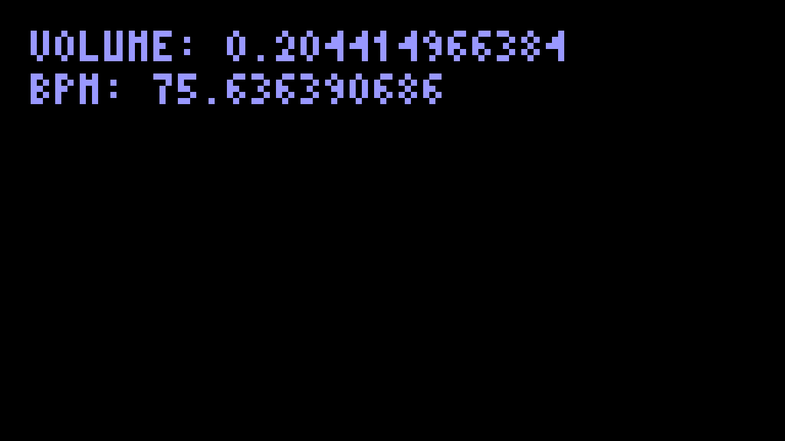

Video {#chap:video}
=====

Historically, Liquidsoap was dedicated to generating audio streams such as those
found in radios, even though it was conceived from the beginning in order to be
extensible with other kinds of data, such as video. When it started in 2004,
there was absolutely no video support, then some work began to add that around
2009, but it was still not much used, partly because it was quite
inefficient. Starting with the release of Liquidsoap 2.0 in 2021, the internal
coding of video changed to RGB to YUV420, which is much more compact and used by
most video libraries: Liquidsoap is now able to decently handle videos, as we
will see in this chapter.

Generating videos
-----------------

### Playing a video

Most sources accepting audio files (`single`, `playlist`, etc.) also accept
video files, so that generating a video stream is performed in the exact same
way you would generate an audio stream, excepting that you start from video
files instead of audio files. For instance, you can play a video file `test.mp4`
with\indexop{single}

```{.liquidsoap include="liq/play-video.liq" from=1}
```

The operator `output.audio_video`\indexop{output.audio\_video} plays both the audio and the video of the
source `s`, and you can use `output.video` to play the video only. These
operators chose a local output operator among the ones provided by
Liquidsoap. There are currently two of them:

- `output.sdl` which uses the SDL library to display the video, and
- `output.graphics` which uses the library provided by OCaml in order to display
  graphical data.

The videos can even be directly be pulled from YouTube with the `youtube-dl`\indexop{youtube-dl}
protocol, which requires that you have installed the
[`yt-dlp`](https://github.com/yt-dlp/yt-dlp) program:

```{.liquidsoap include="liq/play-video-yt.liq" from=1}
```

Since the whole video has to be downloaded beforehand, it can take quite some
time, which is why we specify a "large" `timeout` parameter (10 minutes instead
of the default 30 seconds).

As another example, if we have a playlist `video.playlist` of video files, it
can be played with\indexop{playlist}

```{.liquidsoap include="liq/play-video2.liq" from=1}
```

Generally, the video will be generated form a playlist using the `playlist`
operator or from user's request using `request.queue` operator. Those were
already presented in [there](#sec:inputs), nothing changes for video.

#### The webcam

\index{webcam}

Under Linux, it is possible to use our webcam as a source with the `input.v4l2`\indexop{input.v4l2}
operator which reads from the webcam:

```{.liquidsoap include="liq/v4l2.liq" from=1}
```

### Parameters of the video

The format used by Liquidsoap for videos can be changed by setting the following
configuration keys:

- `settings.frame.video.width`: width of videos (in pixels),
- `settings.frame.video.height`: height of videos (in pixels),
- `settings.frame.video.framerate`: number of images per seconds.

The default format for images is 1280×720 pixels at 25 images per seconds which
corresponds to the 720p (or _HD ready_) format. You can switch to 1080p (or
_Full HD_) format with

```{.liquidsaop include="liq/full-hd.liq"}
```

Remember that processing video data in realtime is very costly. Reducing the
resolution to 854×480 (called 480p) or even 640×360 (called 360p) will degrade
the quality of images, but can greatly improve the CPU consumption, in
particular if your server is getting a bit old: a low resolution video is better
than a laggy or jumpy one...

For convenience the functions `video.frame.width`, `video.frame.height` and
`video.frame.rate` are also defined and return the corresponding configuration
parameters.

### Blank and colored frames

The operator `blank`\indexop{blank} can generate video (in addition to audio): it will generate
an image which is _blank_, i.e. fully transparent. In order to generate a video
of a given color, you can use the `video.fill`\indexop{video.fill} operator which fills the video of
the source with the color specified in the `color` argument. For instance, the
script

```{.liquidsoap include="liq/video.fill.liq" from=1}
```

will play a red image. The color should be specified in hexadecimal, in the form
`0xrrggbb` where `rr` specifies the red intensity, `gg` the green and `bb` the
blue, each color ranges from `00` (color absent) to `ff` (color with maximum
intensity) in hexadecimal.

### Images

Images can be used as sources just as video files: they are accepted by
operators such as `single`, `playlist`, etc. For instance,

```{.liquidsoap include="liq/image.liq" from=1}
```

Liquidsoap will complain that it cannot decode the file `test.png`. This is
because, by default, Liquidsoap tries to decode the image with an audio track,
and this is not possible for an image. We can however force the source to have
no audio as follows, and you should then see the image:

```{.liquidsoap include="liq/image2.liq" from=1}
```

Here, `(x:source(audio=none))` means that we constrain `x` to be a source with no
audio, this mechanism is explained in more details in [there](#sec:source-type). In
order for you to avoid thinking of those subtleties, the standard library
provides the `image`\indexop{image} operator which does this for you and conveniently creates a
source from an image:

```{.liquidsoap include="liq/image3.liq" from=1}
```

You are advised to use this operator when dealing with images.

#### Specifying the dimensions

Decoders also take in account the following metadata when decoding images:

- `x`, `y`: offset of the decoded image (in pixels),
- `width`, `height`: dimensions of the decoded image (in pixels),
- `duration`: how long the image is made available.

This means that the script

```{.liquidsoap include="liq/image4.liq" from=1}
```

will show a small image of 50×50 pixels.

#### Cover art

\index{cover}

Most recent audio formats (such as mp3 or ogg) allow embedding the cover of the
album into metadata. Liquidsoap has support for extracting this and provides the
`video.cover`\indexop{video.cover} operator in order to extract the cover from an audio stream and
generate a video stream from it. The script

```{.liquidsoap include="liq/cover.liq" from=1 to=-1}
```

defines an audio source `a` from our music library, generates a video track `v` from its
covers with `video.cover`, adds it to the sound track `a` (with `mux_video`,
detailed below) and plays the result. It is important here that we use `mksafe`
around `video.cover` in order to play black by default: the source will not be
available when the track has no cover!

#### Playlists

If you want to rotate between images, you can use playlists containing
images. However, remember that images have infinite duration by default, and
therefore a `duration` metadata should be added for each image in order to
specify how long it should last. The most simple way of performing this is to
have entries of the form

```
annotate:duration=5:/path/toimage.jpg
```

Alternatively, if the playlist contains only the paths to the images, the
`duration` metadata can be added by using the `prefix` argument of the playlist
operator. For instance, the script

```{.liquidsoap include="liq/image-playlist.liq" from=1 to=-1}
```

will display for 2 seconds the images of the playlist `image.playlist`.

#### Changing images

The `image` operator produces a source with a method `set` which can be used to
change the displayed image: it takes as argument the new path to the image to
stream. For instance, the following script shows a random image in the current
directory every 2 seconds:

```{.liquidsoap include="liq/image-set.liq" from=1 to=-1}
```

In more details, the `file.ls(".")` function returns a list of files in the
current directory. We then use `list.filter` to extract all the files which end
with the `.png` or `.jpg` extension (the `string.match` function looks at whether the strings
match the regular expression `.*\\.png|.*\\.jpg` which means: "anything followed
by `.png` or anything followed by `.jpg`"). We define an `image` source `s` of
which we change the image every 2 second using the `set` method, with
`list.pick(files)` which picks a random element of the list `files`.

This mechanism can also be used to change the displayed image depending on some
metadata. For instance, consider the script

```{.liquidsoap include="liq/image-metadata.liq" from=1 to=-1}
```

It creates a source `a` from a playlist `playlist-with-image` which contains
audio songs with a metadata `image` indicating the image to display with the
song. Typically, a line of this playlist would look like

```
annotate:image="myimage.png":mysong.mp3
```

(or the metadata `image` could also be hardcoded in the audio files). It also
creates an `image` source `v`, whose image is set to the contents of the `image`
metadata of each new track in `a`. Finally, we show the source `s` obtained by
combining the audio source `a` and the video source `v`.

### Adding videos

Our beloved `add`\indexop{add} operator also works with videos. For instance, we can add a
logo on top of our video source `s` by adding a scaled down version of our
`logo.png` image:

```{.liquidsoap include="liq/add-videos.liq" from=1}
```

When taking a list of sources with video as argument, the `add` operator draws
the rightmost last: it is therefore important that the `logo` source is second
so that it is drawn on top of the other one.

Because one often does this, Liquidsoap provides the function `video.add_image`,
which allows adding an image on top of another source, and the previous script
can be more concisely written as

```{.liquidsoap include="liq/add-videos2.liq" from=1}
```

The function `video.add_image` moreover has the advantage of allowing getters
for the parameters, so that we can program a moving logo as follows:

```{.liquidsoap include="liq/add-videos3.liq" from=1}
```

#### Picture in picture

\index{scale}
\index{resize}

Instead of adding a small image on top of a big one, we can also add a small
video on top of a big one. In order to reduce the size of a video, we can either use

- `video.scale`: which scales a video according to a given factor `scale`,
- `video.resize`: which resizes a video to a given size specified by its `width`
  and `height`.

Both functions also allow translating the video so that the upper-left corner is
at a given position (`x`, `y`). 

For instance, the following script adds a small webcam capture on top of the
main video:

```{.liquidsoap include="liq/add-scale.liq" from=1}
```

Here, the main source `s` is a playlist of videos and `w` is the capture of the
webcam. Since it does not have audio (only video), we add to it a blank audio
track so that it has the same type as the source `s` and can be added with
it. We scale down the webcam image with `video.scale` and finally add it on top
of the main video with `add`.

#### Alpha channels

\index{alpha channel}

A defining feature of video in Liquidsoap is that _alpha channels_ are supported
for video: this means that images in videos can have more or less transparent
regions, which allows to see the "video behind" whenever adding videos. The
overall opacity of a video can be changed with the `video.opacity` operator,
which takes a coefficient between 0 (transparent) and 1 (fully opaque) in
addition to the source. For instance, with

```{.liquidsoap include="liq/video.opacity.liq" from=3 to=-1}
```

we are adding the source `s1` with the source `s2` made opaque at 75%: this
means that we are going to see 75% of `s2`, and the remaining 25% are from `s1`
behind.

Transparent regions are also supported from usual picture formats such as
png. In particular, when you add a logo to a video stream, it does not have to
be a square!

### Combining audio and video sources

\index{mux}

Given an audio source `a` and a video source `v`, one can combine them in order
to make a source `s` with both audio and video with the `mux_audio` and
`mux_video` operators, which respectively add audio and video to a source, by

```{.liquidsoap include="liq/mux_audio.liq" from=2 to=-1}
```

or

```{.liquidsoap include="liq/mux_video.liq" from=2 to=-1}
```

For instance, we can generate a stream from a playlist of audio files and a
playlist of image files with

```{.liquidsoap include="liq/audio-video-playlists.liq" from=1 to=-1}
```

The "opposite" of the muxing functions are the functions `drop_audio` and
`drop_video`, which respectively remove the audio and video channels from a video
track. For instance, if we have two sources `s1` and `s2` with both audio and
video, we can create a source `s` with the audio from `s1` and the video from
`s2` by

```{.liquidsoap include="liq/mix-av.liq" from=3 to=-1}
```

### (Cross)fading

\index{crossfading}

In order to have nice endings for video, one can use the `video.fade.out`
operator which will fade out to black (or actually rather to transparent) the
video. The time it takes to perform this is controlled by the `duration`
parameter (3 seconds by default), the kind of transition can be controlled by
the `transition` parameter whose values can be

- `fade`: perform a fade to blank,
- `slide_left`, `slide_right`, `slide_up`, `slide_down`: make the video slide
  left, right, up or down,
- `grow`: makes the image get smaller and smaller,
- `disc`: have a black disc covering the image,
- `random`: randomly choose among the previous transitions.

Similarly, the operator `video.fade.in` add fade effects at the beginning of
tracks:

```{.liquidsoap include="liq/video.fade.in.liq" from=2 to=-1}
```

Since the `add` and `cross` operators also work with video sources, this means
that we can nicely crossfade the tracks of a video playlist as follows:

```{.liquidsoap include="liq/video-cross.liq" from=2}
```

We apply fading at the beginning and the end of the videos, and then use the
`cross`\indexop{cross} operator to add the end of each track with the beginning of the next one
during 1.5 seconds. As a variant, slided transitions can be achieved with

```{.liquidsoap include="liq/video-cross2.liq" from=2}
```

### Test sources

\indexop{video.testsrc}

<!-- \TODO{See bug 1604, we should rename ffmpeg to video.testsrc, test it for sync and detail various test patterns} -->

In order to generate test videos, the operator `video.testsrc` can be used. For
instance,

```{.liquidsoap include="liq/video.testsrc.liq" from=1 to=-1}
```

will generate a video such as

{width=300px}\

The pattern displayed can be changed by passing the parameter `pattern` whose
value can be `"testsrc"` (the default value), `"testsrc2"`, `"smptebars"` or
`"rgbtestsrc"`.

### Text

\index{text}
\indexop{video.add\_text}

In order to add text on videos, we provide the `video.add_text` operator which,
in addition to the text to print and the source on which it should add the text,
takes the following optional arguments:

- `color`: color of the text, in the format `0xrrggbb` as explained above for
  `video.fill`,
- `font`: the path to the font file (usually in ttf format),
- `metadata`: metadata on which the text should be changed,
- `size`: the font size,
- `speed`: the speed at which it should scroll horizontally to have a "news
  flash" effect (in pixels per seconds, set to `0` to disable),
- `x` and `y`: the position of the text.

This function uses one of the various basic implementations we provide. You
should actually try those various implementations in order to reach what you
want: they have various quality and functionalities, and unfortunately we have
not found the silver bullet yet. Those implementations are

- `video.add_text.native`: the native implementation. It always works and does
  not rely on any external library, but uses a hand-made, hard-coded, low-fi
  font.
- `video.add_text.sdl` / `video.add_text.gd` / `video.add_text.gstreamer` /
  `video.add_text.ffmpeg`: synthesize the text using SDL, GD, GStreamer and
  FFmpeg libraries.
  
For instance,

```{.liquidsoap include="liq/video.add_text.liq" from=2 to=-1}
```

The text is a getter which means that it can vary over times. For instance, the
following prints the current volume\index{RMS} and BPM\index{BPM} of a song:

```{.liquidsoap include="liq/video.add_text-volume-bpm.liq" from=1}
```

and here is the output:

{width=300px} \

The position parameters are also getters, so that the position of the text can
also be customized over time. For instance, the following will add a text moving
along the diagonal at the speed of 10 pixels per second in each direction:

```{.liquidsoap include="liq/video.add_text2.liq" from=2 to=-1}
```

Filters and effects
-------------------

In order to change the appearance of your videos Liquidsoap offers video
effects. These are not as well developed as for audio processing, but this is
expected to improve in the future, and we support generic libraries which
provide a large amount of effects.

### Builtin filters

\index{filter!video}

By default, Liquidsoap only offers some very basic builtin video filters such as

- `video.greyscale`: convert the video to black and white,
- `video.opacity`: change the opacity of the video,
- `video.fill`: fill the video with given color,
- `video.scale` / `video.resize`: change the size of the video.

### Frei0r

\index{frei0r}

Liquidsoap has native support for [frei0r plugins](https://frei0r.dyne.org/),
which are based on the frei0r API for video effects. When those are installed on your system, they
are automatically detected and corresponding operators are added in the
language. Those have names of the form `video.frei0r.*` where `*` is the name of the
plugin. For instance, the following adds a "plasma effect" to the video:

```{.liquidsoap include="liq/frei0r.liq" from=2 to=-1}
```

Each operator (there are currently 129) of course has specific parameters which
allow modifying its effect, you are advised to have a look at their
documentation, as usual.

### FFmpeg filters {#sec:ffmpeg-filters}

\index{FFmpeg}

Another great provider of video (and audio) effects is FFmpeg: at the time of
writing, we currently have access to [447 of
those](https://ffmpeg.org/ffmpeg-filters.html)!  Its filters are a bit more
involved to use because FFmpeg expects that you create a _graph_ of filters (by
formally connecting multiple filters one to each other) before being able to use
this graph for processing data, and because it operates on data in FFmpeg's
internal format. Those filters can process both audio and video data, we chose
to present it here and not in [previous chapter](#chap:workflow) because it is
more likely to be used for video processing.

The basic function we are going to use for creating filters is
`ffmpeg.filter.create`. Its argument is a function `mkfilter` which takes as
argument the graph of filters we are going to build, attaches filters to it, and
returns the resulting stream. Usually this function

- uses the operators

  - `ffmpeg.filter.audio.input`
  - `ffmpeg.filter.video.input`

  to input from some stream,
- processes the stream using one or more `ffmpeg.filter.*` functions,
- outputs the result using one of the operators

  - `ffmpeg.filter.audio.output`
  - `ffmpeg.filter.video.output`
  - `ffmpeg.filter.audio_video.output`

In this way, we can define the following function `myfilter` which inputs the
audio track and add a flanger effect to it, inputs the video track, flips its
images horizontally and inverts the colors of the video, and finally outputs
both audio and video:

<!-- \TODO{could be simplified with audio + video output, see bug 1612} -->

```{.liquidsoap include="liq/ffmpeg-effect3.liq"}
```

The function can then be used on a source `s` as follows:

```{.liquidsoap include="liq/ffmpeg-effect4.liq" from=2}
```

If you look at the type of the function `myfilter`, you will see that it is

```
(source(audio=ffmpeg.audio.raw('a), video=ffmpeg.video.raw('b), midi=none)) -> source(audio=ffmpeg.audio.raw('d), video=ffmpeg.video.raw('e), midi=none)
```

which means that it operates on streams where both audio and video are in
FFmpeg's internal raw format (`ffmpeg.audio.raw` and `ffmpeg.video.raw`). In the
above example this is working well because

- sources which decode audio from files such as `single` (or `playlist`) can
  generate streams in most formats, including FFmpeg's raw,
- the encoder we have chosen operates directly on streams in FFmpeg's raw format
  (because we use an `%ffmpeg` encoder with `%audio.raw` and `%video.raw`
  streams).

<!--

The first problem is that the resulting source has no audio, because the filter
is only processing video. It is easy to preserve the audio of the original
source by changing the penultimate line

```liquidsoap
ffmpeg.filter.create(mkfilter)
```

to

NOTE: this is ffmpeg-effect2.liq
```liquidsoap
mux_audio(audio=drop_video(s), ffmpeg.filter.create(mkfilter))
```

which adds back the audio of the source `s` to the result.

TODO: this is bad because it involves unnecessary encoding of audio

Alternatively, we can process both audio and video in the filter by performing
both audio and video input in the filtered and use
`ffmpeg.filter.audio_video.output` to output both:

```{.liquidsoap include="liq/ffmpeg-effect3.liq"}
```
-->
<!--
This is fine if your effect applies on a decoding
source (such as `single` or `playlist`) because those know how to decode directly in FFmpeg's internal format.
-->

If you want to operate on a source `s` which is in the usual Liquidsoap's
internal format, you can use

- `ffmpeg.raw.encode.audio_video` to convert from Liquidsoap's internal to
  FFmpeg's raw format,
- `ffmpeg.raw.decode.audio_video` to decode FFmpeg's raw format into
  Liquidsoap's internal format.

For instance, from the above `myfilter` function, we can define a function
`myfilter'` which operates on usual streams as follows:

```{.liquidsoap include="liq/ffmpeg-effect5.liq" from=2}
```

by encoding before applying the filter and decoding afterward.

Encoders
--------

The usual outputs described in [there](#sec:outputs) support streams with video,
which includes

- `output.file`: for recording in a file,
- `output.icecast`: for streaming using Icecast,
- `output.hls`: for generating HLS playlists streams,
- `output.dummy`: for discarding a source.

We do not explain them here again: the only difference with audio is the choice
of the encoder\index{encoder} which indicates that we want to use sources with video.

### FFmpeg {#sec:ffmpeg-video}

The encoder of choice for video is FFmpeg\index{FFmpeg}, that we have already seen in
[here](#sec:ffmpeg-encoder). The general syntax is

```liquisoap
%ffmpeg(format="...", %audio(...), %video(...))
```

where the omitted parameters specify the format of the container, the audio
codec and the video codec.

#### Formats

The full list of supported formats can be obtained by running `ffmpeg
-formats`. Popular formats\index{container} for

- encoding in files:
  - `mp4` is the most widely supported, (its main drawback is that index tables
    are located at the end of the file, so that partially downloaded files
    cannot reliably be played, and the format is not suitable for streaming),
  - `matroska` corresponds to `.mkv` files, supports slightly more codecs than
  mp4 and it license-free, but is less widely supported,
  - `webm` is well supported by modern browsers (in combination with the VP9
    codec),
  - `avi` is getting old and should be avoided,
- streaming:
  - `mpegts` is the standard container for streaming, this is the one you should
    use for HLS for instance,
  - `webm` is a modern container adapted to streaming with Icecast,
  - `flv` is used by some old streaming protocols such as RTMP, still widely in
    use to stream video to platforms such as YouTube.

Many [other formats](https://ffmpeg.org/ffmpeg-formats.html) are also
supported.

#### Codecs

The codec\index{codec} can be set by passing the `codec` argument to `%video`.
The codecs all take `width` and `height` parameters, which allow setting the
dimensions of the encoded video. Remember that smaller images have lower
quality, but require smaller bitrates and encode faster. Common resolutions for
16:9 aspect ratio are

 360p     480p    720p     1080p
-------  ------- -------- ---------
640×360  854x480 1280×720 1920×1080

the "default reasonable value" being 720p nowadays. By default, the videos are
encoded at the dimensions of internal frames in Liquidsoap, which can be set via
`video.frame.width` and `video.frame.heigth`. If you only need to encode a video
to "small" dimensions, it is a better idea to lower these values than specifying
the codec parameters, in order to avoid computing large images which will be
encoded to small ones.

You generally also want to set the bitrate by passing the `b` argument in bits
per second (e.g. `b="2000k"`). Typical bitrates for streaming, depending on the
resolution, at 25 frames per second, are

 Resolution   Bitrate
-----------  --------
640×360       700k
1280×720      2500k
1920×1080     4000k

Alternatively, many encoders allow specifying a "quality" parameter instead of a
bitrate: in this case, it tries to reach a target quality instead of bitrate, by
increasing the bitrate on complex scenes. This is not advised for videos
intended for streaming since it can lead to unexpected bandwidth problems on
those scenes.

Another useful parameter is the GOP (group of picture) which can be set by
passing the argument `g` and controls how often keyframes are inserted (we
insert one keyframe every `g` frames). A typical default value is 12, which
allows easy seeking in videos, but for video streams this value can be increased
in order to decrease the size of the video. The habit for streaming is to have a
keyframe every 2 seconds or less, which means setting `g=50` at most for the
default framerate of 25 images per second.

We now detail the two most popular codecs H.264 and VP9, but there are [many
other ones](https://ffmpeg.org/ffmpeg-codecs.html).

#### H.264

The most widely used codec for encoding video is `libx264` which encodes in
H.264\index{H.264}. This format has hardware support in many devices such as smartphones (for
decoding). The most important parameter is `preset`, which controls how fast the
encoder is, and whose possible values are

> `ultrafast`, `superfast`, `veryfast`, `faster`, `fast`, `medium`, `slow`,
> `slower`, `veryslow`

with the obvious meaning. Of course, the faster the setting is the lower the
quality of the video will be, so that you have to find a balance between CPU
consumption and quality.

Instead of imposing a bitrate, one can also choose to encode in order to reach a
target quality, which is measured in _CRF_ (for Constant Rate Factor) and can be
passed in the `crf` parameter. It is an integer ranging from 0 ( the best quality) to
51 (the worse quality). In order to give you ideas,

- 0 is lossless,
- 17 is with nearly unnoticeable compression,
- 23 is the default value,
- 28 is the worse acceptable value.

Additional parameters can be passed in the `x264-params` parameter, e.g.

```
"x264-params"="scenecut=0:open_gop=0:min-keyint=150:keyint=150"
```

use this if you need very fine tuning for your encoding (you need to put quotes
around the parameter name `x264-params` because it contains a dash).

A typical setting for encoding in a file for backup would be

```{.liquidsoap include="liq/encoder-ffmpeg-h264-file.liq" from=2 to=-1}
```

and for streaming in HLS it would be

```{.liquidsoap include="liq/encoder-ffmpeg-h264-streaming.liq" from=2 to=-1}
```

<!-- See: https://obsproject.com/blog/streaming-with-x264 -->

The successor of H.264 is called H.265 (how imaginative) or HEVC and is
available through FFmpeg codec `libx265`. The parameters are roughly the same as
those for `libx264` described above.

#### VP9 and AV1

VP9\index{VP9} is a recently developed codec, which is generally more efficient than H.264
and can achieve lower bitrates at comparable quality, and is royalty-free. It is
supported by most modern browsers and is for instance the used by the YouTube
streaming platform. It is generally encapsulated in the WebM container although
it is supported by most modern containers.

The encoder in FFmpeg is called `libvpx-vp9`, some of its [useful
parameters](https://developers.google.com/media/vp9) are

- `quality` can be `good` (the decent default), `best` (takes much time) or
  `realtime` (which should be used in your scripts since we usually want fast
  encoding),
- `speed` goes from -8 (slow and high quality) to 8 (fast but low quality),
  for realtime encoding you typically want to set this to 5 or 6,
- `crf` controls quality-based encoding, as for H.264.

A typical WebM encoding would look like this:

```{.liquidsoap include="liq/encoder-ffmpeg-vp9-file.liq" from=2 to=-1}
```

and if you are on budget with respect to CPU and bandwidth:

```{.liquidsoap include="liq/encoder-ffmpeg-vp9-streaming.liq" from=2 to=-1}
```

The successor of VP9 is AV1\index{AV1} and is under heavy development and diffusion. It can
be used through the FFmpeg codec `libaom-av1` which essentially takes the same
parameters as `libvpx-vp9`.

### Ogg/Theora

We have support for the Theora\index{Theora} video codec encapsulated in ogg container,
already presented in [there](#sec:ogg). The encoder is named `%theora` whose
main parameters are

- `bitrate`: bitrate of the video (for fixed bitrate encoding, in bits per second),
- `quality`: quality of the encoding (for quality-based encoding, between 0 and 63),
- `width` / `height`: dimensions of the image,
- `speed`: speed of the encoder,
- `keyframe_frequency`: how often keyframes should be inserted.

For instance, we can encode a video in ogg with opus for the audio and Theora
for the video with

```{.liquidsoap include="liq/encoder-theora.liq" from=2 to=-1}
```

### AVI

Liquidsoap has native (without any external library) builtin support for
generating AVI\index{AVI} files with the `%avi` encoder. The resulting files contain raw
data (no compression is performed on frames), which means that we need to compute
almost nothing but also that it will not be compressed. This format should thus
be favored for machines which are tight on CPU but not on hard disk, for backup
purposes:

```{.liquidsoap include="liq/encoder-avi.liq" from=2}
```

You can expect the resulting files to be huge and you will typically want to
re-encode the resulting files afterward.

If you want to generate AVI files with usual codecs, you should use the FFmpeg
encoder presented above. For instance,

```{.liquidsoap include="liq/encoder-ffmpeg-avi.liq" from=2 to=-1}
```

Specific inputs and outputs
---------------------------

### Standard streaming methods

The two standard methods for streaming video are the same as those which have
already been presented for audio in [there](#sec:outputs): they are Icecast
(with `output.icecast`) and HLS (with `output.hls`). The only difference is that
the encoder should be one which has support for video.

### Streaming platforms

Another very popular way of streaming video is by going through streaming
platforms such as YouTube, Twitch or Facebook. All the three basically use the
same method for streaming. You first need to obtain a secret key associated to
your account on the website. Then you should send your video, using the RTMP
protocol, to some standard url followed by your secret key, using the
`output.url` operator, and that's it. Because of limitations of the RTMP
protocol, videos should be encoded using the FLV container with H.264 for video
and mp3 or aac for audio.

#### YouTube {#sec:youtube}

\index{YouTube}

The streaming key can be obtained from the [YouTube streaming
platform](https://youtube.com/live_dashboard) and the url to stream to is

```
rtmp://a.rtmp.youtube.com/live2/<secret key>
```

If we suppose that we have stored our key in the file `youtube-key`, we can
stream a video source `s` to YouTube by

```{.liquidsoap include="liq/video-youtube.liq" from=2 to=-1}
```

These settings are for quite low quality encoding. You should try to increase
them depending on how powerful your computer and internet connection are.

#### Twitch

\index{Twitch}

The streaming key can be obtained from the [Twitch
dashboard](https://dashboard.twitch.tv/settings/stream) and a [list of
_ingesting servers_](https://stream.twitch.tv/ingests/) is provided (the url you
should send your stream to is obtained by appending your key to one of those
servers). For instance:

```{.liquidsoap include="liq/video-twitch.liq" from=2 to=-1}
```

#### Facebook

\index{Facebook}

The url and streaming key can be obtained from the [Facebook Live
Producer](https://facebook.com/live/producer/). According to
[recommendations](https://facebook.com/help/1534561009906955), your video
resolution should not exceed 1280×720 at 30 frames per second, video should be
encoded in H.264 at at most 4000 kbps and audio in AAC in 96 or
128 kbps. Keyframes should be sent at most every two second (the `g` parameter
of the video codec should be at most twice the framerate). For instance,

```{.liquidsoap include="liq/video-facebook.liq" from=1}
```

### Saving frames

In case you need it, it is possible to save frames of the video with the
`video.still_frame`\indexop{video.still\_frame} operator: this operator adds to a source a method `save`
which, when called with a filename as argument, saves the current image of the
video stream to the file. Currently, only bitmap files are supported and the
filename should have a `.bmp` extension. For instance, the following script will
save a "screenshot" of the source `s` every 10 seconds:

```{.liquidsoap include="liq/screenshot.liq" from=1}
```
