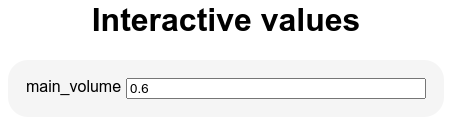
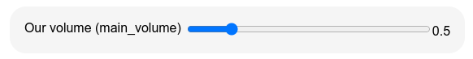
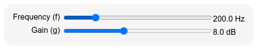
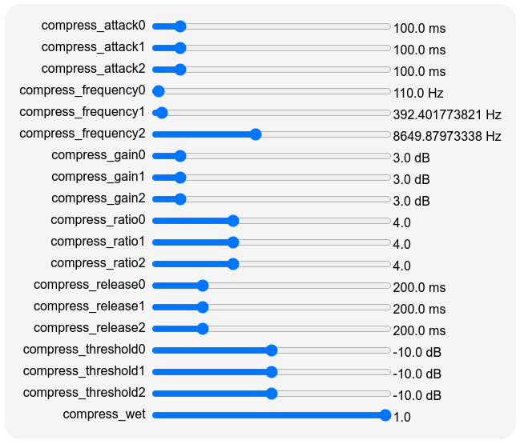

Full workflow of a radio station {#chap:workflow}
================================

This chapter explains in details the main tools and techniques in order to setup
a webradio. It essentially follows [the introductory chapter](#chap:quickstart),
but gives much more details about techniques and parameters one can use to
achieve his goals.

Inputs
------

### Playlists

A radio generally starts with a playlist, which is simply a file listing files
to be played. The `playlist`\index{playlist@\texttt{playlist}} operator does
that: it takes as a playlist argument and plays it. For instance, the script

```{.liquidsoap include="liq/playlist2.liq" from=1}
```

will play all the files listed in the `my_playlist` playlist. The operator also
accepts a directory as argument, in which case the playlist will consist of all
the file in the directory: the script

```{.liquidsoap include="liq/playlist.liq" from=1}
```

will play all the files in the `Music` directory. The format of the playlists
generally consist in listing files, with one file per line, such as

```
/data/mp3/file1.mp3
/data/mp3/file2.mp3
/data/mp3/file3.mp3
http://server/file.mp3
ftp://otherserver/file.mp3
```

but other more advanced playlist formats are also supported: pls, m3u, asx,
smil, xspf, rss podcasts, etc. Those are generally created by using dedicated
software.

By default, the files are played in a random order but this can be changed with
the `mode` parameter of `playlist` which can either be

- `"normal"`: play files in order,
- `"randomize"`: play files in a random order chosen for the whole playlist at
  each round (default mode),
- `"random"`: pick a random file each time in the playlist (there could thus be
  repetitions in files).

\TODO{explain the loop argument}
  
By default, the playlist is never reloaded, but this can be changed by using the
parameters `reload` and `reload_mode`, for instance:

- reload the playlist every hour (1 hour being 3600 seconds):
  
  ```liquidsoap
  s = playlist(reload=3600, reload_mode="seconds", "playlist")
  ```

- reload the playlist after each round (when the whole playlist has been played):

  ```liquidsoap
  s = playlist(reload=1, reload_mode="rounds", "playlist")
  ```
  
- reload the playlist whenever it changes (this requires Liquidsoap being
  compiled with support for the inotify library):

  ```liquidsoap
  s = playlist(reload_mode="watch", "playlist")
  ```
  
\TODO{also present the reload method}

Another useful option is `check_next`, to specify a function which will
determine whether a file should be played or not in the playlist: this function
takes a request as argument and returns a boolean. For instance, we can ensure
that only the files whose name end in ".mp3" are played with

```{.liquidsoap include="liq/playlist-check.liq" from=1 to=-1}
```

The function `check` takes the request `r` given as argument, extracts its uri,
and then returns true or false depending on whether this uri ends with ".mp3" or
not. As another example, we can base our decision on the metadata of the file
as follows:


```{.liquidsoap include="liq/playlist-check2.liq" from=1 to=-1}
```

Here, we use the function `request.read_metadata` to force the reading of the
metadata for the request (this is not done by default at this point), obtain the
metadata with `request.metadata`, and declare that we should play a file only if
its genre is "Rock" (remember that the metadata are encoded as an association
list as explained in [there](#sec:association-list)).

\TODO{do the same with playlist.list which has the advantage of being predictable and more efficient, but takes time at startup...}

```{.liquidsoap include="liq/playlist-check3.liq" from=1 to=-1}
```

If you only need to play one file, you can avoid creating a playlist with this
file only, by using the operator `single` which loops on one file. This operator
is also more efficient in the case the file is distant because it is downloaded
once for all:

```liquidsoap
s = single("http://server/file.mp3")
```

By the way, if you do not want to loop over and over the file, and only play it
once, you can use the operator `once` which takes a source as argument and plays
one song of this source (it becomes unavailable after that).

```liquidsoap
s = once(single("http://server/file.mp3"))
```

### Distant streams

The operators `playlist` or `single` make sure in advance that the file to be
played is available: in particular, they download distant files so that we are
sure that they are ready when we need them. Because of this, they are not
suitable in order to play continuous streams (which are very long, or even
infinite), because Liquidsoap would try to download them entirely before reading
them.

This is the reason why the `input.http` operator should be used in order to play
a stream:

```{.liquidsoap include="liq/input.http.liq" from=1 to=-1}
```

This operator works with streams such as those generated by Icecast, but also
with playlists containing streams. It will regularly pull data from the given
location, and therefore should be used for locations that are assumed to be
available most of the time. If not, it might generate unnecessary traffic and
pollute the logs: in this case, it is perhaps better to inverse the paradigm and
use the `input.harbor` operator described below, which allows the distant stream
to connect to Liquidsoap. If the stream is using secure http protocol (if the
uri starts with `https://...`), the operator `input.https` should be used
instead.

Streams in HLS format are quite different from the above (they consist of a
rolling playlist of short audio segments, see [there](#sec:HLS)) and are
therefore handled by a different operator, `input.hls`:

```{.liquidsoap include="liq/input.hls.liq" from=1 to=-1}
```

<!--
In this protocol the stream is segmented in small files and Liquidsoap will
regularly look for new segments (how often can be controlled by the `reload`
parameter).
-->

<!--
\TODO{polish this: we can use input.ffmpeg}
TODO: the format is optional and usually well detected, the list of supported formats can be obtained with `ffmpeg -formats`

```{.liquidsoap include="liq/input.ffmpeg-hls.liq"}
```
-->

### Interactive playlists {#sec:request.dynamic}

\TODO{mention that `playlist` is implemented with `playlist.dynamic`}

Instead of having a static playlist, you might want to use you own script to
generate the song which should be played next (e.g. you might fetch requests
from users from the web or a database, or you might have a neural network
deciding for you which song is the best to be played next). In this case you
should use `request.dynamic`, which takes as argument a function returning the
next song to be played. This function has type `() -> request('a)`, meaning that
it takes no argument and returns a request. For instance, suppose that we have a
script called `next-song`, which echoes the next song to be played on the
standard output. A degenerate example of such a script, using the shell, could
be

```{.bash include="liq/next-song"}
```

which always returns `test.mp3` as song to be played, but of course you could
use any program in any programming language as long as it outputs the file to be
played on the standard output. We can then query this script in order to play
song as follows:

```{.liquidsoap include="liq/request.dynamic.liq" from=1 to=-1}
```

Here, our `next` function executes the above script `next-song`, using the
function `get_process_lines` which returns the list of lines returns by the
script. We then take the first line with `list.hd` and return a request from
created from it using `request.create`. As a variant, suppose that the next song
to be played is present in a file named `song`. We can play it as follows:

```{.liquidsoap include="liq/request.dynamic2.liq" from=1 to=-1}
```

The `check` function now reads the contents of the file `song` and creates a
request from it. In the case were the file is empty there is no song to play,
and in this case we return the value `null` to indicate it. The `retry_delay`
parameter of `request.dynamic` indicates that, in this last case, we should wait
for 1 second before trying again. This example is not perfect: there is a chance
that a given song will be played multiple times if we don't update the file
`song` timely enough: we see a better way of achieving this kind of behavior in
next section.

### Request queues {#sec:request.queue}

In an interactive playlist, the operator asks for the next song. But in some
situations, instead of this passive way of proceeding (you are asked for songs),
you would rather have an active way of proceeding (you inform the operator of
new files when you have some). Typically, if you have a website where users can
request songs, you would like to be able to put the requested song in a playlist
at the moment the user requests it. This is precisely the role of the
`request.queue` operator, which maintains a list of songs to be played in a
queue (the songs are played in the order they are pushed). A typical setup
involving this operator would be the following:

```{.liquidsoap include="liq/request.queue.liq" from=1}
```

We have both a playlist and a queue, and the radio is defined by using the
`fallback` operator which tries to fetch the stream from the queue and if none
is available defaults to the playlist. The `track_sensitive=false` instructs
that we should play the stream from the queue as soon as it is available: by
default, `switch` will wait for the end of the current track before switching to
the queue.

#### Pushing songs in a queue

You might wonder then: how do we add new songs in the queue?  The role of the
first line is to instruct Liquidsoap to start a server, which is listening by
default on port 1234, on which commands can be sent; we refer the reader to
[this section](#sec:telnet) for details about this telnet server. The queue will
register a new command on this server so that if you connect to it and write
`queue.push` followed by an uri, it will be pushed into the queue. In practice
this can be done with commands such as

```
echo "queue.push test.mp3" | nc localhost 1234
```

which uses the standard unix tool `nc` to connect to the server on supposed to
be running on the local host on port 1234, and write the command `queue.push
test.mp3` on this server, to which it will react by adding the song "`test.mp3`"
on the queue.

If you have multiple queues in your script, you can specify their names by
specifying the `id` parameter of `request.queue`, which can be any string you
want, so that the command will be `id.push` (where `id` is replaced by the id
you specified) and you know in which queue you are pushing. For instance, in the
script

```{.liquidsoap include="liq/request.queues.liq" from=1}
```

the two queues are respectively called `q1` and `q2`, so that we can push a song
on the second queue by issuing the telnet command `q2.push file.mp3`.

It is also possible to push a request into the queue directly from Liquidsoap by
using the method `push` of a source defined by `request.queue` to push a request
on it, or the method `push.uri` to push an uri. For instance, consider the
following script

```{.liquidsoap include="liq/request.queue-push.liq" from=1}
```

It uses an auxiliary queue `q`, and uses the function `thread.run` to execute
every minute a function which pushes in to the queue the uri `"say:Another
minute has passed!"`. Because it begins by "`say:`" Liquidsoap will use a speech
synthesis software to turn the text into audio, as detailed below, and we will
hear "Another minute has passed" every minute, over the playlist (the `add`
operator plays simultaneously all the sources in its input list).

#### Implementation of queues

Incidentally, the function `request.queue` is implemented in Liquidsoap, by
using a list to maintain the queue of requests. Here is a slightly simplified
version of it:

```{.liquidsoap include="liq/request.queue-implementation.liq" from=1 to=-1}
```

Internally, it maintains a reference on a list called `queue`. The `next`
function pops the first element of the list and returns it (or `null` if the
queue is empty) and the `push` function adds a new request at the end of the
list. Finally, the source is created by `request.dynamic` with `next` as
function returning the next request; note that we use the labeled argument
`available` which is a boolean getter indicating whether or not the function
`next` has a meaningful next request to answer (it does not when the list is
empty). Finally, the source is returned, decorated with the method `push`.

### Protocols

We have seen that playlists can either contain files which are local or distant,
the latter beginning by prefixes such as "`http:`" or "`ftp:`". A _protocol_ is
a way of turning such a prefixed uri into an actual file. Most of the time it
will consist in downloading the file in the appropriate way, but not
only. Liquidsoap supports many protocols and even the possibility of adding your
own.

For instance, the `youtube-dl` protocol allows the use of the `youtube-dl`
program in order to download files from youtube.

```{.liquidsoap include="liq/youtube-dl.liq" from=1 to=-1}
```

when playing such a file, we need to do more than simply connect to some
particular location over the internet, and have to do tricky stuff in order to
fetch the video from youtube. Similarly, the `say` protocol uses the
text-to-speech software `text2wav` provided by the festival project in order to
synthesize speech. For instance,

```{.liquidsoap include="liq/say.liq" from=1 to=-1}
```

Incidentally, the `prefix` parameter of `playlist` can be used to add a prefix
to every element of the playlist, which is typically useful for
protocols. Typically, the following will read out the paths of the file in the
playlist:

```{.liquidsoap include="liq/say-playlist.liq" from=1 to=-1}
```

Another very useful protocol is `annotate` which adds metadata to the following
song, as in

```
annotate:artist=The artist,comment=Played on my radio:test.mp3
```

In particular, this can be used to add metadata in playlists (which can contain
files beginning with `annotate:`), to specify the usual information such as
artist and title (although those are generally already present in files), but
also internal information such as cue in and cue out time.

 More powerful, the `process` protocol allows to launch any command in order to
process files. The syntax is

```
process:<ext>,<cmd>:uri
```

where `<ext>` is the extension of the produced file, `<cmd>` is the command to
launch and `uri` is the uri of a file. In `<cmd>`, `$(input)` will be replaced
by the input file and `$(output)` by the output file (a temporary file whose
extension is `<ext>`. For instance, we can convert a file `test.mp3` in stereo
wav (even if the input file is mono) by:

```{.liquidsoap include="liq/process1.liq" from=1 to=-1}
```

When playing it, Liquidsoap will first download `test.mp3` into some place (say
`/tmp/temp.mp3`) and then execute

```
ffmpeg -y -i /tmp/temp.mp3 -ac 2 /tmp/temp.wav
```

in order to convert it to stereo wav, and then play the resulting temporary file
`/tmp/temp.wav`. The protocol `process` also accepts files of the form

```
process:<ext>,<cmd>
```

in which case only `$(output)` will be replaced in the command. For instance,
the implementation of text-to-speech in Liquidsoap essentially amounts to doing

```{.liquidsoap include="liq/process2.liq" from=1 to=-2}
```

which will run

```
echo 'Hello world!' | text2wave > /tmp/temp.wav
```

and play the resulting file.

#### Registering new protocols

One of the most powerful features of Liquidsoap is that it gives you the ability
of registering your own protocols. For instance, suppose that we have a program
`find_by_artist` which takes as argument the name of an artist and prints a
lists of music files from this artist. Typically, this would be achieved by
looking into a database of all your music files. For instance,

```
find_by_artist Halliday
```

will print

```
/data/mp3/allumer_le_feu.mp3
/data/mp3/l_envie.mp3
/data/mp3/que_je_t_aime.mp3
```

We are going to define a new protocol named `artist` so that, when playing a
file such as `artist:Halliday`, Liquidsoap will run the above command in order
to find a song. This can be done by using the `add_protocol` operator: its first
mandatory argument is the name of the protocol (here, `artist`) and the second
one is a function which takes as arguments

- a function `rlog` to log the resolution process (you can use it to print
  whatever is useful for you to debug resolution problems),
- a duration `maxtime` in seconds which the resolution should not exceed (you
  should be careful about it when querying distant servers which might take a
  long time for instance),
- the request,

and returns a list of file names (which might use any protocol again)
corresponding to the request (Liquidsoap will play one of them). In our example,
we implement the protocol as

```{.liquidsoap include="liq/add_protocol2.liq" from=1 to=-3}
```

We use the `add_protocol` to register our protocol `artist`, where the function
`artist_protocol`, which returns the list of files corresponding to a request,
simply returns the list of all the files printed by the command
`find_by_artist`. The `doc` parameter is free form documentation for the
protocol and the `syntax` parameter provides an illustration of a typical
request using this protocol (both are only for documentation purposes). Once
this defined, we can finally play songs of any artist:

```liquidsoap
s = single("artist:Haliday")
```

and, of course, an uri such as `artist:Haliday` could also be used in a playlist
or pushed in a request queue.

<!--
TODO: some other useful predefined protocols:

- s3
- annotate (detailed below)
- There is a [list of
protocols](https://www.liquidsoap.info/doc-dev/protocols.html)
-->

### Soundcard inputs

In order to input sound from a soundcard you should use functions such as
`input.alsa` or `input.pulseaudio` or `input.portaudio` depending on the library
you want to use for this: the first one is a little more efficient, because
closer to the hardware, and the second is more portable and widespread. For
instance, you can hear your voice with

```{.liquidsoap include="liq/mic.liq" from=1}
```

Basically, this scripts plays the stream generated by `input.alsa`. However, we
have to use the `buffer` operator in order to bufferize the stream coming from
the soundcard and deal with with synchronization issues between the input and
the output, as detailed in [there](#sec:clocks-ex).

If you want to use a particular device, you should use the parameter `device` of
`input.alsa`, which takes as argument a string of the form `hw:X,Y` where `X` is
the card number and `Y` is the device number. The list of all devices available
on your computer can be obtained with the command

```
aplay -l
```

On my computer this returns

```
card 0: PCH [HDA Intel PCH], device 0: ALC3246 Analog [ALC3246 Analog]
  Subdevices: 0/1
  Subdevice #0: subdevice #0
card 0: PCH [HDA Intel PCH], device 3: HDMI 0 [HDMI 0]
  Subdevices: 1/1
  Subdevice #0: subdevice #0
```

so that if I want to input from HDMI, I should use `hw:0,3` as `device`
parameter.

By default, the ALSA operators have an internal buffer in order to be able to
cope with small delays induced by the soundcard and the computer. However, you
can set the `bufferize` parameter to `false` in order to avoid that in order to
reduce latencies. For instance, if you are lucky, you can hear your voice
almost in realtime, with some flanger effect added just for fun:

```{.liquidsoap include="liq/alsa-realtime.liq" from=1}
```

Beware that by reducing the buffers, you are likely to hear audio glitches due
to the fact that blank is inserted when audio data is not ready soon enough. In
this case, you should also see the following in the logs

```
Underrun! You may minimize them by increasing the buffer size.
```

which indicates that you should buffer in order to avoid defects in the audio.

### Icecast inputs with harbor {#sec:input.harbor}

Many programs are able to stream to an Icecast server, and we can use those as
an input for Liquidsoap scripts with the `input.harbor` operator. This operator
instructs Liquidsoap to run an Icecast-compatible server, called
_harbor_\index{harbor}. Clients can then connect to it, as they would do on any
Icecast server, and the stream they send there is then available as a source in
your script. This can be useful to relay a live stream without polling the
Icecast server for it, or if you have punctual distant interventions from live
speakers or DJs (for instance the [Mixxx](https://mixxx.org/) software can be
used to easily make mixes from home). A typical setup would be

```{.liquidsoap include="liq/input.harbor.liq" from=1}
```

In this example, we use the `playlist` source by default, but we give priority
to the `live` source, which is a harbor input, available only when some client
connects to it. Apart from the parameters specifying the port and the password
to use when connecting, the unlabeled argument specifies the _mountpoint_: this
should be specified by the client when connecting, which means that a same
harbor server can simultaneously relay multiple sources, as long as they use
different mountpoints.

In order to test the above script, you can use your favorite tool to stream to
Icecast. Ours obviously being Liquidsoap, you can run the script

```{.liquidsoap include="liq/input.harbor-client.liq" from=1}
```

which will stream connect to the harbor Icecast server and stream our music
library in mp3 format.

#### Security

Since harbor exposes a server to the internet, you should be serious about
security and think thoroughly about who should be having access to this
server. The fact that the server is programmed in OCaml makes it quite unlikely
that an exploit such as a buffer overflow is possible, but one never knows.

First the list of IPs which are allowed to connect to harbor can be changed with
the following setting:

```liquidsoap
set("harbor.bind_addrs", ["0.0.0.0"])
```

It takes as argument a list of allowed IPs, the default one 0.0.0.0 meaning that
every IP is allowed.

In practice, it is often quite difficult to know in advance the IPs of all the
clients, so that the main security is given by the password which is passed as
argument of `input.harbor`: please chose it wisely, and avoid at any means the
default password `"hackme"`. Even with a strong password, the security is not
very good: if some of the clients leaks the password or you want to revoke some
a client, you have to change it for every client which is not convenient. For
this reason, the authentication can also be done through a function, which is
passed as the `auth` argument of `input.harbor` and is of type `(string, string)
-> bool`: it takes as argument the username and the password of a client trying
to log in and returns whether it should be allowed or not. Typically, you would
like to call an external script, say `harbor-auth`, which will take the username
and password as argument and print "`allowed`" if the user is allowed (such a
command would usually look into a database to see whether the credentials match,
and perhaps do additional checks such as ensuring that the user has the right to
connect at the given time).

```{.liquidsoap include="liq/input.harbor-auth.liq" from=1}
```

Here, our function `auth` begins by executing the script `harbor-auth` with the
username and password as argument. Note that we use `string.quote` to escape
shell special characters, so that the user cannot introduce shell commands in
his username for instance... The `process.read.lines` function returns the list
of lines returned by our script and our function returns `true` or `false`
depending on whether this first line is "`allowed`" or not. In this way you
could easily query an external database of allowed users.

Finally, the clients should be able to determine that they are really connected
with your server and not some hacker's one. The best way to achieve that is to
use SSL certificates, which can be handled with the `input.harbor.ssl` variant
of the harbor source (it is present only if Liquidsoap has been compiled with
SSL support). The certificate can be specified with the setting
`harbor.ssl.certificate` (the setting `harbor.ssl.private_key` can also be used
to specify the private key and `harbor.ssl.password` the password to unlock the
private key). Obtaining a proper SSL certificate can be tricky. You may want to
start with a self-signed certificate first, which you can for instance obtain
from [Let's Encrypt](https://letsencrypt.org/). Alternatively, a self-signed
certificate for local testing you can use the following one-liner:

```
openssl req -x509 -newkey rsa:4096 -sha256 -nodes -keyout server.key -out server.crt -subj "/CN=localhost" -days 3650
```

### External inputs

In case you are still not satisfied (for instance, if you have very specific
needs or are the proud owner of hardware which is not widely supported), it is
possible to use any program as an input, as long as this program echoes audio on
its standard output either in wav or in raw audio format, with the operators
`input.external.wav` and `input.external.rawaudio`. Here, "raw audio" data
consists in interleaved samples encoded as signed 16 bits little-endian integers
(the use of the wav format is preferable to avoid confusions about the encoding
format). For instance, we can play a sine wave which is generated by the program
`ffmpeg` with

```{.liquidsoap include="liq/input.external.wav.liq" from=1 to=-1}
```

or with

```{.liquidsoap include="liq/input.external.rawaudio.liq" from=1 to=-1}
```

The argument `cmd` is the program which is going to be executed: here, we use
`ffmpeg` , which is instructed to generate a sine at 440 Hz (`-i
'sine=frequency=440'`) in stereo (`-ac 2`), encode it in wav (`-f wav`) or raw
format (`-f s16le`), and output it on the standard output (`-`).

#### Jack input

If the other program has support for it, it is possible to use
Jack\index{Jack} with the `input.jack` operator. This library is dedicated to
the communication of audio data between programs and greater stability and
precision is expected than with the above method. We do not detail it here,
because it involves some configuration (in particular, a dedicated Jack server
should be running) which is not specific to Liquidsoap.

#### GStreamer input

Finally, another very general possibility for input is to use the
`input.gstreamer.audio` operator in order to use the GStreamer\index{GStreamer}
library to generate audio. The generation itself is described through a
_pipeline_ which consists in a sequence of GStreamer operators separated by
"`!`": a pipeline "`a ! b`" means that the output of operator "`a`" should be
fed to operator "`b`". We refer the reader to the documentation of the library
for more information about it. In Liquidsoap, the pipeline can be passed in the
argument labeled `pipeline`, as expected. For instance, we can generate a sine
wave (again) with

```{.liquidsoap include="liq/input.gstreamer.liq" from=1 to=-1}
```

where we use the operator `audiotestsrc` to generate a sine, which we pipe to
the `audioamplify` operator to change its volume. Similarly, we can play the
file `test.mp3` with

```{.liquidsoap include="liq/input.gstreamer2.liq" from=1 to=-1}
```

In practice, no one would use the above example as is, because Liquidsoap
already has builtin support for using GStreamer to decode files...

### Webcast

TODO

Scheduling
----------

Now that we have a wide panel of sources, we need to combine them.

### Fallback {#sec:fallback}

The first way of combining sources is through the `fallback` operator, which
takes as argument a list of sources, and plays the first one which is available,
i.e. can produce some stream. We have already seen examples of this with request
queues ([here](#sec:request.queue)) such as

```liquidsoap
radio = fallback([queue, playlist])
```

Here, we want to play a song from the request queue when there is one, otherwise
we play songs from the playlist. By default, if we are playing a song from the
playlist and there is a new song in the queue, the operator will wait for the
current playlist song to finish before playing the one from the queue. This
behavior can be changed by setting the `track_sensitive` parameter to `false`,
in which case the song from the queue will be immediately played:

```liquidsoap
radio = fallback(track_sensitive=false, [queue, playlist])
```

Typically, you would use this to switch to a live show when available

```{.liquidsoap include="liq/input.harbor.liq" from=1 to=-1}
```

or to feature live interventions when someone is speaking on the microphone

```{.liquidsoap include="liq/blank.strip.liq" from=1 to=-1}
```

In this last example, we are using the operator `blank.strip` to make the source
`mic` unavailable when there are at least 2 seconds of silence (the duration is
controlled by the `max_blank` argument, and the `threshold` argument indicates
that we consider anything below -20 dB as silence): in this case, the `fallback`
operator will default to the `music` playlist until someone is speaking again.

In order to make a source `s` always available, it is quite common to stream
blank when the source is not available, i.e. re-define the source

```{.liquidsoap include="liq/fallible3.liq" from=1 to=-1}
```

with a fallback on blank. Since this is quite common in scripts, the function
`mksafe` is defined in the standard library as a shorthand, and the above is
equivalent to writing

```liquidsoap
s = mksafe(s)
```

#### Skipping fallback

In a fallback situation where we have a live source and a music playlist as
above, the solution we provided is not entirely satisfactory: when the live
source ends, the music source is played again where we left it, whereas it is
often the case that we want to start on a fresh track. The `fallback.skip`
operator allows precisely this: the script

```{.liquidsoap include="liq/fallback.skip.liq" from=5 to=-1}
```

will play the `live` source and default to the `music` source, like a regular
track insensitive fallback operator, but it will also skip the current track of
the `music` source after switching to the `live` source, so that we will begin
on a fresh track when switching back again to `music`.

### Switching and time predicates

Another way of selecting between sources is the `switch` operator which takes as
argument a list, whose elements are pairs consisting of a predicate and a
source. Here, each _predicate_ is function taking no argument an returning a
boolean (it is of type `() -> bool`) indicating whether the corresponding source
should be played or not. The `switch` operator will then select the first source
whose predicate returns `true`. For instance, supposing that we have two
different playlists for night and day, we could alternate between those
depending on the hour with

```{.liquidsoap include="liq/switch.liq" from=3 to=-1}
```

Here also, the `track_sensitive` parameter controls whether a change of source
only occurs at track boundaries (when `true`, which is the default) or as soon
as possible.

If you want to make sure that there is always something to play, the condition
of the last source should always be true, i.e. you can use `{true}`. For
instance,

```{.liquidsoap include="liq/switch2.liq" from=4 to=-1}
```

will have two special programs on morning and evening, and will default to the
`music` playlist at other times. We thus obtain the same behavior as if we had
used a `fallback` operator:

```{.liquidsoap include="liq/switch2-fallback.liq" from=4 to=-1}
```

#### Time predicates

In the above examples `{0h-7h}` is a _time predicate_: it is something which is
`true` or `false` depending on the current time. Some other examples of time
predicates are

-------------   -------------------------------------
`{11h15-13h}`   between 11h15 and 13h
`{12h}`         between 12h00 and 12h59
`{12h00}`       at 12h00
`{00m}`         on the first minute of every hour
`{00m-09m}`     on the first 10 minutes of every hour
`{2w}`          on Tuesday
`{6w-7w}`       on weekends
-------------   -------------------------------------

Above, `w` stands for weekday: 1 is Monday, 2 is Tuesday, and so on. Sunday is
both 0 and 7.

#### Other predicates

We could also use this operator to manually switch between sources. As an
illustration, suppose that we have two radio streams named `radio1` and `radio2`
then we could use a script such as

```{.liquidsoap include="liq/switch3.liq" from=6 to=6}
```

where the predicate `p` determines when `radio1` should be played. For instance,
if we want to play it when a file `select-radio` contains "`1`", we could define
it as

```{.liquidsoap include="liq/switch3.liq" from=3 to=3}
```

Another way to achieve this could be use an "interactive boolean", as detailed
in [there](#sec:telnet), and defined instead

```{.liquidsoap include="liq/switch3.liq" from=4 to=5}
```

The interactive boolean is a sort of reference whose value can be changed over
the telnet by issuing commands such as "`var.set r1 = true`", which sets the
value of the boolean named `r1` to `true`. Therefore, we can switch to radio 1
by typing the command

```
echo "var.set r1 = true" | nc localhost 1234
```

and back to radio 2 with

```
echo "var.set r1 = false" | nc localhost 1234
```

(or directly connecting to the telnet server and issuing the commands).

### Adding

Instead of switching between two sources, we can play them together with the
`add` operator, which takes a list of sources whose sound are to be added. For
instance, if we want to make a radio consisting of a microphone input together
with background music (which is often called a "bed"), we can define

```{.liquidsoap include="liq/add.liq" from=3 to=-1}
```

This will play the two sources `mic` and `bed` at equal volume. By default, the
volume of the output is divided by 2 (because there are 2 sources) in order not
increase the loudness too much. If you want to keep the original volume of the
sources, you should set the `normalize` parameter to `false`:

```{.liquidsoap include="liq/add2.liq" from=3 to=-1}
```

but beware that this might result into some clipping if the two sources are
loud, which is never nice to hear\TODO{some more explanations about this in section... below}. The operator also offers the possibility of
weighting the sources: if we want to hear the microphone twice as loud as the
bed, we should give the microphone twice the weight of the bed. The weight of
each source can be specified in a list passed in the `weights` arguments. For
instance,

```{.liquidsoap include="liq/add3.liq" from=3 to=-1}
```

assigns the weight `2.` to `mic` and `1.` to `bed`. This is equivalent to
amplifying each of the sources with the corresponding factor, i.e.

```{.liquidsoap include="liq/add4.liq" from=3 to=-1}
```

but more efficient and natural.

As a side note, the operator `add` only adds the sources which are ready. This
means that if `mic` is taken from an harbor input such as

```{.liquidsoap include="liq/add.liq" from=1 to=1}
```

and the client did not connect or was disconnected, we will hear only the bed,
as expected.

### Sequencing

The `sequence` operator allows a behavior which sometimes useful: it takes as
argument a list of sources and plays one track from each source in order, and
finally keeps on playing tracks from the last source. This means that

```liquidsoap
s = sequence([s1, s2, s3])
```

will play one track from `s1`, one track from `s2` and will then keep on playing
`s3`. We will for instance use this in [section below](#sec:transitions) in
order to insert jingles during transitions.

### Jingles and ads

Jingles are short announcements, generally indicating the name of the radio or
the current show. They are quite important in order for the listener to remember
the brand of your radio and create some familiarity with the radio (the music
changes but the jingles generally remain the same). Technically, jingles are not
different from any other music source, but we give here the usual ways of
inserting those, presenting tricks which might be useful in other situations too
(in particular, ads follow basically the same techniques). We suppose here that
we have a source `music` which plays our music and a source `jingles` which
plays jingles: typically, it will be defined as

```{.liquidsoap include="liq/jingles-add.liq" from=1 to=1}
```

where `jingles` is a playlist containing all our jingles.

#### Playing only one track with `switch`

Let us begin with a quite common but tricky feature. Suppose that we want to
play a jingle at the beginning of each hour, without interrupting the current
track. One would typically write a script such as

```{.liquidsoap include="liq/jingles-once.liq" from=3 to=-1}
```

which states that when the current minute of the time is "00", we should play
the `jingles` source. But this is not really good: if a track from the music
source starts at 11h58 and ends at 12h01 then no ad will be played around
noon. In order to accommodate for this, we are tempted to widen the time
predicate and replace the second line with

```liquidsoap
    ({00m-15m}, jingles),
```

Well, this is not good either: if a track of the music source ends at 12h01, we
now hear a jingle as expected, but we actually continuously hear jingles for 14
minutes instead of hearing only one. In order to fix this, we are tempted to use
the `once` operator and change the line to

```liquidsoap
    ({00m-15m}, once(jingles)),
```

This is not good either: `once(jingles)` plays only one track from `jingles`,
but during the whole execution of the script. This means that our script will
only work as expected on the first hour, where we will correctly hear one
jingle, but on the following hours we will hear no jingle because one has
already been played.

The right solution, consist in using the `predicate.once` function: it takes a
predicate `p` as argument, and returns a predicate which is true only once each
time `p` is continuously true. In case it helps, we have illustrated in the
following figure an example of a predicate `p` over time (below) and the
resulting predicate `predicate.once(p)` over time (above):

\

This means that `predicate.once({12h00-12h15})` is a predicate which is true
once between 12h00 and 12h15. This is exactly what we were looking for, and the
script we were looking for is

```{.liquidsoap include="liq/jingles-once2.liq" from=3 to=-1}
```

As a variant, if we wanted to play a jingle every half hour, we could replace
the second line by

```liquidsoap
    ({00m-15m or 30m-45m}, once(jingles)),
```

As another variant, if we wanted to play 3 jingles, we could write

```liquidsoap
    (predicate.at_most(3, {00m-15m}), jingles),
```

where `predicate.at_most` is similar to `predicate.once`, but is true a given
number of times instead of only once (its it pointless to play 3 jingles in a
row, but this can be quite useful for ads for instance).

If we want to add the jingle on top of the currently playing music, we can use
the function `available(p, s)` which takes as arguments a predicate `p` and a
source `s` and makes the source available only when the predicate is
satisfied. We can then add the music with the jingles source made available once
every half hour as follows:

```{.liquidsoap include="liq/jingles-available.liq" from=3 to=-1}
```

#### Delaying tracks

Another approach consists in using the `delay` function which prevents a source
from being available before some time. For instance, we can play a jingle
roughly every 30 minutes with

```{.liquidsoap include="liq/jingles-delay.liq" from=3 to=-1}
```

The function `delay` above enforces that, after playing a track, the source will
not be available again before 1800 seconds (which is 30 minutes). Therefore
every time the current music track ends and more than 30 minutes has passed
since the last jingle, a new one will be inserted. As a variant, we can add the
jingle on top of the currently playing music with

```{.liquidsoap include="liq/jingles-delay2.liq" from=3 to=-1}
```

\TODO{this is useful for non-track-sensitive switches to play one track, but
ensuring that is won't last longer, see https://github.com/savonet/liquidsoap/issues/1544}

#### Rotating tracks

How often we should play jingles, instead of being based on time, can be based
on tracks. The `rotate` operator allows implementing such behaviors by
specifying that we want to play a track of such source every n tracks of such
other source. This function takes a list of sources and a list of weights
associated to each source (in the argument labeled `weight`), and selects tracks
from the sources according to the weights. For instance, in the following script

```{.liquidsoap include="liq/jingles-rotate.liq" from=3 to=-1}
```

we play `jingles` with weight `1` and `music` with weight `4`: this means that
we are going to play one jingle, then four music tracks, then one jingle, then
four music tracks, and so on. If you want something less regular, the `random`
operator can be used instead of `rotate`:


```{.liquidsoap include="liq/jingles-random.liq" from=3 to=-1}
```

It is basically a randomized version of the previous source, which will randomly
chose tracks from `jingles` and `music`, the probability of choosing a track
from the later being four times the probability of choosing a track from the
former.

The `rotate` and `random` operators can also be used to vary the contents of a
source. For instance, if we wanted our `jingles` sources to play alternatively a
jingle, a commercial and an announcement for a show, we could have defined

```{.liquidsoap include="liq/jingles-rotate2.liq" from=1 to=-1}
```

#### Signaling

As a more advanced use of predicate, we would like to introduce the
`predicate.signal` function which creates a particular predicate which is false
most of the time, unless some other part of the program sends a "signal", in
which case the predicate becomes true once and then false again (until the next
signal). Concretely, we can use this function to create a predicate `p` by

```liquidsoap
p = predicate.signal()
```

The predicate `p` is false by default, in order to make it true we can send a
signal by calling its method `signal`, i.e. writing `p.signal()`. For instance,
in the script

```{.liquidsoap include="liq/jingles-signal.liq" from=3 to=-1}
```

we use `predicate.signal` to create a predicate `p` which controls playing
jingles (if there is no jingle to play we default to the `music` source). We
then use `thread.run` to execute `p.signal()` every 20 minutes (or 1200
seconds). This means that every 20 minutes (or a bit more because we are waiting
for the current track of `music` to end), we will hear a jingle.

Of course, this is not the way one would typically regularly insert jingles, but
this can easily be modified to insert jingles by interacting with the
environment. For instance, we can register a command on the telnet server as
follows:

```{.liquidsoap include="liq/jingles-signal2.liq" from=6 to=-1}
```

The function `cmd`, when called with some argument, will run `p.signal()` and
return a string indicating that the jingle has been inserted. We then use the
`server.register` function to instruct Liquidsoap that the function `cmd` should
be called when a user runs the command `insert_jingle` on the telnet
server. This means that if you connect to the telnet server and type
`insert_jingle`, a jingle will be inserted after next track, which could be
quite useful if you are designing some sort of a graphical interface for your
radio.

#### Inserting jingles on metadata

We will also see in [next section](#sec:tracks) that the insertion of jingles
can also conveniently be triggered by metadata in sources.

#### Inserting jingles in transitions

Yet another method for inserting transition consists in adding them in
transitions between tracks, this is detailed in [a later
section](#sec:transitions).

Tracks and metadata {#sec:tracks}
-------------------

Liquidsoap has a notion of _track_ in stream, which is generally used to mark
the boundary between two successive songs. We have seen that many functions to
control the stream (`fallback`, `switch`, etc.) have the ability to detect
tracks and only change stream when a track is over in order not to abruptly
interrupt a playing song (this behavior can be altered by setting the
`track_sensitive` parameter to `false`).

To every track is associated metadata, which are information concerning the song
which is going to be played. In Liquidsoap, metadata can actually be present at
any time, and don't have to correspond to a track boundary (we can have metadata
in the middle of a song) although this is generally the case. We have seen that
metadata is generally coded as an association list, as detailed in
[there](#sec:association-list): this is a list consisting of pairs of strings,
whose type is thus `[string * string]`. Typically, the metadata `m` for a track
will look like

```{.liquidsoap include="liq/metadata.liq" from=0 to=0}
```

which indicates that the artist is "Sinatra" and the title is "Fly me". Typical
metadata fields are: artist, title, album, genre, year and comment.

In order to retrieve the title in such a list, one should use the notation

```liquidsoap
m["title"]
```

which will return the value associated to the field `title` in the metadata `m`,
the empty string `""` being returned in the case where the metadata is not
present. Changing the value of some metadata is simply obtained by putting the
new metadata at the top, by using the function `list.append`. For instance, we
can define a metadata `m'` where the artist has been changed and the year has
been added by

```{.liquidsoap include="liq/metadata.liq" from=1 to=1}
```

Metadata are usually stored within files (for instance, mp3 files generally
contain metadata encoded in the ID3v2 format). Typical operators reading files,
such as `playlist`, automatically read those when opening a file. We recall that
it is also possible to add metadata to files in playlists using the annotate
protocol described above. For instance,

```
annotate:artist=The artist,comment=Played on my radio:test.mp3
```

Incidentally, the `prefix` parameter of the `playlist` operator can be used to
add a prefix to every file in the playlist. It can in particular be used to
annotate every file in order to add some metadata. For instance, if we want to
set the metadata `jingle` to `true` for every track in our playlist, we can
write something like

```{.liquidsoap include="liq/playlist-prefix.liq" from=1 to=-1}
```

### Handling tracks

Each source has a method `on_track` and a method `on_metadata` to execute a
function when a track boundary or metadata occur in the stream. In both cases,
it takes as argument a function of type `([string * string]) -> unit`: this
function itself will be called with the metadata as argument.

#### Logging tracks

We can use this to log every song which has gone on air:

```{.liquidsoap include="liq/log-songs.liq" from=1 to=-1}
```

We first define a function `log_song` which takes the metadata `m` as argument,
extracts the artist and the title, and appends those to the file
`/tmp/songs`. We then run the method `on_track` of our `music` source to
register this function to be called when there is a new track and that's it! By
the way, if you want a quick and effective logging of the metadata, we would
advise the use the `json_of` function, which will convert all the metadata at
once into a standardized textual representation called
[JSON](https://www.json.org/):

```{.liquidsoap include="liq/log-songs2.liq" from=1 to=3}
```

#### Adding jingles on metadata

The above functions can also be used in order to insert jingles (or ads) when
some metadata is present. For instance, we suppose that we have a music source
`s`, perhaps generated by a playlist: when a track has the metadata `jingle` set
to `true`, we want to play a jingle beforehand. One way to perform this is

```{.liquidsoap include="liq/jingles-metadata.liq" from=10}
```

It consists in creating a queue `q` and executing a function `insert_jingle`
when a track is present: this function will look whether the value of the
`jingle` metadata is `true`, and if this is the case it will insert a jingle
(the file `jingle.mp3`) into the queue, which will then be played by a usual
fallback mechanism. As an easy variant of the above script, we can read out the
last song which was played on air, by inserting in a queue a request to read it
using the `say` protocol:

```{.liquidsoap include="liq/jingles-metadata2.liq" from=5}
```

Another approach to insert jingles when the particular metadata is present could
consist in using the `predicate.signal` function detailed above to trigger
playing one track of a `jingles` playlist when the metadata is present:

```{.liquidsoap include="liq/jingles-metadata3.liq" from=10}
```

#### Prepending and appending tracks

The logic of the programs can be somewhat simplified by the use of the `prepend`
operator: this operator takes as argument a function which is called on every
track, with its metadata as source, and returns a source to be played before the
current track. For instance, we can insert a jingle when the metadata `jingle`
is set to `true` by:

```{.liquidsoap include="liq/jingles-prepend.liq" from=11}
```

The function `insert_jingle` looks at the metadata, and if present returns the
`jingles` source, containing all the jingles, of which one track will be
played. If the metadata is not present, we return `fail()` which is a source
which is never available: in this case, prepend will simply not insert any track
because none is ready. The function is then registered with the `prepend`
operator.

Of course, there is a dual operator `append` which allows appending a track for
every track: contrarily to `prepend`, it inserts the track after the currently
playing track. For instance, we can read the song which we have just played with

```{.liquidsoap include="liq/jingles-prepend2.liq" from=5}
```

### Rewriting metadata

If you want to systematically modify the metadata, you can use the
`map_metadata` function which will modify the metadata of a source: it takes as
argument a function and a source, and uses the function to systematically change
the metadata. The type of the function is

```
([string * string]) -> [string * string]
```

it takes the current metadata and returns the new metadata to be inserted. For
instance, we can add the year in the title and a comment into the metadata of
our source `s` with

```{.liquidsoap include="liq/map_metadata.liq" from=2 to=-1}
```

Whenever a metadata passes on the source `s`, the function `f` is executed with
it and returns the metadata to insert. Here, it states that we should set the
title to `"<title> (<year>)"` (where `<title>` is the title and `<year>` is the
year present in the original metadata) and that we should advertise about
Liquidsoap in the field `comment`.


### Removing tracks and metadata

In order to remove the tracks of a source, the `merge_track` operator can be
used: it takes a source `s` as argument and returns the same source with the
track boundaries removed.

Similarly, `drop_metadata` removes all metadata from a source. This can be
useful if you want to "clean up" all the metadata before inserting your own, as
indicated below.

### Inserting tracks and metadata

If you want to insert tracks or metadata at any point in a source, you can use
the `insert_metadata`: this operator takes a source as argument and returns the
same source with a new method `insert_metadata` whose type is

```
(?new_track : bool, [string * string]) -> unit
```

It takes an argument labeled `new_track` to indicate if some track should be
inserted along with the metadata (by default, not) and the metadata, and inserts
the metadata in the stream. For instance, suppose that we have a source `s` and
we want to set the title and artist metadata to "Liquidsoap" every minute. This
can be achieved by

```{.liquidsoap include="liq/insert_metadata.liq" from=2 to=-1}
```

Here, we add the ability to insert metadata in the source `s` with the operator
`insert_metadata`, and we then use `thread.run` to regularly call a function
which will insert metadata by calling `s.insert_metadata`.

Similarly, we can add a telnet command to change the title metadata by

```{.liquidsoap include="liq/insert_metadata-title.liq" from=3 to=-1}
```

Again, we suppose given a source `s`. We begin by defining a function `cmd`
which takes the title as argument, inserts it into the stream of `s`, and
returns a message saying that the title was inserted. We then register this
command as `set_metadata` on the telnet server (see [there](#sec:telnet) for
details): when we enter the command

```
set_title New title
```

on the telnet, the title will be set to "New title". In fact, the standard
library offers a generic function in order to do this and not have to program
this by yourself: the function `server.insert_metadata` takes an identifier `id`
and a source as argument and registers a command `id.insert` on the telnet which
can be used to insert any metadata. A typical script will contain

```{.liquidsoap include="liq/server.insert_metadata.liq" from=3 to=-1}
```

and we can then set the title and the artist by running the telnet command

```
src.insert title="New title",artist="Liquidsoap"
```

(the argument of the command is of the form `key1=val1,key2=val2,key3=val3,...`
and allows specifying the key / value pairs for the metadata).

<!--
### ICY metadata

*ICY metadata* is the name for the mechanism used to update metadata in
icecast's source streams. The techniques is primarily intended for data formats
that do not support in-stream metadata, such as mp3 or AAC. However, it appears
that icecast also supports ICY metadata update for ogg/vorbis streams.

When using the ICY metadata update mechanism, new metadata are submitted
separately from the stream's data, via a http GET request. The format of the
request depends on the protocol you are using (ICY for shoutcast and icecast 1
or HTTP for icecast 2).

Starting with 1.0, you can do several interesting things with icy metadata
updates in liquidsoap. We list some of those here.

You can enable or disable icy metadata update in `output.icecast` by setting the
`icy_metadata` parameter to either `"true"` or `"false"`. The default value is
`"guess"` and does the following:

- set `"true"` for: mp3, aac, aac+, wav
- set `"false"` for any format using the ogg container

You may, for instance, enable icy metadata update for ogg/vorbis streams.

The function `icy.update_metadata` implements a manual metadata update using the
ICY mechanism. It can be used independently from the `icy_metadata` parameter
described above, provided icecast supports ICY metadata for the intended stream.

For instance the following script registers a telnet command name
`metadata.update` that can be used to manually update metadata:

```liquidsoap
def icy_update(v) =
  # Parse the argument
  l = string.split(separator=",",v)
  def split(l,v) =
    v = string.split(separator="=",v)
    if list.length(v) >= 2 then
      list.append(l,[(list.nth(v,0,default=""),list.nth(v,1,default=""))])
    else
      l
    end
  end
  meta = list.fold(split,[],l)

  # Update metadata
  icy.update_metadata(mount="/mystream",password="hackme",
                      host="myserver.net",meta)
  "Done !"
end

server.register("update",namespace="metadata",
                 description="Update metadata",
                 usage="update title=foo,album=bar,..",
                 icy_update)
```

As usual, `liquidsoap -h icy.update_metadata` lists all the arguments
of the function.
-->

### Skipping tracks

Every source has a method `skip` which allows skipping the current track and go
to the next one. For instance, if our main source is `s`, we can hear the first
5 seconds of each track of `s` with

```{.liquidsoap include="liq/source.skip.liq" from=2}
```

We could also easily use this to register a telnet command but this done by
default with the `playlist` operator: you can always use the `skip` telnet
command (or `id.skip` if an identifier `id` was specified for the source) to
skip the current song. For instance, with the script

```{.liquidsoap include="liq/source.skip2.liq" from=1}
```

running the telnet command `music.skip` will end the current track and go to the
next one. As another example, let us register skip as an http service: the script

```{.liquidsoap include="liq/source.skip3.liq" from=2}
```

makes it so that whenever we connect to the url `http://localhost:8080/skip` the
current song on the source `s` is abruptly ended: this is part of the
interaction you would typically have when designing a web interface for your
radio. Interaction through telnet and harbor http is handled in
[there](#sec:interaction), so that we do not further detail this example here.

\TODO{seeking}

### End of tracks

TODO: `source.on_end`

example, say the current song 10 seconds before the end

say that this is used to implement fade outs

Transitions {#sec:transitions}
-----------

So far, we have seen that we can easily play several music files sequentially
(for instance with the `playlist` operator) or switch between two sources (using
the `fallback` or `switch` operators). However, the resulting transitions
between two tracks are quite abrupt: one track ends and the other starts. We
often want crossfading transitions between tracks, which means that the volume
of the first track should be progressively lowered and the one of the second
progressively increased in such a way that we hear the two during the
transition:

\

Note that, as figured in the graph above, we don't necessarily want the duration
of the transition to be the same for all tracks: for instance, the transition
should be shorter (or there should even be no transition) for tracks starting or
ending abruptly.

Liquidsoap supports both

- transitions between two distinct sources (for instance, when changing the
  source selected by a `switch`), and
- transitions between consecutive tracks of the same source.

The latter are more tricky to handle, since they involve a fast forward
computation of the end of a track before feeding it to the transition function:
such a thing is only possible when only one operator is using the source,
otherwise we will run into synchronization issues.

### Cue points

Before performing transitions, we should first ensure that our tracks begin and
end at the right time: some songs features long introductions or long endings,
that we would like not to play on a radio (think of a Pink Floyd song). In order
to do so, we would rather avoid directly editing the music files, and simply add
metadata indicating the time at which we should begin and end playing the files:
these are commonly referred to as the _cue in_ and the _cue out_ points.

The `cue_cut` operator takes a source and cuts each track according to the cue
points which are stored in the metadata: by default, the metadata `liq_cue_in`
and `liq_cue_out` are used for cue in and cue out points (the name of the
metadata can be changed with the `cue_in_metadata` and `cue_out_metadata`
parameters of `cue_cut`), and are supposed to be specified in seconds relative
to the beginning of the track.

For instance, in the following example, we use the `prefix` argument of
`playlist` to set `liq_cue_in` to `30` and `liq_cue_out` to `40.5` for every
track of the playlist:


```{.liquidsoap include="liq/cue_cut.liq" from=2}
```

We will thus play every song of the playlist for 10.5 seconds, starting at
second 30. In practice, the metadata for cue points would either be hardcoded in
the files or added for each file with `annotate` in the playlist. In a more
elaborate setup, a `request.dynamic` setup would typically also use `annotate`
in order to indicate the cue points, which would be fetched by your own
scheduling back-end (for instance, the cue points could be stored in a database
containing all the songs).

### Fading

In order to have smoother transitions, a first way to proceed is to
progressively increase the volume from 0 (the minimum) to 1 (the maximum) at the
beginning of tracks and progressively decrease the volume from 1 to 0 at the end
of tracks: these operations are respectively called _fading in_ and _fading out_
and their effect on the volume can be pictured as follows:

\

The operators `fade.in` and `fade.out` fade respectively in and out every track
of the source given as argument. The `duration` parameter controls the duration
in seconds of the fade: this corresponds to the length of the ramp on the above
figures, by default it takes 3 seconds to entirely change the volume. The
duration can also be changed by using setting the metadata `liq_fade_in` (the
name can be changed by with the `override_duration` parameter of the
functions). Finally, the parameter `type` controls the shape of the fade: it can
respectively be `"lin"`, `"sin"`, `"log"` and `"exp"` which will respectively
change the shape of the fade as follows:\TODO{mention track-sensitive parameter}

\

The default shape is linear (it is the simplest), but the sine fade tends to be
the smoother for the ear. For instance, the script

```{.liquidsoap include="liq/fade.liq" from=2 to=-1}
```

will add a sinusoidal fade in of 4 seconds and a linear fade out of 3 seconds to
every track of the source `s`.

### Transitions between successive tracks

In order to have nice transitions between successive tracks of a source, the
simplest way is to use the `crossfade` operator which takes a source and
performs fading: it fades out the current track, fades in the next track and
superposes the two. In order to crossfade the tracks of a source `s` you can
simply write

```{.liquidsoap include="liq/crossfade.liq" from=2 to=-1}
```

et voilà!

The `fade_out`, `fade_in` and `duration` parameters of `crossfade` control the
length in seconds of the fade out, fade in and the total duration of the
transition as figured below:

\

(in this example, we have a fade out time of 2 seconds, a fade in time of 3
seconds and a fade duration of 4 seconds). The default values are 3 seconds for
fade in and out and 5 seconds for fade:

\

The total duration should always be strictly longer than the one of the fades,
otherwise the fades will not be complete and you will hear abrupt changes in the
volume. For instance, with a fade in and out of 3 seconds and a fade duration of
2 seconds:

\

The duration can be changed by setting the `liq_cross_duration` metadata (and
the name of the metadata can be changed in the `override_duration` parameter).

<!--
This operator needs to compute the beginning of the next track of the source in
advance, which requires that we have full control over the logical time of the
source. For instance, it will work very well with a source generated by a
`playlist` operator, because
-->

#### Smart crossfading

The `crossfade` operator has a "secret" option called `smart` to produce more
relevant transitions. When you set this parameter to `true`, Liquidsoap inspects
the relative loudness of the ending track and the starting track and applies a
different transition depending on their values. The general idea is that we want
to fade music which is soft (i.e. not very loud) and apply no fading to more
brutal (i.e. loud) music. In details the transitions are as follows:

- if both tracks are not very loud (both are below the value specified by the
  `medium` parameter) and the loudness are comparable (their difference is below
  the value specified by the `margin` parameter), we apply a regular transition:
  
  \
  
- if both tracks are very loud (both are above the value specified by the `high`
  parameter), we apply no transition:
  
  \
  
- if the first track is not loud and the second one is, we only fade the first

  \
  
  and dually if the first one is loud and the second one is not.

#### Under the hood: the `cross` operator

In the case you want to have more custom transitions between tracks, you should
use the `cross` operator which allows the fully specify which transition we
should apply (in fact, the `crossfade` operator is itself programmed using the
`cross` operator). This operator takes as argument `duration` the duration of
the fade (default value is 5 seconds), a function specifying the transition, and
the source whose tracks should be crossfaded. The type of the transition
function is

```
(float, float, [string * string], [string * string], source, source) -> source
```

It takes as arguments

- the loudness in dB of the old track,
- the loudness in dB of the new track,
- the metadata of the old track,
- the metadata of the new track,
- a source playing the end of the old track,
- a source play the end of the new track,

and returns a source corresponding to the crossfading of the two tracks. For
instance, the usual fading can be achieved with

```{.liquidsoap include="liq/cross.liq" from=3 to=-1}
```

The transition function `f` simply adds the old source with a fade out together
with the new source with a fade in. It is important that We set here the
`normalize` argument of the `add` to `false`: otherwise the overall volume will
be divided by two (because there are two sources) and we will hear a volume jump
once the transition is over.

Let us give some other examples of transition functions. If we want to have no
transition, we can use the `sequence` operator to play the end of the old source
and then the beginning of the new source:

```{.liquidsoap include="liq/cross2.liq" from=3 to=-2}
```

We could take this opportunity to insert a jingle in between the tracks:

```{.liquidsoap include="liq/cross3.liq" from=3 to=-2}
```

(we suppose there that `jingle` is a playlist of jingles). Or we could to all
the three at once. Suppose that we have a jingle and we want to achieve the
following:

- we begin by fading out `a` for 3 seconds,
- after 1 second, we start playing the jingle (say that it lasts for 3 seconds),
- after 2 seconds, we start playing `b` which is faded in

Graphically, this would look like the following:

\

This can be achieved by the following function which is basically adding the old
source faded out, the jingle and the new source faded in:

```{.liquidsoap include="liq/cross4.liq" from=3 to=-2}
```

The operators `sequence` are used here to add some blank at the beginning of the
source in order to delay the moment where they are started. The "real" duration
of the fade is 5 seconds, but we set the `duration` parameter to 6 to have 1
extra second for safety. In order to illustrate the use of the metadata, suppose
that we want to have no transition, but want to insert a jingle when the
metadata `jingle` of the new track is set to `true`. This can be achieved with:

```{.liquidsoap include="liq/cross5.liq" from=3 to=-2}
```

Namely, we recall that the arguments `ma` and `mb` respectively contain the
metadata of the old track and of the new track.

Finally, in the case where the current track end unexpectedly, we might not have
enough time to perform the transition (basically, when we skip the current track
of a source, we immediately go to the next track). The `minimum` parameter of
`cross` controls how much time in advance we should have to perform the
transition: if the remaining time of the current track is below this value, we
simply don't apply any transition.

### Transitions between different sources

The operators which allow switching between different sources (`switch`,
`fallback`, `rotate` and `random`) also allow specifying the transitions to be
applied when switching from one source to the other. A _transition_ is described
by a function taking two sources as arguments and returning a new source: the
first argument is the source which is about to be left, the second argument is
the newly selected source, and the returned source is the result of their
combination. This is similar to the transitions for `cross`, excepting that we
don't have the power and metadata in this case. The default transition is the
function

```
fun (a, b) -> b
```

which simply discards the stream from the old source and returns the one of the
new one. In practice, the first argument is often irrelevant because Liquidsoap
cannot predict accurately when the next switch will occur.

The switching operators all take an argument `transition_length` which controls
the length of the transition in seconds, i.e. how long the two sources `a` and
`b` will overlap, the result of the overlap being computed by the transition
function. This transition duration can be overridden by passing the metadata
named `liq_transition_length` (the name of this metadata can be changed with the
`override` parameter). The operators also take a list `transitions`: the nth
element of this list is the transition function that will be used when switching
to the nth source.

In order to illustrate this, suppose that we have two sources: `live` which is a
live source available from time to time (for instance, a DJ connecting to an
`input.harbor` source) and `music` which is a local music source (for instance,
a playlist). In such a situation, we would define with a fallback which plays
the live source if available and defaults to the music source otherwise:

```liquidsoap
radio = fallback(track_sensitive=false, [live, music])
```

We want to enhance our setup and have transitions such that

- when we switch to the live source, we want to hear "And now the live show!"
  while the sound of the live source progressively fades in,
- when we switch back to the music source, we want to hear a jingle and then the
  music source.
  
This will be achieved by implementing two dedicated transition functions:

- the first one, `to_live(a, b)`, will add a request to say the text once with
  the source `b` (which contains the beginning of the live show),
- the second one, `to_music(a, b)`, uses the operator `sequence` to play a
  jingle and then the source `b`.
  
Their code is given below:

```{.liquidsoap include="liq/fallback-transition.liq" from=4 to=-1}
```

We finally use the `fallback` operator to play the live source if available and
the music source otherwise. We set the list `transitions` of transitions to
`to_live` and `to_music`, which are respectively used when switching to the
`live` and `music` sources.

\TODO{test and implement track-sensitive=false transitions}

<!--
Transitions have limited duration, defined by the `transition_length`
parameter. Transition duration can be overriden by passing a metadata. Default
field for it is `"liq_transition_length"` but it can also be set to a different
value via the `override` parameter.

see also: <https://github.com/savonet/liquidsoap/issues/1541>
-->

Signal processing
-----------------

Now that we have seen the ways of generating sound, we should see ways to shape
the sound.

<!--
The authors of the book have to admit that they are not specialists
of signal processing and what we describe below are the common uses\TODO{feel
free to comment}
-->

### Amplification

The first basic sound effect is _amplification_, i.e. raising or lowering the
volume of a source. This is basically achieved with the `amplify` operator which
takes a float coefficient and a source, and amplifies the sources by the
coefficient. For instance, we can halve the loudness of a source `s` by

```{.liquidsoap include="liq/amplify.liq" from=2 to=-1}
```

As for most parameters of audio effects, `amplify` also accepts getters as
coefficients, which allow modifying the value dynamically. For instance, we
could use an interactive variable for the amplification parameter:

```{.liquidsoap include="liq/amplify-interactive.liq" from=2 to=-1}
```

this would allow changing the value of the amplification on the telnet using the
command

```
set main_volume 1.2
```

We could also fetch the value of the volume from the contents of the `volume`
file as follows:

```{.liquidsoap include="liq/amplify-file.getter.liq" from=2 to=-1}
```

The `file.getter.float` regularly looks at the contents of the file `volume` and
returns an updated value. Such mechanisms could be handy to provide the user
with a way to adjust his volume for a live show using a graphical interface.

The `amplify` parameter also support setting the amplification coefficient using
metadata: if the metadata `liq_amplify` is specified then its value will be
taken as coefficient for current track (the name of the metadata itself can be
changed with the `override` parameter `amplify`). This value can either be
specified as a float coefficient (such as `0.7`) or in decibels (such as `-3.10
dB`).

#### ReplayGain

In particular, `amplify` is quite useful if you want to have all your audio
files playing at the same loudness, without having to re-encode them: we can
simply amplify each track differently based on a metadata in order to have more
homogeneous loudness. There is a standard way of computing the required
amplification factor, called _ReplayGain_, which takes in account the human
perception of the sound in order to suggest a volume correction, thus ensuring a
comfortable, consistent listening experience. Many tools are available to
precompute this value and store it as a metadata in the file, for instance

```
loudgain -s i file.mp3 
```

will add the `replaygain_track_gain` metadata to `file.mp3` and set it to a
value such as `-1.69 dB` indicating that we should lower the volume by 1.69
decibels (which amounts to performing an amplification by 0.82) in order to
reach a standard volume. If we assume that our files are tagged in this
(standard) way, we can use the `amplify` operator to apply the gain correction
as follows:

```{.liquidsoap include="liq/replaygain.liq" from=1 to=-1}
```

For convenience, the amplification by this metadata is defined in the standard
library as the `replaygain` operator, so that we can even simply write

```{.liquidsoap include="liq/replaygain2.liq" from=1 to=-1}
```

If not all your files are tagged with ReplayGain metadata you can use the
command

```{.liquidsoap include="liq/replaygain3.liq" from=1 to=1}
```

to instruct Liquidsoap to compute it for every played file: for each file, it
will run a script (called `extract-replaygain`) which will try to look if the
replaygain metadata is present, and if not will compute it (using `ffmpeg`). If
you want instead to perform it on a per-file basis, you can use the protocol
`replaygain:` which instructs to compute the ReplayGain of a file, with the same
method. For instance,

```{.liquidsoap include="liq/replaygain4.liq" from=1 to=-1}
```

will play the file `test.mp3`, computing its ReplayGain beforehand, and
correcting its volume. Incidentally, we recall that the `prefix` parameter of
playlists can be used add this protocol to all the files in the playlist:

```{.liquidsoap include="liq/replaygain5.liq" from=1 to=-1}
```

#### Normalization

The above ReplayGain allows performing _volume normalization_ when playing music
files: we want the loudness to be more or less constant during the stream. For
files this is "easy" because we can compute this information in advance, however
for live streams we have to proceed differently since we do not have access to
the whole stream beforehand. For such situations, the `normalize` operator can
be used: it continuously computes the loudness of a stream and adjusts the
volume in order to reach a target loudness: this operation is sometimes called
_automatic gain control_. Basically, the sound of a source `s` can be normalized
with

```{.liquidsoap include="liq/normalize.liq" from=2 to=-1}
```

Of course, the `normalize` operator takes quite a number of optional parameters
in order to control the way the normalization is performed:

- `target` is the loudness we are trying to achieve for the stream (-13 dB by
  default).
- `up` and `down` respectively control the time it takes to increase the volume
  when the stream is not loud enough and the time it takes to decrease the
  volume when it is too loud (the higher, the more times it takes). Default
  values are respectively 10. and 0.1: we want to quickly lower the volume
  because a sound too loud is irritating (or worse, can damage the user's ear),
  but we increase it more slowly in order not to be too sensitive to local
  variations of the loudness.
- `gain_min` and `gain_max` is the minimum and maximum gain we can apply
  (respectively -12 dB and 12 dB by default, which correspond to an amplification
  by 0.25 and 4): the second is particularly useful so that we do not amplify
  like crazy when the stream is almost silent.
- `threshold` controls the level below which we consider that we have silence
  and do not try to increase the volume anymore.
- `window` is the duration of the past stream we take in account as the current
  volume: default value is 0.5 seconds. Increasing this will make the operator
  less sensitive to local variations of the sound, but also less reactive.
- `lookahead` specifies how many seconds of sound we look at in advance (beware
  that this will introduce that amount of delay in the output stream).

For instance, in the script

```{.liquidsoap include="liq/normalize2.liq" from=2 to=-1}
```

we use `normalize` with a window of 4 seconds, which is quite long in order not
to be too sensitive to local variations of sound, and a time of 0.5 seconds to
lower the volume. This results in quite a smooth volume variation, but which
tends to be late: because of the window, we only realize that the sound has gone
up quite some time after it has actually gone up. In order to compensate this,
we use a lookahead of 2 seconds, which makes the normalization base its
decisions on audio 2 seconds in the future. In this way, when the loudness
suddenly goes up, the `normalize` operator will "guess" it in advance and begin
lowering the volume before the peak occurs.

Tweaking the parameters can take quite some time. In order, to ease this, the
`debug` parameter, when set, will print internal parameters of the normalization
(the current loudness, the target loudness, the current gain, and the gain
required to reach target loudness) at the specified interval in the logs. The
messages are printed as debug message, so that you should ensure that you set
the log level high enough to see them:

```{.liquidsoap include="liq/normalize3.liq" from=2 to=-1}
```

If you need more custom logging the source exports methods to retrieve the
current loudness (`rms`), volume (`gain`) and volume required to reach the
target loudness (`target_gain`); those are given in linear scale and can be
converted to decibels with `dB_of_lin`. For instance, the script

```{.liquidsoap include="liq/normalize4.liq" from=2 to=-1}
```

prints the loudness and volume every second.

Finally, if you need more customization over the operator, you can have a look
at its code and modify it. It is written in Liquidsoap, in the `sound.liq` file
of the standard library.

### Handling silence

Another basic signal-processing feature that everyone wants to have is _blank
detection_. We want at all cost to avoid silence being streamed on our radio,
because listeners generally don't like it and will go away.

#### Skipping blank

For instance, it might happen that some music file is badly encoded and features
a long period of blank at the end. In this case we want to skip the end of the
song, and this is precisely the role of the `blank.skip` function:

```{.liquidsoap include="liq/blank.skip.liq" from=3 to=-1}
```

The parameter `max_blank` specifies how long we want to take before skipping
blank, 2 seconds in our example. Other interesting parameters are `threshold`,
the loudness in dB below which we consider sound as silence, and `min_noise`,
the minimum duration of non-silence required to consider the sound as non-silent
(increasing this value allows considering as blank, silence with some
intermittent short noises).

#### Stripping blank

It might also happen that the DJ has turned his microphone off but forgotten to
disconnect, in which case we want to get back to the default radio stream. In
this case, we cannot use `blank.skip` because we cannot skip a live stream, and
have to use `blank.strip` which makes a source unavailable when it is steaming
blank, and is typically used in conjunction with fallback:

```{.liquidsoap include="liq/blank.strip.liq" from=1 to=-1}
```

Note that we are using the `min_noise` parameter here, so that we sill consider
as silent a microphone where there is no sound most of the time, excepting short
noises from time to time (such as a person walking around).

#### Gating

Sometimes we do want to stream silence, and when we do so, we want to stream
real silence. When you have an input such as a microphone, it generally induces
a small noise, which is almost unnoticeable when someone is talking, but quite
annoying when we hear only that. In order to address this, the `gate` operator
can be used to lower the volume when a source is almost silent. For instance,

```{.liquidsoap include="liq/gate.liq" from=1 to=-1}
```

The useful parameters of gate are

- `threshold`: the level (in dB) from which we consider that sound is not
  silence anymore,
- `range`: by how much (in dB) we should lower the volume on "silence",
- `attack` and `release`: the time (in ms) it takes to increase or decrease the
  volume,
- `hold`: how much time (in ms) to wait before starting to lower the volume when
  we did not hear loud sounds.
  
The following pictures both the amplitude of the sound (the squiggling curve)
and the answer of the gate (the thick curve):

\

The internal state of the operator can be observed by the exported method `gate`
which provides a value between 0 and 1 indicating whether the gate is "closed"
or "open", i.e. if the volume is currently lowered or not.

### Sound shaping

Now that we have presented the basic effects, which mainly operate on the volume
of the sound, we will now be presenting some more advanced audio effects, which
can be used to make the listening experience more homogeneous and give a "unique
color" to your radio. We however need to begin by explaining one of the main
issues we have to face when operating on sound: clipping.

#### Clipping

We have indicated that all the audio samples should have a value between -1 and
1 in Liquidsoap. However, if we increase too much the volume of a source be it
manually with `amplify` or in an automated way with `normalize`, it might happen
that we obtain samples above 1 or below -1:

\

This is not a problem per se: Liquidsoap is perfectly able to handle such values
for the samples. However, when we send such a signal to an output, it will be
_clipped_: all the values above 1 will be changed to 1 and all the values below
-1 will be changed to -1, in order to conform to the standard range for
samples. Our signal will then look like this

\

As you can see, this operation is not particularly subtle and, as a matter of
fact it has quite a bad effect on sound. If you want to test it you can try the script

```{.liquidsoap include="liq/clipping-sine.liq" from=1}
```

It plays a sine, whose amplitude is given by the internal time of the source
(`s.time()` is the number of seconds we have played of source `s`). On the first
second, the amplitude will raise from 0 to 1 so that we will hear no
distortion. After second 1, the amplification coefficient will be greater than
1, so that clipping will occur, and it occurs more and more as time goes by. You
should hear that our sine quickly does not sound like a sine anymore: we can
hear high harmonics and the sound gets closer to the one of a square wave (try
the `square` operator if you have never heard one). We will see next section
operators which are useful to mitigate those effects.

In passing, if you insist of performing clipping in Liquidsoap (i.e. restricting
samples between -1 and 1 as described above) you can use the `clip` operator.

#### Compressing and limiting

In order be able to increase the loudness of the signal without the sound
artifacts due to clipping, people typically use _compressors_ which are audio
effects, which leave the signal untouched when it is not very loud, and
progressively lowers when it gets loud. Graphically, the output level given the
input level is represented in the following figure:

\

We can observe that below the _threshold_ the output is the same as the input
(the curve on the bottom left is a diagonal), and that above the threshold, the
output increases more slowly than the input, following a _ratio_ which can be
configured (we have pictured ratios 2:1 and 5:1 to illustrate this). This
operator is implemented in Liquidsoap as the `compress` operator. For instance,
the compression of a source `s` above -10 dB at a ratio of 5:1 can be achieved
with

```{.liquidsoap include="liq/compress.liq" from=2 to=-1}
```

This operator has a number of useful parameters:

- the `threshold` (in dB) above which we should start compressing,
- the `ratio` of compression (in input dB per output dB, as illustrated above),
- the amplification by `pre_gain` and `gain` of the signal, respectively before
  and after compressing,
- the `attack` and `realease` time (in ms), which are the time it takes to
  respectively lower and increase the volume (those operations are generally not
  performed instantly in order to smoothen the variations and make them more
  natural),
- the `knee` (in dB) controls the width of the smoothing around the threshold:

  \

- the `window` (in ms) used to smoothen the computation of the input level,
- the `lookahead` (in ms), i.e. how much time we look at the signal in the
  future (this is similar to what we already saw for `normalize`).
  
Finally, the `wet` parameter gives the original signal when set to 0 and the
compressed signal when set to 1, and can be useful when configuring compressors,
in order to evaluate the effect of a compressor on a signal.

A typical compressor, will have a ratio from 2 to 5: it will smoothly attenuate
high loudness signals, which will allow boosting its loudness while avoiding the
clipping effect. Compressors with higher ratios such as 20 are called
_limiters_: they are here to ensure that the signal will not get out of
bounds. The standard library defines `limit`, which is basically a compressor
with a ratio of 20, and can be thought of as a better version of `clip` with
much less sound distortion induced on the sound. For instance, if we get back to
the example we used to illustrate the effects of clipping, you can hear that the
stream sound much more like a sine if we limit it, even when the amplification
is higher than 1:

```{.liquidsoap include="liq/limiting-sine.liq" from=1}
```

Since the `normalize` function is not perfect, it might happen that it produces
a too loud sound for a short period of time. In order to avoid the clipping it
would induce, it is advisable to always pipe the output of `normalize` to a
limiter:

```{.liquidsoap include="liq/normalize5.liq" from=2 to=-1}
```

#### Filters

The last basic effect we are going to introduce are _filters_, which only keep
some frequencies of the input signal. There are three main types:

- low-pass filters only keep low frequencies (below a given _cutoff_ frequency),
- high-pass filters only keep high frequencies (above a given _cutoff_
  frequency),
- band-pass filters only keep frequencies between two boundaries.

Ideal filters would have a frequency response as indicated in the following
figures:

\

For instance, a low-pass filter would keep all the frequencies below the cutoff
exactly as they were in the original signal and keep none above. In practice,
the transition between kept and removed frequencies is smother and the actual
filter response of a low-pass filter is rather like this:

\

(to be precise, this is the response of a first-order low pass filter, as
implemented in the `filter.rc` operator, with a cutoff frequency of
1000 Hz). Designing filters is an art rather than a science, and this is not the
place to explain it. We will simply mention here that, in practice, using
biquadratic filters is generally a good idea, because they offer good balance
between efficiency and precision. Those are implemented as `filter.iir.eq.*`
operators such as

- `filter.iir.eq.low`: a biquadratic low-pass filter,
- `filter.iir.eq.high`: a biquadratic high-pass filter,
- `filter.iir.eq.low_high`: a band-pass filter obtained by chaining a low- and a
  high-pass biquadratic filter.
  
For comparison, the frequency response of `filter.iir.eq.low` with a cutoff
frequency of 1000 Hz is
  
\

You can observe that it is much sharper than the first-order one, and thus
closer to the ideal filter. The functions `filter.rc` and `filter` are
computationally cheaper (in particular the former) but are of lower quality (in
particular the former): the change of amplitude around the cutoff frequency is
less abrupt for `filter.rc` than for biquadratic filters and `filter` does not
handle well high cutoff frequencies (higher than the quarter of the sampling
rate, which often means around 10 kHz). The `filter.iir.butterworth.*` filter
are of good quality (and their quality can be arbitrarily increased by
increasing their `order` parameter which -- of course -- also makes them more
cpu-hungry), but require more computations.

A typical use of filters is (obviously) to remove unwanted frequencies. For
instance, cheap microphones, often produce noise at low frequencies, which can
be removed using a high-pass filter. This is why the standard library defines
the function

```{.liquidsoap include="liq/mic_filter.liq"}
```

which can be used to perform such a cleaning of the sound by removing
frequencies below 200 Hz.

Another typical use of filters is to increase the frequencies we like. For
instance, increasing bass frequencies makes the sound warmer and thus more
pleasant to listen for background music. If we want to do so, we can extract the
low frequencies (say, below 200 Hz) from a source `s` using a low-pass filter,
amplify them (say, by 6 dB) and add them back to the original sound:

```{.liquidsoap include="liq/bass-boost.liq" from=2 to=-1}
```

However, if we do things in this way, the risk is high that we are going to clip
and thus hear saturation from the basses. As explained above, a much more
pleasant solution consists in using a limiter after increasing the volume. In
this way, we can handle a 8 dB increase of the frequencies below 200 Hz without
any problem:

```{.liquidsoap include="liq/bass-boost2.liq" from=2 to=-1}
```

This is implemented in the standard library as the `bass_boost` operator, so
that the above can be more concisely written

```{.liquidsoap include="liq/bass-boost3.liq" from=2 to=-1}
```

#### Multiband compression

We are now ready to introduce the effect that you were all waiting for, which is
in fact a combination of previous effects: _multiband_ compression aka the _big
fat FM radio sound_. This is what is used in most commercial music radios so
that, when you listen to songs in your car without thinking too much, you are
not disturbed by changes in the dynamics of songs. Whether you like it or not,
this can easily be achieve in Liquidsoap. This is basically achieved by
splitting the signal in various bands of frequencies (using band-pass filters
such as `filter.iir.eq.low_high`), independently compress each of those (using
`compress`), and add them back together (using `add`). In other words, we apply
the same principle as the above "bass booster" to all the spectrum.

For instance, the script

```{.liquidsoap include="liq/compress.multiband.liq" from=2 to=-1}
```

defines a `compress` function by specifying values for some of the arguments of
the original one. It then splits the sound in 5 bands: below 200 Hz, 200 to
800 Hz, 800 to 1500 Hz, 1500 to 8000 Hz and above 8000 Hz. Finally, it applies
compression to each of these bands and adds back the bands.

For convenience, the function `compress.multiband` of the standard library
already implements this: it takes in account the specification of the bands,
which consists in its frequency (this is the higher frequency, the lower one is
taken from the previous band) as well as the threshold, ratio, attack and
release time parameters of the corresponding compressor. The script

```{.liquidsoap include="liq/compress.multiband2.liq" from=2 to=-1}
```

is therefore roughly the same as the above one, excepting that we are varying
the parameters for fun. Of course getting the parameters right requires quite
some trial and error, and listening to the results. Below, we describe
`compress.multiband.interactive` which helps much by providing a simple
graphical interface in which we can have access to those parameters.

<!--
Good examples:

- <https://savonet-users.narkive.com/MiNy36h8/have-a-sort-of-fm-sound-with-liquidsoap>
- <https://www.mkpascal.net/2015/10/25/broadcast-audio-liquidsoap.html> and
  <https://github.com/mkpascal/mk_liquidsoap_processing>
- <https://github.com/JamesHarrison/conduit>
- <https://pzwiki.wdka.nl/mediadesign/Liquidsoap>
- <https://gist.github.com/130db/6001343>
- <https://c-mh.fr/posts/radiomino-mise-a-jour>
-->

### Other effects

We have presented the most useful effects above, but some other are available in
Liquidsoap. You are advised to have a look at the documentation to discover
them.

In particular, there are some effects on stereo stream such as left/right
_panning_ (the `pan` operator) or modifying the width of the signal (the `width`
operator, which takes a float parameter such that -1 turns the original source
into mono, 0 returns the original source and a value greater than 0 returns the
source with "widened" sound). There are some traditional effects used in music
such as `echo` or `flanger`. And finally, there are some effects which operate
on the pitch of the sound such as `stretch` which reads a source quicker than
realtime thus resulting in high-pitched sounds and the `soundtouch` operator
which is able to perform _pitch-shifting_ and _time-stretching_.

<!--
```{.liquidsoap include="liq/stereo.width.liq" from=1}
```
-->

#### LADSPA and LV2 plugins

In the case where you are not satisfied by the builtin operators, Liquidsoap
support LADSPA and LV2 plugins. Those are standards for signal processing
plugins, for use in any application. Many free plugin packs are available, among
which we recommend

- [Calf Studio Gear](https://calf-studio-gear.org/),
- [Linux Studio Plugins](https://lsp-plug.in/),
- [Steve Harris' plugins](https://github.com/swh/ladspa),
- [Tom's plugins](https://tomscii.sig7.se/tap-plugins/ladspa.html).

Once installed on your system, those plugins will appear has operators named
`ladspa.*` or `lv2.*` (here `*` is replaced by the plugin name). You can use the
command

```
liquidsoap --list-functions
```

to list all Liquidsoap operators and thus discover those which are present in
your installation. You can then use the `-h` option to read the help about a
particular plugin. For instance, if we type

```
liquidsoap -h ladspa.fastlookaheadlimiter
```

we obtain

```
Fast Lookahead limiter by Steve Harris.

Type: (?id : string, ?input_gain : {float}, ?limit : {float}, ?release_time : {float}, source(audio=pcm(stereo), video='a, midi='b)) -> source(audio=pcm(stereo), video='c, midi='d)

Category: Source / Sound Processing
Flag: extra

Parameters:

 * id : string (default: "")
     Force the value of the source ID.

 * input_gain : {float} (default: 0.)
     Input gain (dB) (-20 <= `input_gain` <= 20).

 * limit : {float} (default: 0.)
     Limit (dB) (-20 <= `limit` <= 0).

 * release_time : {float} (default: 0.507499992847)
     Release time (s) (0.01 <= `release_time` <= 2).

 * (unlabeled) : source(audio=pcm(stereo), video='a, midi='b)
```

from which we understand that we have some sort of limiter, whose input gain,
threshold and release time can be configured, and can use it in a script as
follows:

```{.liquidsoap include="liq/ladspa.fastlookaheadlimiter.liq" from=2 to=-1}
```

Plugins can be a bit difficult to understand if you have no idea what the plugin
does, in which case the documentation on the author's websites can be useful.

\TODO{explain that it takes startup time and that loading can be disabled}

#### Stereo Tool

A last possibility to handle your sound is to use software dedicated to
producing high quality radio sound, such as _[Stereo
Tool](https://www.stereotool.com/)_. If you want to do so, you can use the
`pipe` operator which allow exchanging audio data with external software through
the standard input and output and is described in [a later
section](#sec:pipe). Typically, one would use it to handle a source `s` with
Stereo Tool as follows:

```{.liquidsoap include="liq/stereotool.liq" from=2 to=-1}
```

The `process` argument gives the program we want to run along with its options
(here, you should replace `/usr/bin/stereo_tool_cmd_64` by the actual path where
the Stereo Tool binary is located, `myradio.sts` by your configuration file and
`seckey` by your actual license key).

### Playing with parameters

We would now like to make a few remarks about the way parameters can be handled
in order to configure sound effects. As you will remark, you quickly face with
loads of parameters and, when you want to find the right values, it can be very
tedious to change them in your script, save the file, and relaunch the whole
script in order to listen to the effect.

#### Decibels

Before dealing with parameters themselves, we remind you that there are two ways
to measure amplitude, either _linearly_ or in _decibels_. The relationship
between the two is not simple: recall from [the beginning of the
book](#sec:audio-processing) that linear _l_ and decibel _d_ measurements are
related by the relations _d_=20 log~10~(_l_) and _l_=10^_d_/20^. What you should
remember is that

- 0 dB is an amplitude of 1,
- subtracting 6 dB amounts to dividing the amplitude by 2,
- adding 6 dB amounts to multiplying the amplitude by 2.

Graphically, the relationship between the linear amplitude and the gain in
decibels is pictured below in both ways:

\

In Liquidsoap, the functions `lin_of_dB` and `dB_of_lin` can be used to convert
between the two (the first converts decibels in linear units and the second does
the converse). For instance, we can amplify a source `s` by 2 dB with

```{.liquidsoap include="liq/amplify-db.liq" from=2 to=-1}
```

When using operators, you should always check in the doc the unit for the
amplitudes. Unfortunately, both exist in nature (for instance, `amplify` takes a
linear parameter whereas most effects such as compressors expect decibels).

#### Getters

Most sound operators take _getters_ as arguments, as already explained in [an
earlier section](#sec:getters). For instance, the type of `amplify` is (roughly)

```
({float}, source) -> source
```

The first argument, which corresponds to the amplification parameter, is of type
`{float}` which means that both

- a `float`, or
- a function of type `() -> float`

are accepted. This means that we can either directly provide a value as in

```{.liquidsoap include="liq/amplify.liq" from=2 to=-1}
```

or we can provide a function which returns a `float` each time it is called,
which can be different each time. For instance, in the script

```{.liquidsoap include="liq/amplify-time.liq" from=2 to=-1}
```

we store in `t0` the time (in seconds) at the startup of the program, define `a`
as the function which returns the difference between the current time and the
startup time (in seconds), and use it as amplification factor for the source
`s`: this means that after running the script for _n_ seconds our source `s`
will be amplified by _n_. We also recall that this can be written more concisely
as

```{.liquidsoap include="liq/amplify-time2.liq" from=2 to=-1}
```

This is quite useful for retrieving parameters from external sources. For
instance, the function `file.getter.float` has type

```
(string) -> () -> float
```

It takes as argument a file name (a string) and returns a function which, each
time it is called, returns the float which is contained in the file (and this is
done in an efficient way). This means that the following script

```{.liquidsoap include="liq/amplify-file.liq" from=2 to=-1}
```

will amplify the source `s` by the value indicated in the file `volume`: as soon
as you change the value in this file, you will hear a corresponding change in
the volume.

#### Interactive variables: telnet

Instead of using files to store parameters as described above, our preferred way
of handling those is with _interactive variables_. These can be thought of as
references whose contents can be changed in various ways. An interactive
variable of type `float` can be created with the function `interactive.float`
(and similarly interactive strings and booleans can be created by
`interactive.string` and `interactive.bool`). This function takes as argument
the name of the interactive variable, which we will use to modify it, as well as
the initial value. For instance, we can amplify a source `s` by an interactive
float named `main_volume` by

```{.liquidsoap include="liq/amplify-interactive.liq" from=2 to=-1}
```

A first way to modify such variables is through the telnet server. It can be
started by adding

```liquidsoap
set("server.telnet", true)
```

add the beginning of the script. We can the connect to the telnet server by
typing

```
telnet localhost 1234
```

(here, we suppose that we are on the machine running the script, otherwise
`localhost` has to be replaced by its address, and `1234` is the default port
for the telnet server). Then we can change the value of the interactive variable
`main_volume` to 0.75 by typing

```
var.set main_volume = 0.75
```

to which the server will answer

```
Variable main_volume set.
END
```

We can also retrieve the value of the variable by typing

```
var.get main_volume
```

which will prompt the answer

```
0.75
END
```

The `telnet` command can also read commands to send from its standard input,
allowing to automate the process of setting variables in scripts. For instance,
we can type

```
echo "var.set main_volume = 0.5" | telnet localhost 1234
```

to set `main_volume` in one go.

#### Interactive variables: persistency

One issue with interactive variables is that they are not _persistent_: if we
stop the script and run it again, their values are lost and we get the default
values again. However, this is easily solved by using the
`interactive.persistent` function, which takes a filename and stores the values
of all interactive variables in this file (in JSON format, which should easily
be readable). For instance, if you end the previous script with

```liquidsoap
interactive.persistent("script.params")
```

you will observe that a file `script.params` has been created and its contents is

```
[ [  ], { "main_volume": 0.5 }, [  ], [  ] ]
```

which, without entering the details, contains the value for
`main_volume`. Moreover, it will automatically be read on next run of the
script, so that interactive variables will keep their values across executions.

There is one important caveat: the function `interactive.persistent` must be
called after all interactive values have been created (i.e. after all calls to
functions `interactive.float` and similar), otherwise previous values are not
taken in account when restarting scripts. If you do not want to think too much,
follow this simple rule: put any call to `interactive.persistent` toward the end
of the script!

#### Interactive variables: web interface

All this is very nice, but having to go though a telnet interface to change
values is not very user-friendly. Fortunately, we can also get a web interface
for free, simply by typing

```liquidsoap
interactive.harbor()
```

This will run a web server, which is accessible at the url

  `http://localhost:8080/interactive`
  
which can be configured by setting parameters of the function, and allows
modifying the values of the variables. If you connect to it, you will see a
webpage like

<!-- \begin{center}\includegraphics{img/interactive1.png}\end{center} -->

 \

where we can edit in realtime the value of the interactive variable (of course
if we had many variables we would have one line for each of them). If we specify
the minimal and maximal value of the interactive variable (`min` and `max`
parameters of `interactive.float`) we moreover get a slider and if we moreover
set the `description` it will be displayed. This means that by changing the
declaration of the interactive variable to

```liquidsoap
a = interactive.float("main_volume", description="Our volume",
                      min=0., max=3., 1.)
```

the webpage will change to

 \

In this way you easily get access to a convenient interface for setting your
parameters, and its values can be stored on the long run by using
`interactive.persistent`.

In order to provide another illustration, suppose that we want to setup a bass
booster for our radio source `s`. The way we are going to design it is by
setting up two interactive variables `f` and `g` for the frequency and the gain

```{.liquidsoap include="liq/bass-boost3.liq" from=2}
```

and tweaking them using the interactive variables webpage which looks like

\

Once the right values found, they are stored in the `bb.params` files, but we
can hardcode them for more resiliency.

As a last example, suppose that we want to set up a multiband compressor. Well,
we could do the same as above for the parameters of `compress.multiband`, but it
becomes quite tedious to create interactive variables for all the parameters of
the function, for each band. Fortunately, the `compress.multiband.interactive`
operator can do this for us: we provide it with the number of bands we want to
have and it creates the `compress.multiband` instance as well as all the
interactive variables for us. For instance, given a source `s`, the script

```{.liquidsoap include="liq/compress.multiband3.liq" from=2}
```

will give rise tot he following interface

\

which allows to easily set up the multiband compressor using our ears. The _wet_
parameter allows to compare the output with and without compression, as
explained below.

#### Interactive variables: OSC

Another way to modify interactive variables is through the OSC (_Open Sound
Control_) protocol, which is used to communicate values over a local
network. There is plenty of software for your tablet or your phone, which
emulate controllers with loads of sliders and send their values using this
protocol. Each of the sliders has an OSC address which looks like
`/the/address`, whose name depend on the software you use. When launching your
software, you should first enter the IP address of the machine you want to
communicate with (in our case, the machine where Liquidsoap is running) and the
port on which we want to communicate (Liquidsoap uses 7777 by default, this can
be changed by setting the `osc.port` parameter). The function
`interactive.float` takes an `osc` parameter which can be used to specify an OSC
controller to listen to: when set, the variable will change when the
corresponding controller updates its value. For instance, the script

```{.liquidsoap include="liq/amplify-osc.liq" from=2}
```

listens on the port 9000 for OSC events and changes the value of the interactive
variable `a` when a new float value is sent at the OSC address `/volume`.

#### Comparing dry an wet

In order to test the pertinence of an effect, it is often useful to compare the
sound without and with the effect. The `dry_wet` operator can help for this: it
takes a float parameter, a source with the original sound (the _dry_ source) and
a source with the modified sound (the _wet_ source). When the parameter varies
between 0 and 1, the output varies between the dry and the wet source: with 0
only the dry source is played, with 1 only the wet source is played. For
instance, if we want to test a compressor on a source `s`, we could have a setup
such as

```{.liquidsoap include="liq/dry_wet.liq" from=2}
```

Here, `s` is the original source and `s2` is the source with the compressor
effect applied. By varying the interactive variable `wet`, we can hear how
compression affects the source.

Outputs
-------

Now that we have the sound we were dreaming of for our radio, we are ready to
export it to the world. We present here the various ways our stream can be
distributed, as well as the various ways it can be encoded.

### Soundcard output

The first basic output is the soundcard. As we have already seen many times, the
`output` operator should select for us a decent soundcard output. You can also
use various output operators, depending on the library you want to use to
communicate with the soundcard `output.pulseaudio`, `output.alsa`,
`output.portaudio` and `output.ao`. The first two are generally a good choice.

### Dummy output

Liquidsoap also features an output called `output.dummy` which allows streaming
to... nowhere! It can still be useful to animate source: without an output a
source does not produces a stream. As an illustration, suppose that we want to
log the metadata (say, the title and artist) of a stream without listening to
it. This could be performed as follows:

```{.liquidsoap include="liq/output.dummy.liq" from=1}
```

The source `s` is here a distant stream fetched by `input.http`. Whenever we see
a new track on `s`, we log the metadata in some file. The important part here is
the last line: the use of `output.dummy` will make the source regularly produce
a stream (as if it was connected to a soundcard output for instance) and we will
thus be able to inspect tracks. If there is no output it is connected to, no one
will ever ask `s` for data, and we would never see a track.

In fact, a script without any output will never do anything sensible with
respect to streams, and for this reason Liquidsoap will simply refuse to start
when there is no output, displaying the message

```
No output defined, nothing to do.
```

### Icecast

Icecast is a server on which Liquidsoap can send a stream, which will take care
of redistributing to the world. In order to use this method, you first need to
setup such a server, which will not be detailed here: you can refer to [the
introductory material](#sec:icecast-setup) or the [official
documentation](http://www.icecast.org) for this. We simply suppose here that we
have setup a sever on the local machine (its address will be `localhost`) with
the default password `hackme` (that you should really really change if you do
not want to have problems).

Streaming our radio to the world is then as simple as this:

```{.liquidsoap include="liq/output.icecast.liq" from=2}
```

The `output.icecast` operator takes as first argument the encoding format
(`%mp3` means that we want to encode our stream in mp3, more about this below),
the host where Icecast is located, the port of the Icecast server (`8000` is the
default port), the password to connect to the Icecast server, the mountpoint
(this is the name of the radio for Icecast) and finally the source we want to
encode (here, we suppose that our stream is named `radio`). We can then listen
to the stream by connecting to the url

  `http://localhost:8000/my-radio.mp3`

The url consists of the name of the Icecast server and its port, followed by the
mountpoint. This allows streaming multiple radios in a same servers, by giving
them different mountpoint names. For instance, if we have a `rock` and a
`techno` stream, we can encode both of them, and encode each of them both in mp3
and aac with

```{.liquidsoap include="liq/output.icecast3.liq" from=2}
```

Here, first define a function `out` which consists in `output.icecast` partially
applied to the common parameters in order not to have to repeat them for each
output, and then we define the various outputs. Note that it is absolutely not a
problem that a given source is encoded multiple times.

Various arguments of `output.icecast` are available to provide more information
about your radio including its `name`, `genre` and provide a `description` of
it. The argument `dumpfile` can be useful to store the stream which is sent, in
order to keep it for later inspection, although we would advise to set up a
proper file output as described below.

#### Casting without ice

If you want to quickly test Icecast output without going through the hassle of
setting up an Icecast server, you can use the `output.harbor` operator. It will
make Liquidsoap start a server which behave like Icecast would, and it is as
simple as this:

```{.liquidsoap include="liq/output.harbor.liq" from=2}
```

As you can remark, for `output.harbor`, you only need to specify the encoding
format, the mountpoint and the source to encode, and it will be available at

  `http://localhost:8000/my-radio.mp3`
  
for you to listen. You can protect the stream by specifying a `user` and a
`password` argument (both need to specified) which will be required when trying
to listen to the stream:

```{.liquidsoap include="liq/output.harbor2.liq" from=2}
```

Alternatively, you can also specify an authentication function in the `auth`
argument: this function itself takes the user and password as argument and
returns whether the listener should be granted access to the stream. For
instance, the following allows listeners whose password have odd length:

```{.liquidsoap include="liq/output.harbor3.liq" from=2}
```

The arguments `on_connect` and `on_disconnect` are also useful to monitor
connections from listeners.

### Encoding formats

TODO: encoding formats `%mp3`, `%wav`, main parameters (quality, numbers of
channels, etc.)

TODO: also explain that we can both pass encoded contents and decode it with
`ffmpeg.decode` (see #1461).

### HLS output

TODO: multiple qualities, we can convert to mono with `mean`


### File output

The next output we are going to see is file output which, as you would expect,
is performed by the operator `file.output`. It takes three arguments: the format
(which describes the format in which we are going to encode the file and is
detailed below), the name of the file, and the source we want to encode in the
file. For instance, we can encode a source `s` in the mp3 file `out.mp3` with

```{.liquidsoap include="liq/output.file.liq" from=2}
```

`on_stop` with `fallible=true` : shutdown when the encoding is over


`output.file`, common encoding formats

It is sometimes useful (or even legally necessary) to keep a backup of an audio
stream. Storing all the stream in one file can be very impractical. In order to
save a file per hour in wav format, the following script can be used:

```
# A source to dump
# s = ...

# Dump the stream
file_name = '/archive/$(if $(title),"$(title)","Unknown archive")-%Y-%m-%d/%Y-%m-%d-%H_%M_%S.mp3'
output.file(%mp3,filename,s)
```

This will save your source into a `mp3` file with name specified by `file_name`.
In this example, we use [string interpolation](language.html) and time litterals to generate a different
file name each time new metadata are coming from `s`.

In the following variant we write a new mp3 file each time new metadata is coming from s:

```
file_name = '/archive/$(if $(title),"$(title)","Unknown archive")-%Y-%m-%d/%Y-%m-%d-%H_%M_%S.mp3'
output.file(%mp3, filename, s, reopen_on_metadata=true)
```

### Youtube

TODO: example of Youtube output, we should work out native ffmpeg youtube output

actually we should only give a simple example here (say a static image) and
defer more fancy stuff to [the dedicated chapter](#chap:video).

### Encode once, output multiple times

TODO: explain how to encode in mp3 and output both in a file and to Icecast
without re-encoding

Testing and monitoring
----------------------

See above for logging tracks

### Blank detection

Use `on_blank` to detect blank...

Some telnet (e.g. know the current song for a source, etc.)


On GeekRadio, we play many files, some of which include bonus tracks, which
means that they end with a very long blank and then a little extra music. It's
annoying to get that on air. The `skip_blank` operator skips the
current track when a too long blank is detected, which avoids that. The typical
usage is simple:

```liquidsoap
# Wrap it with a blank skipper
source = skip_blank(source)
```

At [RadioPi](http://www.radiopi.org/) they have another problem: sometimes they
have technical problems, and while they think they are doing a live show,
they're making noise only in the studio, while only blank is on air; sometimes,
the staff has so much fun (or is it something else ?) doing live shows that they
leave at the end of the show without thinking to turn off the live, and the
listeners get some silence again. To avoid that problem we made the
`strip_blank` operators which hides the stream when it's too blank
(i.e. declare it as unavailable), which perfectly suits the typical setup used
for live shows:

```liquidsoap
interlude = single("/path/to/sorryfortheblank.ogg")
# After 5 sec of blank the microphone stream is ignored,
# which causes the stream to fallback to interlude.
# As soon as noise comes back to the microphone the stream comes
# back to the live -- thanks to track_sensitive=false.
stream = fallback(track_sensitive=false,
	              [ strip_blank(max_blank=5.,live) , interlude ])

# Put that stream to a local file
output.file(%vorbis, "/tmp/hop.ogg", stream)
```

If you don't get the difference between these two operators, you should learn
more about liquidsoap's notion of [source](sources.html).

Finally, if you need to do some custom action when there's too much blank, we
have `on_blank`:

```liquidsoap
def handler()
  system("/path/to/your/script to do whatever you want")
end
source = on_blank(handler,source)
```

### Metrics

Compute RMS and LUFS, conversion with `dB_of_lin` and conversely, `vumeter`, etc.

TODO: expose metrics with JSON on harbor

```{.liquidsoap include="liq/metrics-harbor.liq" from=1}
```

TODO: explain the variant where we store on a file regularly

```{.liquidsoap include="liq/metrics-file.liq" from=1}
```

TODO: expose metrics with prometeus

### Testing scripts

- log as much as possible and use priorities meaningfully
- mention `chopper`, which is useful to simulate track boundaries
- `sine` etc are of course useful to generate sound, also `metronome`
- tracks can be generated with the `synth:` protocol
  (`"synth:shape=sine,frequency=880,duration=1`", default values (shape is sine,
  freq is 440, duration is 1))
- `sleeper`
- `skipper`
- `accelerate`
- what else?

Full example (already presented, we only want to show the first part here)...:

```{.liquidsoap include="liq/jingles-metadata.liq"}
```

It can also be useful to skip with `thread.run`

```{.liquidsoap include="liq/jingles-metadata2.liq"}
```

we can simulate a live source as in

```{.liquidsoap include="liq/fallback-transition.liq"}
```

or

```{.liquidsoap include="liq/fallback.skip.liq"}
```

testing blank

```{.liquidsoap include="liq/blank.skip.liq"}
```

- the `synth` protocol (already presented in "testing scripts" section)

Interacting with other programs {#sec:interaction}
-------------------------------

### Sound from external sources

#### External decoders/encoders {#sec:pipe}

TODO: many people want to use [stereotool](https://www.stereotool.com/), cf
https://github.com/savonet/liquidsoap/issues/885

`pipe`

#### Jack

mention jack again

jamin

`input.jack` / `output.jack`

qjackctl

#### OSC

we have already seen interactive variables

`osc.float` / `osc.on_float` / `osc.send_float`

### Running external programs

`process.run`

A queue fed from a script (if we have not already done this)

#### Exchanging data: JSON

explain that JSON is the preferred way of exchanging structured data

**Exporting values**

Liquidsoap can export any language value in JSON using `json_of`.

The format is the following :

* `() : unit` -> `null`
* `true: bool` -> `true`
* `"abc" : string` -> `"abc"`
* `23 : int` -> `23`
* `2.0 : float` -> `2.0`
* `[2,3,4] : [int]` -> `[2,3,4]`
* `[("f",1),("b",4)] : [(string*int)]` -> `{ "f": 1, "b": 4 }`
* `("foo",123) : string*int` -> `[ "foo", 123 ]`
* `s : source` -> `"<source>"`
* `r : ref(int)` -> `{ "reference":4 }`
* `%mp3 : format(...)` -> ```
"%mp3(stereo,bitrate=128,samplerate=44100)"```

* `r : request(...)` -> `"<request>"`
* `f : (...)->_` -> `"<fun>"`

The two particular cases are:

* Products are exported as lists.
* Lists of type `[(string*'a)]` are exported as objects of the form `{"key": value}`.

Output format is pretty printed by default. A compact output can
be obtained by using the optional argument: `compact=true`.

**Importing values**

If compiled with `yojson` support, Liquidsoap can also
parse JSON data into values. using `of_json`.

The format is a subset of the format of exported values with the notable
difference that only ground types (`int`, `floats`, `string`, ...)
are supported and not variable references, sources, formats,
requests and functions:

* `null` -> `() : unit`
* `true/false` -> `true/false : bool`
* `"abc"` -> `"abc" : string`
* `23` -> `23 : int`
* `2.0` -> `2.0 : float`
* `[2,3,4]` -> `[2,3,4] : int`
* `{"f": 1, "b": 4}` -> `[("f",1),("b",4)] : [(string*int)]`
* `[ "foo", 123 ]` -> `("foo",123) : string*int`

The JSON standards specify that a proper JSON payload can only be an array or an
object. However, simple integers, floats, strings and null values are
also accepted by Liquidsoap.

The function `of_json` has the following type:

```
  (default:'a,string)->'a
```

The default parameter is very important in order to assure 
type inference of the parsed value. Its value constrains
the parser to only recognize JSON data of the the default value's 
type and is returned in case parsing fails.

Suppose that we want to receive a list of metadata, encoded as an object:

```
{ "title": "foo",
 "artist": "bar" }
```

Then, you would use of_json with default value `[("error","fail")]` and do:

```liquidsoap
# Parse metadata from json
m = of_json(default= [("error","fail")], json_string)
```

\TODO{note that it would not work with `default=[]` because we match the
type... Also explain that we cannot represent heterogeneous objects such as
`{"a": "a", "b": 5}`} The type of the default value constrains the parser. For
instance, in the above example, a JSON string `"[1,2,3,4]"` will not be accepted
and the function will return the values passed as default.

You can use the default value in two different ways:

- To detect that the received json string was invalid/could not be parsed to the
  expected type. In the example above, if `of_json` return a metadata value of
  `[("error","fail")]` (the default) then you can detect in your code that
  parsing has failed.
- As a default value for the rest of the script, if you do not want to care
  about parsing errors... This can be useful for instance for JSON-RPC
  notifications, which should not send any response to the client anyway.

If your JSON object is of mixed type, like this one:

```
{ "uri": "https://...",
  "metadata": { "title": "foo", "artist": "bar" } }
```

You can parse it in multiple steps. For instance:

```liquidsoap
# First parse key,value list:
hint = [("key","value")]
data = of_json(default=hint,payload)
print(data["uri"]) # "https://..."

# Then key -> (key,value) list
hint = [("list",[("key","value")])]
data = of_json(default=hint,payload)
m    = list.assoc(default=[],"metadata",data)
print(m["title"]) # "foo"
```

TODO: typical use case, reading values from MySQL database, which [can export to
JSON](https://dev.mysql.com/doc/mysql-shell/8.0/en/mysql-shell-json-output.html)


### Telnet {#sec:telnet}

- add a skip command
- switch between sources

give an example of a python script (e.g. to skip)

TODO: couvrir les sockets \TODO{we should also mention sockets, there is an
example in liq/request.queue.liq but it does not seem to be working right now,
see bug 1542, it does if we use `socat`}


TODO: ajout de commandes

TODO: `server.harbor` (exemple pour pousser dans une queue). Question: comment gérer l'authentification?

TODO: this should be the main section where everything is explained about telnet

TODO: use `nc` instead of `telnet`

You can add more commands to interact with your script through telnet or the server socket.

For instance, the following code, available in the standard API, attaches a source.skip command to a source. It is useful when the original source do not have a built-in skip command.

```liquidsoap
# Add a skip function to a source
# when it does not have one
# by default
def add_skip_command(s) =
 # A command to skip
 def skip(_) =
   source.skip(s)
   "Done!"
 end
 # Register the command:
 server.register(namespace="#{source.id(s)}",
                 usage="skip",
                 description="Skip the current song.",
                 "skip",skip)
end
```

Liquidsoap starts with one or several scripts as its configuration,
and then streams forever if everything goes well.
Once started, you can still interact with it by means of the *server*.
The server allows you to run commands. Some are general and always available,
some belong to a specific operator. For example the `request.queue()` instances register commands to enqueue new requests, the outputs register commands
to start or stop the outputting, display the last ten metadata chunks, etc.

The protocol of the server is a simple human-readable one.
Currently it does not have any kind of authentication and permissions.
It is currently available via two media: TCP and Unix sockets.
The TCP socket provides a simple telnet-like interface, available only on
the local host by default.
The Unix socket interface (*cf.* the `server.socket` setting)
is through some sort of virtual file.
This is more constraining, which allows one to restrict the use of the socket
to some priviledged users.

You can find more details on how to configure the server in the
[documentation](help.html#settings) of the settings key `server`,
in particular `server.telnet` for the TCP interface and `server.socket`
for the Unix interface.
Liquidsoap also embeds some [documentation](help.html#server)
about the available server commands.

Now, we shall simply enable the Telnet interface to the server,
by setting `set("server.telnet",true)` or simply passing the `-t` option on
the command-line.
In a [complete case analysis](complete_case.html) we set up a `request.queue()`
instance to play user requests. It had the identifier `"queue"`.
We are now going to interact via the server to push requests into that queue:

```
dbaelde@selassie:~$ telnet localhost 1234
Trying 127.0.0.1...
Connected to localhost.localdomain.
Escape character is '^]'.
request.push /path/to/some/file.ogg
5
END
metadata 5
[...]
END
request.push http://remote/audio.ogg
6
END
trace 6
[...see if the download started/succeeded...]
END
exit
```

Of course, the server isn't very user-friendly.
But it is easy to write scripts to interact with Liquidsoap in that way,
to implement a website or an IRC interface to your radio.
However, this sort of tool is often bound to a specific usage, so we have
not released any of ours. Feel free to
[ask the community](mailto:savonet-users@lists.sf.net) about code that you could re-use.

```liquidsoap
# Attach a skip command to the source s:
add_skip_command(s)
```

TODO: (re)explain interactive variables

TODO: maybe other interactions here : harbor / OSC

### Watching files

```{.liquidsoap include="liq/file.watch.liq"}
```

### Harbor

#### Making http requests to other sites

#### Serving webpages and services

We should put the telnet and http here?

all functions have an `https` variant

we can serve static pages with `harbor.http.static`

we can register dynamic pages with `harbor.http.register`: we can split
parameters with `url.split_args` and we should forge answers with
`http.response` (the interactive values example)

#### Harbor as HTTP server

The harbor server can be used as a HTTP server. You 
can use the function `harbor.http.register` to register
HTTP handlers. Its parameters are are follow:

```
harbor.http.register(port=8080,method="GET",uri,handler)
```

where:

- `port` is the port where to receive incoming connections
- `method` is for the http method (or verb), one of: `"GET"`, `"PUT"`, `"POST"`, `"DELETE"`, `"OPTIONS"` and `"HEAD"`
- `uri` is used to match requested uri. Perl regular expressions are accepted.
- `handler` is the function used to process requests.

`handler` function has type:

```
(~protocol:string, ~data:string, 
 ~headers:[(string*string)], string)->string))->unit
```

where:

* `protocol` is the HTTP protocol used by the client. Currently, one of `"HTTP/1.0"` or `"HTTP/1.1"`
* `data` is the data passed during a POST request
* `headers` is the list of HTTP headers sent by the client
* `string` is the (unparsed) uri requested by the client, e.g.: `"/foo?var=bar"`

The `handler` function returns HTTP and HTML data to be sent to the client,
for instance:

```
HTTP/1.1 200 OK\r\n\
Content-type: text/html\r\n\
Content-Length: 35\r\n\
\r\n\
<html><body>It works!</body></html>
```

(`\r\n` should always be used for line return
in HTTP content)

For convenience, a `http_response` function is provided to 
create a HTTP response string. It has the following type:

```
(?protocol:string,?code:int,?headers:[(string*string)],
 ?data:string)->string
```

where:

- `protocol` is the HTTP protocol of the response (default `HTTP/1.1`)
- `code` is the response code (default `200`)
- `headers` is the response headers. It defaults to `[]` but an appropriate `"Content-Length"` header is added if not set by the user and `data` is not empty.
- `data` is an optional response data (default `""`)

Thess functions can be used to create your own HTTP interface. Some examples
are:

#### Redirect Icecast's pages
Some source clients using the harbor may also request pages that
are served by an icecast server, for instance listeners statistics.
In this case, you can register the following handler:

```
# Redirect all files other
# than /admin.* to icecast,
# located at localhost:8000
def redirect_icecast(~protocol,~data,~headers,uri) =
   http_response(
     protocol=protocol,
     code=301,
     headers=[("Location","http://localhost:8000#{uri}")]
   )
end

# Register this handler at port 8005
# (provided harbor sources are also served
#  from this port).
harbor.http.register(port=8005,method="GET",
                     "^/(?!admin)",
                     redirect_icecast)
```

Another alternative, less recommended, is to
directly fetch the page's content from the Icecast server:

```
# Serve all files other
# than /admin.* by fetching data
# from Icecast, located at localhost:8000
def proxy_icecast(~protocol,~data,~headers,uri) =
  def f(x) =
    # Replace Host
    if string.capitalize(fst(x)) == "HOST" then
      "Host: localhost:8000"
    else
      "#{fst(x)}: #{snd(x)}"
    end
  end
  headers = list.map(f,headers)
  headers = string.concat(separator="\r\n",headers)
  request = 
    "#{method} #{uri} #{protocol}\r\n\
     #{headers}\r\n\r\n"
  get_process_output("echo #{quote(request)} | \
                      nc localhost 8000")
end

# Register this handler at port 8005
# (provided harbor sources are also served
#  from this port).
harbor.http.register(port=8005,method="GET",
                     "^/(?!admin)",
                     proxy_icecast)
```

This method is not recommended because some servers may not
close the socket after serving a request, causing `nc` and
liquidsoap to hang.

#### Get metadata
You can use harbor to register HTTP services to 
fecth/set the metadata of a source. For instance, 
using the [JSON export function](json.html) `json_of`:

```
meta = ref []

# s = some source

# Update current metadata
# converted in UTF8
def update_meta(m) =
  m = metadata.export(m)
  recode = string.recode(out_enc="UTF-8")
  def f(x) =
    (recode(fst(x)),recode(snd(x)))
  end
  meta := list.map(f,m)
end

# Apply update_metadata
# every time we see a new
# metadata
s = on_metadata(update_meta,s)

# Return the json content
# of meta
def get_meta(~protocol,~data,~headers,uri) =
  m = !meta
  http_response(
    protocol=protocol,
    code=200,
    headers=[("Content-Type","application/json; charset=utf-8")],
    data=json_of(m)
  )
end

# Register get_meta at port 700
harbor.http.register(port=7000,method="GET","/getmeta",get_meta)
```

Once the script is running, 
a GET/POST request for `/getmeta` at port `7000`
returns the following:

```
HTTP/1.1 200 OK
Content-Type: application/json; charset=utf-8

{
  "genre": "Soul",
  "album": "The Complete Stax-Volt Singles: 1959-1968 (Disc 8)",
  "artist": "Astors",
  "title": "Daddy Didn't Tell Me"
}
```

Which can be used with AJAX-based backends to fetch the current 
metadata of source `s`

#### Set metadata
Using `insert_metadata`, you can register a GET handler that
updates the metadata of a given source. For instance:

```
# s = some source

# x is of type ((metadata)->unit)*source
# first part is a function used to update
# metadata and second part is the source 
# whose metadata are updated
x = insert_metadata(s)

# Get the function
insert = fst(x)

# Redefine s as the new source
s = snd(x)

# The handler
def set_meta(~protocol,~data,~headers,uri) =
  # Split uri of the form request?foo=bar&...
  # into (request,[("foo","bar"),..])
  x = url.split(uri)

  # Filter out unusual metadata
  meta = metadata.export(snd(x))
  
  # Grab the returned message
  ret =
    if meta != [] then
      insert(meta)
      "OK!"
    else
      "No metadata to add!"
  end

  # Return response
  http_response(
   protocol=protocol,
   code=200,
   headers=[("Content-Type","text/html")],
   data="<html><body><b>#{ret}</b></body></html>"
  )
end

# Register handler on port 700
harbor.http.register(port=7000,method="GET","/setmeta",set_meta)
```

Now, a request of the form `http://server:7000/setmeta?title=foo`
will update the metadata of source `s` with `[("title","foo")]`. You
can use this handler, for instance, in a custom HTML form.

#### File requests

TODO: an example of a request queue with harbor (see #949).

#### Limitations

When using harbor's HTTP server, please be warned that the server is **not**
meant to be used under heavy load. Therefore, it should **not** be exposed to
your users/listeners if you expect many of them. In this case, you should use it
as a backend/middle-end and have some kind of caching between harbor and the
final user. In particular, the harbor server is not meant to server big files
because it loads their entire content in memory before sending them. However,
the harbor HTTP server is fully equipped to serve any kind of CGI script.

